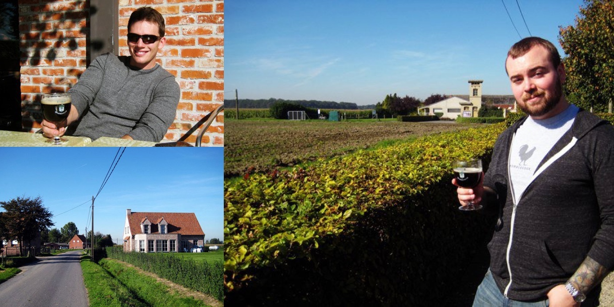
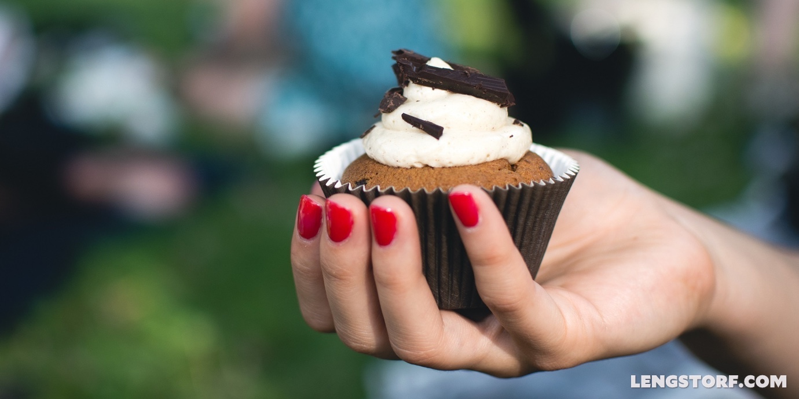
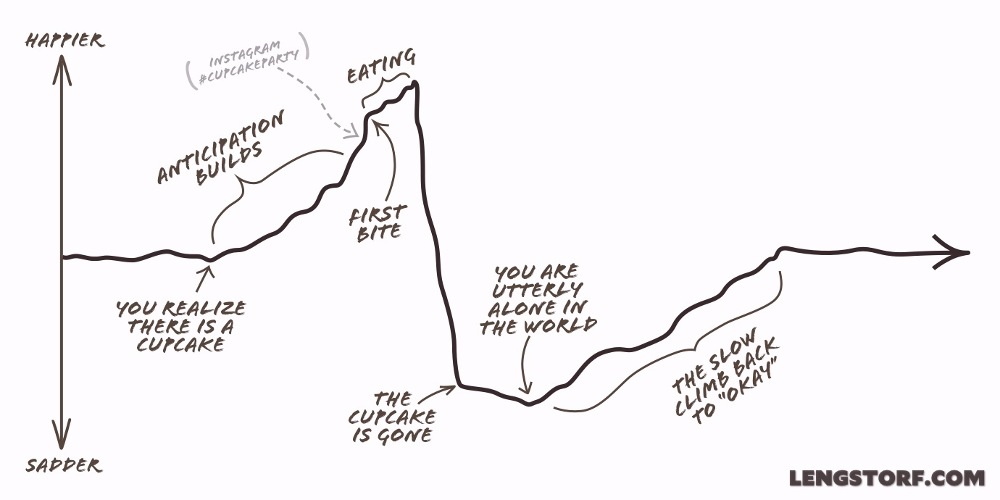
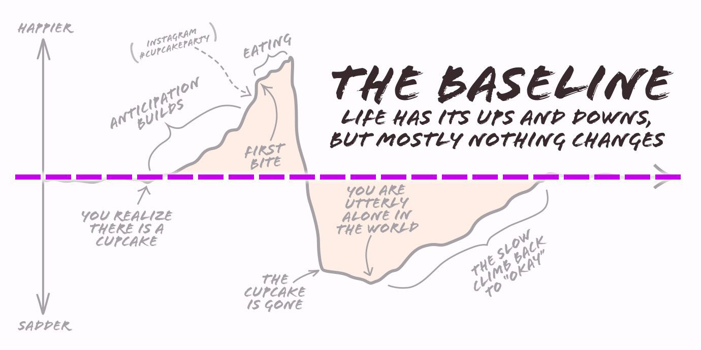
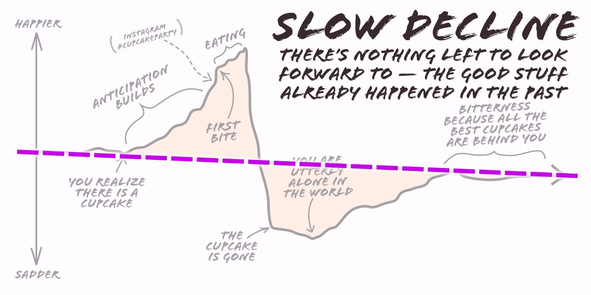
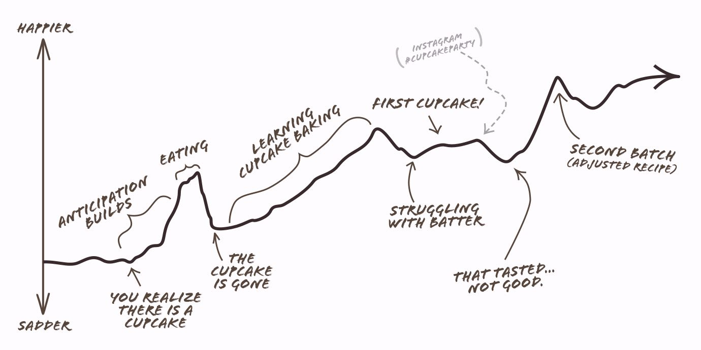
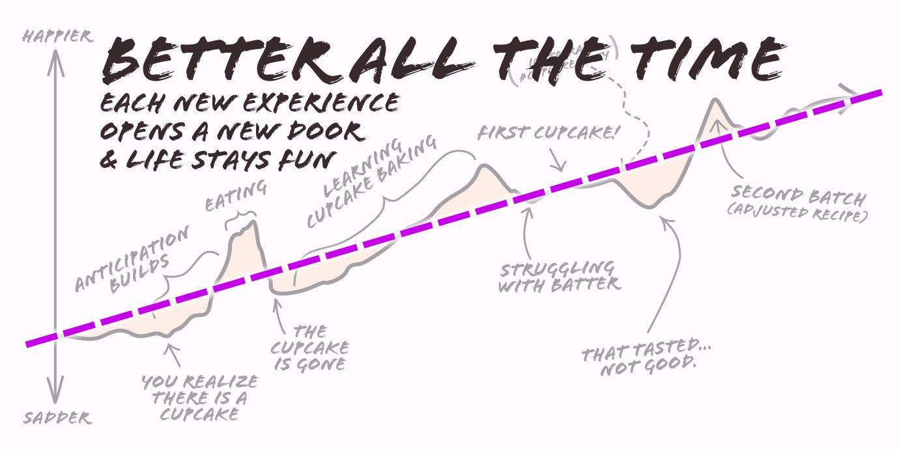

import { Image } from '$components';

The first time I left the United States, I was so excited I could have hung my
carry-on off the front of my pants.[^lowbrow]

[^lowbrow]:
  "Jesus, he's not even going to warm us up before waving a boner joke in our faces?"

This was a trip [Nate](https://nategreen.org/) and I had been talking about
since high school — it was supposed to be _the_ big trip after high school
graduation — and after years of "saving up",[^nope] delays, and excuses, I
_finally_ had my ticket.

[^nope]:
  Just kidding. I didn't save _anything_ in those days. I made an extreme sport out of trying to stretch the $8.71 in my wallet across three days until I (hopefully) got an invoice paid.

My mood improved steadily as the trip grew closer, dipping slightly a week out
when the "why am I not leaving _neeaaooooowwwww_" fit of whinery kicked in,
spiking up drastically when my feet touched non-American soil for the first
time.

<Image
  caption="We wandered into the Belgian countryside to try “The Best Beer in the World” at the Westvleteren Brewery at St. Sixtus Abbey."
>

  

</Image>

I was able to keep the good times rolling until a few days after coming home,
feeding on the envy of my family and friends as I flipped through photos and
told stories.

But then came the drop. And it was no small thing; this was the precipitous,
nuts-jump-to-the-stomach-and-stomach-jumps-to-the-throat variety of emotional
free-fall.

I sank low. For _years_ I'd been looking forward to this trip.

But now? _It was all over._

I had nothing to look forward to. I started to worry I may never feel that kind
of happiness again.

My incredible high was matched by an equally crushing low.

## Finding Happiness the Hard Way

It's tempting to measure only by extremes.

Happiness, especially, tends to be noticed only at its heights, or in its utter
absence.

A "happy person" is a walking highlight reel: a dream wedding with a romantic
destination honeymoon chaser; a new puppy to round out graduation and the start
of a promising career; a bucket list vacation photo series with a
first-class-upgrade cherry on top.

**Our high points are often the only metric used to determine how happy we
are.** And thanks to the latent one-upsmanship we all tend to suffer from, in
order to "stay happy" we need to reach for higher and higher highs.[^boring]

[^boring]:
  There's actually some psychological headfuckery at work here: as we have experiences, doing the same thing starts to feel boring — no matter how exciting it may have been at first. I've talked about how we can use this as a [tool to overcome fear](/overcoming-fear), but in the case of happiness it can work against us.

More exotic vacations.[^exotic] Bigger adventures. Go further, go harder, do
more, _or else you'll be sad_.

[^exotic]:
  Oh, you stayed in a quaint little _cabina_ in Costa Rica? Well, _we_ stayed in a Moroccan _riad_. Yeah? _We_ stayed in a cave house in Cappadocia. Oh yeah? _We stayed in a fucking tree house in Peru._ SUCK IT WE STAYED IN A CASTLE.

### If we only chase higher highs, we're opening ourselves up for lower lows.

The catch with focusing only on the ups, though, is that it ignores a
fundamental truth: life happens in swings.

**If the highs are getting increasingly higher, we stand to experience even
lower lows.**[^newton]

[^newton]:
  Thanks for nothing, Newtonian mechanics.

My big trip, for example, was the highest high I'd reached at that point in my
life. So on the downswing — when the trip was over, and all my anticipation,
planning, and experiencing were behind me — I was crushed.

## Here's a Simpler Example: Say You've Got a Cupcake

Now, this cupcake looks _amazing_. It's still warm from the oven. It's the
perfect mix of moist and springy. The icing is buttercream, made from scratch.
_It's filled with goddamn salted caramel._

<Image
  caption="🎶 My love, there’s only you in my life..."
  creditLink="https://pixabay.com/en/chocolate-cupcake-icing-food-993327/"
  credit="skeeze"
>

  

</Image>

As you look at it on your plate, you think about how great it will taste. Your
Pavlovian cupcake response kicks in and you drool and lick your lips and your
palms sweat and you close all the curtains so you can be alone for
this.[^normal]

[^normal]: This is how everyone eats cupcakes, right?

And then — oh god — you take a bite. _Holy dammit Christmas_ this is a good
cupcake. The world fades away, and it's just you and this cupcake and
["Endless Love"](https://youtu.be/qnfwnOp6uek) playing in the background.

<iframe width="560" height="315" src="https://www.youtube.com/embed/bAqz0AwLRjk" frameborder="0" gesture="media" allow="encrypted-media" allowfullscreen></iframe>

But then, just as quickly as it started, it's all over. Even as you desperately
lick your fingers, you know it's true: the cupcake is gone.

Where once you soared on the sugary wings of eagles, you now wallow in the
bitter depths of sadness. Never again will you have this cupcake. Never again
will this heavenly confection pass your lips.

The plate is empty. You are utterly alone in the world.

<Image
  caption="Happiness (and crushing defeat) as experienced over the course of discovering, eating, and recovering from a cupcake."
  credit="Jason Lengstorf"
>

  

</Image>

Minutes pass, feeling like years. The world is cold and flavorless. All colors
have gone grey in this, the world without cupcakes.

But no. This is not the end. You're strong. You've lived without cupcakes
before, and goddammit you can live without them now.

You don't know how, but life will continue, step after merciless, unsprinkled
step, until somehow, someday, hope can return.

## How to Create Long-Term Happiness: Focus on the Baseline

For most of my teens and twenties, [I chased happiness as a sort of
destination](/finding-happiness). I'd see something shiny,
struggle toward it, achieve it, feel amazing for the briefest of moments, and
then plunge into the existential quagmire of existing without goals — until I
saw something shiny.

It was a strange sort of holding pattern, where I'd oscillate between euphoria
and angst, always at about the same frequency. My _average happiness_, if we
look at the highs and lows on a graph, stayed about the same.

<Image
  caption="The highs and the lows average out, and overall nothing changes."
  credit="Jason Lengstorf"
>

  

</Image>

**I was pretty happy sometimes, and pretty sad sometimes, and mostly nothing changed.**

### Don't live in a world where the best cupcakes are behind you.

Since we generally acclimate to circumstances pretty quickly, staying the same
often feels like things are getting worse.

And _that_ is where things get ugly, because **when we make predictions about how we're going to feel, they tend to be self-fulfilling prophecies.**

<Image
  caption="If we believe all the best cupcakes are behind us, we may not be open to trying new cupcakes."
  credit="Jason Lengstorf"
>

  

</Image>

**If I believe that things are in decline, and all the good stuff happened in
the past, it's a short jump to resigning myself to a life where the best years
are behind me.**

This is where bitterness comes from, and the suspicion that there's only so much
happiness (or love, or money, or whatever) in the world, and that someone else
is getting your share.

And if we look at happiness as a zero-sum game, we're all fucked.[^zero-sum]

[^zero-sum]:
  Note to self: write a post about this and explain what the fuck you're talking about.

## How to Have Higher (Crash-Free) Highs

So if you'll humor me, let's all agree that the following assumptions hold true:

* Chasing happiness as destinations leads to seeking higher highs, with the
  accompanying lower lows.
* This leads to a baseline happiness that more or less stays flat.
* A flat baseline happiness can start to feel like things are stagnating and/or
  getting worse.
* This can lead to believing things are _actually_ getting worse.
* If we start to believe our best years are behind us, we become bitter and
  unhappy.

With all of that laid out, we'd be hard-pressed to find many benefits to this
approach.

So what are our alternatives?

### Are you ready for me to stop talking about cupcakes?

Going back to our cupcake example, what if we made one simple adjustment?

**What if, instead of seeing the cupcake as the _reason_ for our happiness, we
look at it as a _starting point_?**

Maybe our thought process goes something like this:

> This cupcake looks amazing. How do you make a cupcake look this good?
>
> And holy shit — it tastes as good as it looks. _How do you make a cupcake
> taste this good?!_
>
> I should try and make cupcakes. I bet I can make pretty good ones.

Instead of a deep crash when the cupcake is gone, we come out of the experience
with a new goal: **we're going to learn how to make cupcakes that taste this
good.**

<Image
  caption="The cupcake paves the way for curiosity, which leads to learning and improvement."
  credit="Jason Lengstorf"
>

  

</Image>

This means we have _something else_ to look forward to — we're not left without
a goal once the cupcake is gone — and we get to chase our curiosity.

### Each new experience brings us happiness and gives us new ideas to pursue.

By looking at each new experience as a step instead of a destination, we're
reducing the full depths of the crash. And that's _really_ important.

**If our post-high crashes are less extreme than our highs, our baseline
happiness will _increase_ over time.**

<Image
  caption="Each good experience is a step, not a destination, and that means we're getting happier all the time."
  credit="Jason Lengstorf"
>

  

</Image>

It's a subtle shift: instead of thinking, "[I'll be happy when...](/finding-happiness)", we think, "This will be fun to try."

**Removing the focus on the destination makes the _whole process_ a reward, instead of just the outcome.** On top of that, learning something almost always
exposes new things to learn, and — if you give yourself permission to keep
learning — that means you'll always have some interesting thread to tug at.

## What's Your Baseline?

Which way is your baseline trending? And what could you do _today_ to get it
trending upward? [Share your action step.](https://twitter.com/intent/tweet?text=Here’s+how+I’m+improving+my+baseline+today:&url=https://lengstorf.com/baseline&via=jlengstorf)
