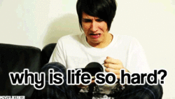
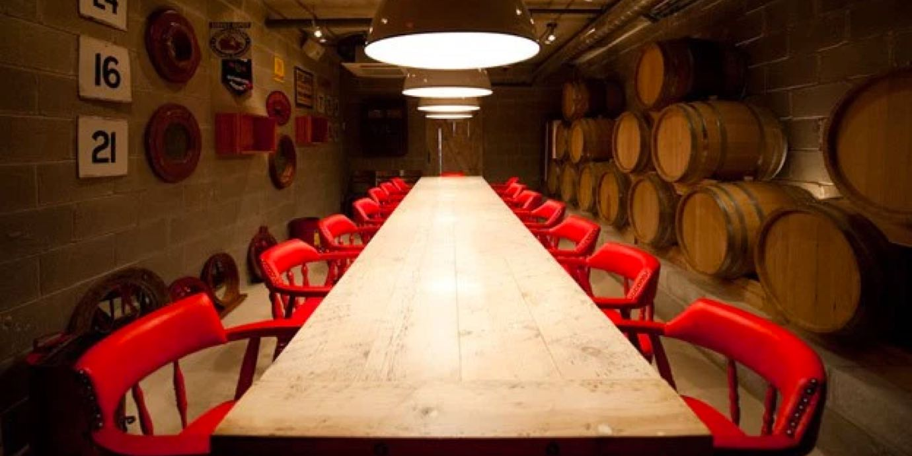
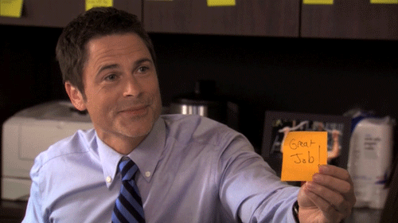

import { Image } from '$components';

As simple as it seems, taking the time to recognize the good stuff can have a
huge positive impact on your relationships with colleagues, significant others,
friends, and clients.

**NOTE:** This post originally ran back in 2013 on
[S2B](http://www.scrawnytobrawny.com/).[^why] I've updated it to reflect some of
the changes in my life since it was first written.

[^why]:
  Why was I writing for a fitness blog? S2B was formerly a branch of [Precision Nutrition's coaching program](http://www.precisionnutrition.com/), and Nate headed up marketing for it. In 2013, I had barely any readership, and Nate took pity on me by running this article.

A while back, S2B was shut down so PN could concentrate its efforts on their other programs. So I'm moving this post to my own blog because A) the practices in this article have played a _huge_ part of my transition from overworked and miserable to "feeling pretty balanced and happy", and B) I have no idea if/when the S2B blog will be shut down.

<Image
  caption="Marisa and I in Barcelona."
  creditLink="http://www.laboutiquedelaluz.com"
  credit="La Boutique de la Luz"
>

  

</Image>

## We Take a Good Thing for Granted

As much as I hate to admit it, **I’m kind of a shitty person by default.**

With very few exceptions, nearly every part of my day goes off perfectly.

I wake up every morning without an alarm, next to a woman who makes me deeply
happy. We playfully argue about whose turn it is to make coffee,[^local] cook
breakfast and listen to [Radiolab](http://www.radiolab.org/), and head to a
local gym to get our day started.

[^local]:
  The coffee is from a local roaster who cares more about coffee than some people care about their children.

My work schedule is flexible. The projects I work on are of my own choosing; I
have the freedom to only take on tasks that are both extremely interesting and
intensely satisfying.

Evenings are free to meet friends for drinks,[^cocktails] or to have a slow
dinner at some fantastic restaurant I read about somewhere.

[^cocktails]:
  Usually this happens at cocktail lounges employing bartenders that look at an old fashioned with the same air of professionalism as a surgeon about to perform a double bypass.

Every so often I’m asked to speak at a conference, which means I get paid to
travel to a cool city like Austin or San Francisco and share my ideas with
people who love web design as much as I do.

I’m not telling you this to brag about how great my life is.

**I’m trying to paint a picture of what an entitled asshole I can be.**

## Ask Me How My Day Was

With all the great things I’m lucky enough to do on a regular basis, you might
expect that I wear a permanent grin on my face and pour out gratitude at
Niagara-esque volumes.

But if you asked me how my day was back in 2013, you’d probably hear something
like:

* “It’s okay, I guess.”
* “Super busy. I’m _so_ tired.”
* “It’d be better if \_\_\_\_\_\_\_\_ would finally \_\_\_\_\_\_\_\_.”

What an ungrateful dick, right?

## “Are You Actually Complaining Right Now?”

One of my long-term clients is a company called Precision Nutrition. It’s run by
[Dr. John Berardi](http://www.precisionnutrition.com/about/john-berardi) and
[Phil Caravaggio](http://www.precisionnutrition.com/issa/phil-caravaggio), and
employs a good number of truly brilliant people, including my long-time friend
[Nate Green](https://nategreen.org/).[^nate]

[^nate]:
  Update: Nate moved on from PN in early 2016.

<Image
  caption="Left to right: JB, me, Phil, and Nate, back in 2011."
>

  

</Image>

During a trip to Toronto for an all-hands PN meeting, JB, Phil, Nate, and I went
out for dinner at a very cool Italian restaurant. We had an incredible
family-style meal, and afterward we started talking about whatever was on our
minds.

During the course of conversation, I made a couple negative comments about my
life; **essentially, I started complaining about my situation.**

Phil looked me in the eye and asked, point blank, _“Are you actually complaining
right now?”_

The question caught me off guard, because I was used to commiserating with other
entrepreneurs about how “hard” our lives were and all the things we wished we
could change.

Yet here was a fellow business owner staring at me like I just set the
restaurant on fire.

### “How many good things happened today?”

I started feeling foolish and fought the urge to start rambling in an attempt to
backpedal. I decided the best thing I could do was try to steer into the skid.

“I guess I was, yeah.”

JB leaned in. “How many good things have happened to you today?”

My four-star hotel room and the day’s extremely successful meeting with PN
flashed through my mind. I felt blood rushing to my cheeks.

<Image
  align="right"
  caption="How I imagine other people saw me when I complained about my awesome life."
  creditLink="https://www.youtube.com/user/danisnotonfire"
  credit="Dan Howell"
>

  

</Image>

“And how many bad things?”

I had to think pretty hard. I forgot toothpaste and had to call the front desk
to get some. They sent peppermint, but I prefer spearmint. I had to wait in line
for a taxi for, like, _ten whole minutes_.

**I was acting like a colossal tool.**

### It's easy to only focus on the negative things.

“We tend to forget all the good things that happen to us. I mean, why make a
note of something that goes well?” Nate joined the conversation, and continued,
“But if something goes wrong, that sticks out in our minds. So when we think
about our days, just the negative stuff jumps out at us and we complain.”

JB smiled and said, “It’s a psychological default. We all do it.” He looked at
Phil.

“Until we decide to stop doing it,” Phil continued.

JB swirled his wine and said, “This is going to feel silly, but list three good
things about today. Out loud. Doesn’t matter what they are.”

I felt like a kid getting a lecture, but I knew they had all done this
previously, so I played along.

<Image
  caption="The exact table at Gusto where I decided to start being more positive."
  creditLink="http://gusto101.com/"
  credit="Gusto 101"
>

  

</Image>

“My hotel has a great shower, our meeting today has really good implications for
my business, and this is one of the best Italian meals I’ve ever had.”

Phil beamed; he had picked the restaurant.

“It feels silly,” said JB, “but every time I find myself complaining, I
immediately stop and list off three good things about my day.

“Over time I stopped complaining, partly because I felt silly having to stop
mid-conversation to derail a complaint,” JB paused to make eye contact, “but
mostly because I just don’t think of the negative stuff as often.”

<Image creditLink="http://laboutiquedelaluz.com" credit="La Boutique de la Luz">

  

</Image>

## Reprogramming My Brain

In the weeks that followed, that conversation stuck with me.[^years] I was
acutely aware of my negativity, and admonished myself publicly by stopping
mid-complaint to apologize and list the day’s high points.

[^years]:
  It's been years since that conversation, now, and I _still_ find this to be one of my most effective tools for staying positive.

Most of our lives are full of creeping, incremental changes that we can't really
pinpoint; we start in one mindset, and over weeks or years we find that we've
_shifted_, and now we have a different mindset, even though we didn't notice the
change.

**This conversation was a hard, serious, overnight change.** I can distinctly
remember how I used to feel before taking this advice, and how I felt
immediately after — it was like flipping a light switch that made me less of an
ungrateful asshole, and more of a happy, fun-to-be-around person.

It didn’t take long for me to notice a significant drop in complaints. But that
wasn’t the only thing that happened; **I started to pay more attention to the
positive things as well.**

## Don’t Let the Good Go Unnoticed

<Image
  align="right"
  caption="“I LOVE MY WHOLE HOUSE!”"
  creditLink="https://www.youtube.com/watch?v=qR3rK0kZFkg"
  credit="dmchatster"
>

  

</Image>

In my new effort to curb negativity, I started making “anti-complaints”.

* “I really like Dave. He’s such a happy guy.”
* “Our waitress was really excellent tonight.”
* “This project is going really smoothly.”
* “I’m so happy someone invented toast.”

These anti-complaints did more than realign my perception of the world, though;
I started to see the people around me becoming more positive as well, which made
for better experiences in both my professional and personal life.

## Putting Positivity Into Practice

Being positive doesn’t stop at making you sound less whiny at dinner: **a positive outlook can be the catalyst for huge improvements in all areas of your life.**

### How to stay positive at work.

In a healthy workplace, you’ll be asked for feedback on projects — it’s
inevitable that some of that feedback will be negative.

**By taking the time to point out the good things your colleagues are doing, the negative feedback is less jarring.**

<Image
  caption="Chris Traeger is <em>literally</em> the best at positive feedback."
  creditLink="http://www.nbc.com/parks-and-recreation"
  credit="Parks and Recreation"
>

  

</Image>

Imagine a situation where you turn in projects to your boss, and she never says
anything. Every project is accepted silently without any feedback.

Then a project gets rejected: your boss tells you all the things that are wrong
with the project and sends you on your way to try again.

It doesn’t matter that every project before this one was accepted; **the only
feedback you’ve received from her has been negative.**

However, in the exact same situation, if every accepted project had been
accompanied with positive feedback — “great job on the layout”; “I love this
sentence here”; “I really appreciate you getting this in on time” — the negative
feedback wouldn’t have felt so jarring.

It would have been feedback as usual, working with you toward a better final
product.

It’s not weak or overly emotional to tell someone you appreciate them. In fact,
**sharing positive feedback makes both people feel great, and creates a strong
foundation that helps weather any rough patches.**

### How to stay positive at home.

<Image
  align="right"
  caption="Marisa is the only person I’ve ever met who takes “don’t take life so seriously” as seriously as I do."
  creditLink="http://paintwithstars.com"
  credit="paint with stars"
>

  

</Image>

I tell [Marisa](https://marisamorby.com) how much I like her probably a
half-dozen times a day.

I try to remember to call out all the things I like about her, whether it's her
constant drive to improve herself, her
[unwillingness to accept that other people can do things she can't](https://marisamorby.com/talent/),
her ability to match my giant-bearded-toddler playfulness, or the fact that she
can handle my so-coldly-logical-it's-often-hurtful tendencies.[^case-in-point]

[^case-in-point]:
  Relevant example: as I was updating this article, some of the edits involved an ex-girlfriend, and — like a robot — in one section I merely replaced my ex's name with Marisa's.

  When I did this, I thought to myself, "Well, what I said about my ex then is now true about Marisa, so this is acceptable."

  When Marisa read that draft, she was (understandably) pissed. I didn't understand. So she patiently explained that normal people — including her — have feelings, and that a find-and-replace to swap out one name for another was a good way to hurt those feelings.

  So we argued, I apologized, she was grumpy with me for half a day, and I (hopefully) learned something. There was no yelling. No crying. No sulking silences or blistering attacks on each other's character. We knew we were only fighting about _this mistake I made_, and not about anything else.

As a result, we can share frustrations with each other without worrying that the
relationship is falling apart. When we argue, it's not about whether or not we
like each other; it's just that one of us was supposed to get ready to leave,
and was still sans-pants three minutes before we're supposed to be out the
door.[^my-bad]

[^my-bad]:
  Yeah, that was my bad. I _really_ hate pants.

## Even When It’s Bad, It’s Not That Bad

If your partner makes a decision you disagree with, or a colleague shows you a
project that you think needs work, **it’s extremely important to remember that very few things are a total failure.**

Try to start by acknowledging the effort that was put in, and listing any
positive aspects. Remember whose team you’re on, and that everything can be
fixed if you’re working together.

Next time in you’re in this position, try this experiment: **don’t look at the project as a failure with salvageable parts; see it as a solid effort with room for improvement.**

It's a subtle difference, but it reframes the situation from a botched outcome
to [an obstacle in an otherwise pleasant journey](/baseline).

## Make Sure To Share The Love

Positivity works best when it’s shared. The people around you can’t read minds,
so even if you’re noticing all the things they do that you appreciate and
admire, **they’ll never know it unless you tell them.**

<Image
  caption="Don’t hold back on the positive feedback."
  creditLink="http://www.sonypictures.com/movies/21jumpstreet/"
  credit="21 Jump Street"
>

  

</Image>

**If you make a habit of sharing all the good things, you become someone that makes the people around you more positive.** You become a bright spot in
people's days. You create a vacuum where negativity cannot survive, because you
don't give it the chance to feed and grow.

My efforts to become more positive were immediately met with more positivity
from the people around me: I talked about what I liked, and that encouraged
others to talk about what they liked, and that made all of us feel better — a
welcome break from the circlejerk of commiseration that I'd grown accustomed to.

## Life Is Exactly As Good (Or As Bad) As We Choose To Experience It

In the years since I’ve forced my brain to focus on — and share — the positive
things in my life, I’ve seen a marked improvement in my relationships across the
board. This has led to a better home life, a better workplace, and happier
clientele.

All of these things have [improved my happiness](/finding-happiness), made me more successful, and (I hope) made me more pleasant to spend time with.

I think it’s important to note that nothing else changed while these
improvements were happening. I was living the same life, working the same job,
spending my time with the same people.

**The only thing that changed was [the lens through which I chose to view my world](/stories).**

## Your Turn: List 3 Good Things That Happened Today

You can change your life too, starting today. Share your experiences in the
comments and [**tell me 3 good things that happened today**](https://twitter.com/intent/tweet?text=%40jlengstorf).
