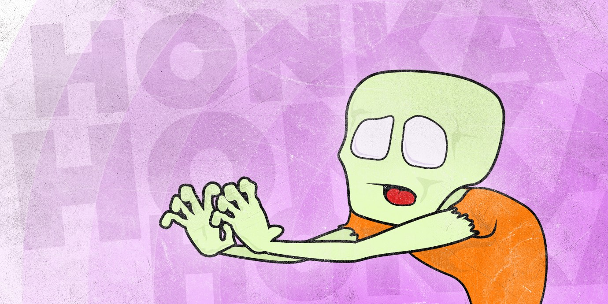
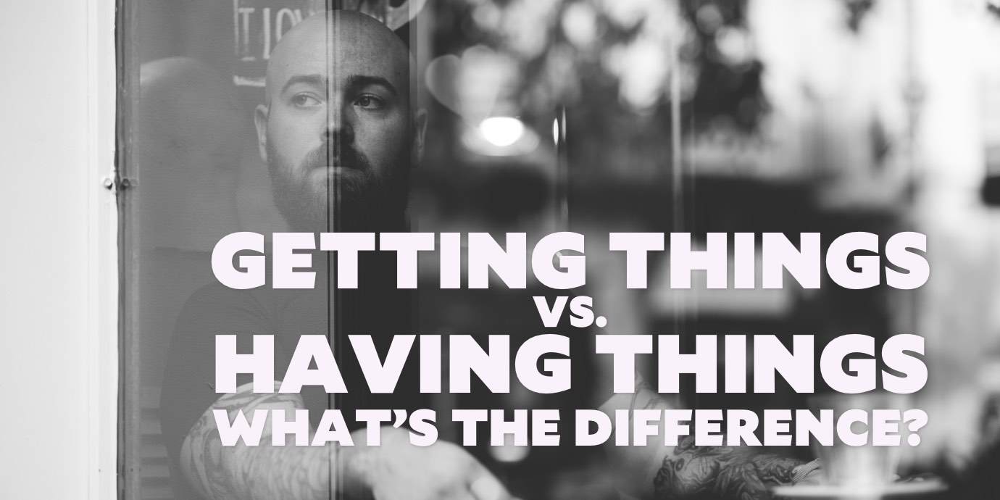
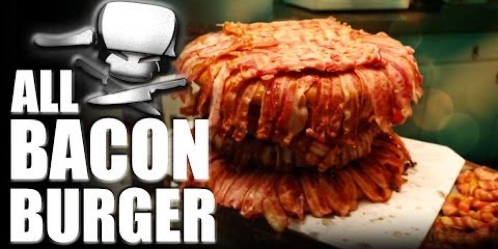
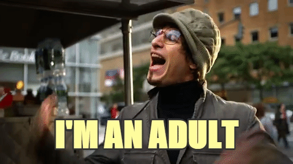
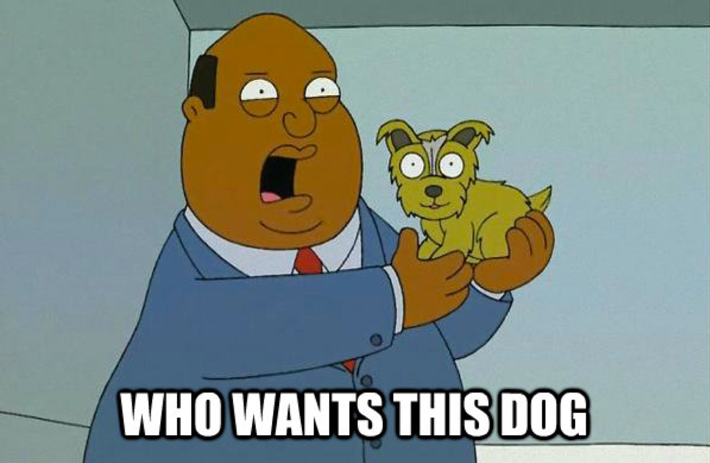
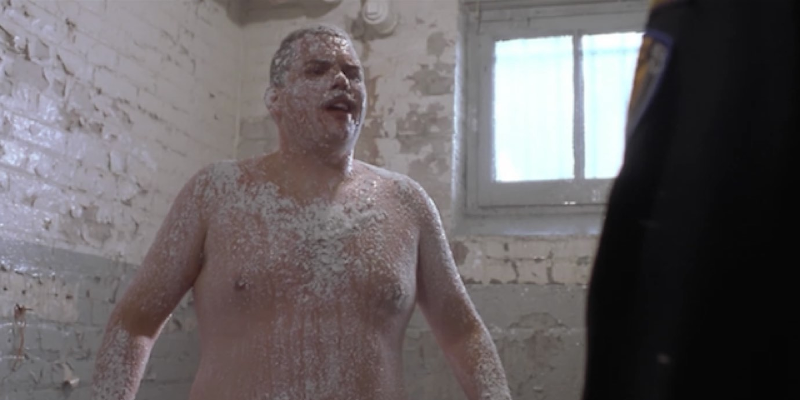

import { Image } from '$components';

You know how we always want what we can't have?

And how once we _can_ have it, we lose interest?

Have you ever wondered why that happens? Logically, it doesn't make any sense:
if I want a thing, and that thing becomes available to me, I should be happy
that I now have that thing.

But that's not how it works.

## The Thrill of the Chase

Before my adult morals had grown in, I was addicted to the problem-solving
challenge of convincing someone to date me. I loved the chase, the dance, the
puzzles — _[when should I call?](https://youtu.be/JV-m9bJTrh8?t=2m23s) should I
be sincere or playful right now? am I striking the right balance between
interested and independent?_ — and the rush of knowing that I was successfully
convincing another person that I was worth their time.

And in the cases where I was successful, I found myself with a shiny new
relationship as a prize.

And that relationship was _doomed_.

### Am I even interested in this?

At this point in my life I was little more than a boner-zombie, hands
outstretched in the _honka-honka_ motion, shuffling the halls through a haze of
hormones and teenage sexual lore.[^sex-ed]

[^sex-ed]:
  If you're not from the United States, our sexual education curriculum in public schools amounts to sitting kids down, glaring at them, and shouting "don't do it!" until the bell rings.

<Image caption="Self-portrait, circa 2001." credit="Jason Lengstorf">

  

</Image>

  Since we didn't learn anything from credible sources, we kind of just made shit up and tried to pass it off to our friends as fact. This is how terrible ideas survive, and we end up telling each other, "Just write the alphabet with your tongue, dude. Works _every_ time."

I bring this up because my decision-making during this phase was suspect at best. I'm better now. I swear.

Here's how things happened in my brain back then:

* I stumble into a conversation with a girl.
* She does not run away or start crying.
* This is encouraging; _she likes me!_
* My campaign to make out with her begins.

### Thinking through to tomorrow morning.

Two considerations were conspicuously absent in my decision-making process:

1. What will happen after we make out?
2. Would I enjoy being in a relationship with this person?

I was after the thrill of wooing — I had _zero_ interest in the post-woo
responsibilities.

And because of that, I painted myself into a lot of corners, and made huge
messes that I could have easily avoided if my head hadn't been up my ass.

<Image
  caption="The act of getting things can be a lot more fun than actually having things."
  creditLink="http://laboutiquedelaluz.com"
  credit="La Boutique de la Luz"
>

  

</Image>

## This Is More Than a Dating Problem

Short-term thinking is obvious in dating: we've all had the experience of one
person in a relationship only being invested in the short-term, leaving the
other feeling slighted.

Where it was less obvious for me was in _literally every other aspect of my
adult life_.

### I chased business opportunities I never wanted.

Building a business is — for me, at least — the _ultimate_ thrill of the chase.
We [don't have coming-of-age rituals anymore](/growing-up-vs-growing-older), so the closest I could get to discovering
what I'm made of was to pin my survival to my ability to grow and maintain a
business.

Growing a business gave me a sense of self-confidence and self-reliance that I
wouldn't trade for anything. But for all the good, I made _many_ mistakes — and
almost all of them because I wanted the thrill of a good chase.

#### I sold projects even when I hated the work.

"More is better."

<Image
  align="right"
  caption="IF ADDING BACON MAKES IT BETTER REPLACING EVERYTHING WITH BACON IS OBVIOUSLY BEST"
  creditLink="https://youtu.be/m8u8Z3bUQfs"
  credit="Epic Meal Time"
>

  

</Image>

It's an American mantra; we [don't have time for your weak-ass "moderation"](/goldilocks-zone-avoid-burnout) here — we see a hint of progress and it's GO GO GO
until we win or we crash and burn.

Thanks to that mentality, I didn't think very hard about prospective projects.
**I wanted the sale. Full stop.**

I ignored red flags and explained away my get-the-fuck-out-of-here gut feelings.
I saw another rung on my ladder to success, and I wasn't going to pass it up.

As a result, I ended up with more than a few projects where I was miserable,
doing boring work for companies I wasn't particularly fond of.[^companies] I was
going for the _sale_ with no consideration of what came afterward.

[^companies]:
  You know the [trolley problem](https://en.wikipedia.org/wiki/Trolley_problem)? "Would you kill one person to save five? Or let those five people die?"

  There's a freelancers' edition of this problem: "If [huge corporation] offered you a shitload of money to work on a project for them, would you take it — despite a mountain of information detailing their obvious evil?"

  In the theoretical models, I steadfastly refuse. I launch a scathing attack on Corporate America and its erosion of the human spirit. Triumphant music swells in the background. I exit to a slow clap, astride a grizzly bear. The corporate sleazeballs cry, then explode.

  But in reality, I just cashed the fucking check and felt dirty.

#### I worked hard to get responsibility I didn't want.

I went after power in the same way: I angled for management roles, trying to
amass as much authority as possible. Because — again — I saw a chase. A
challenge.

Except I _hate_ working in management. I like to do stuff; telling a team of
people to do stuff and keeping them on task does not make me happy. The politics
and scheduling and meetings and reporting makes me crazy, and — most importantly
— I'm not actually very good at it.[^leader]

[^leader]:
  Marisa says that I'm "a good leader, but a terrible manager." I think this is her way of diplomatically telling me that my human interactions should be limited to speeches that have been prepared — edited — in advance.

Let me state that again, because I still can't believe the cognitive dissonance
that was happening:

1. I worked very hard to convince people to give me more authority on projects —
   which put me in a management role — because I liked the challenge of
   convincing people to trust me with high-dollar, high-risk projects.
2. **_I fucking hate working in management._**

### I went after status indiscriminately.

My personal life is just as littered with the wreckage of my shitty
decision-making as my professional and romantic lives.

#### I bought "heirloom-quality" shit for my house.

<Image
  align="right"
  caption="“Didn’t you see my flatware? It’s <em>very</em> expensive!”"
  creditLink="http://www.nbc.com/saturday-night-live"
  credit="Saturday Night Live"
>

  

</Image>

In Portland, I spent _way too much money_ on a Dordoni Worktop Table, because I
needed the _right_ desk; Demeyere stainless steel pots and pans, because "I'd
have them forever"; a Herman-Miller Embody office chair; a custom-made platform
bed.

I thought having all this stuff made me a successful grown-up.

In retrospect, I sounded an awful lot like the narrator in _Fight Club_:

> It's just, when you buy furniture, you tell yourself, that's it. That's the
> last sofa I'm gonna need. Whatever else happens, I've got that sofa problem
> handled. **Narrator,
> [_Fight Club_](http://www.foxmovies.com/movies/fight-club)**

But none of that crap actually made me happy.[^chair] And I don't have any of it
anymore — I [got rid of everything I owned](/do-more-with-less)
when I was [preparing to travel](/leaving).

[^chair]:
  Except [the chair](http://www.hermanmiller.com/products/seating/performance-work-chairs/embody-chairs.html). I _loved_ that chair.

I was caught up in the chase: I wanted nice stuff to prove I was a successful
guy. But I didn't actually _want_ the stuff I was accumulating.

#### I went to college with no plan.

Both of my parents went to college. My mom dropped out with just a few credits
to go before graduation so she could go with my dad to California for his new
job. She never ended up finishing; partly because she wasn't ever really sure
what she wanted to be — she changed majors several times — and partly because of
me.[^its-not-a-tumor]

[^its-not-a-tumor]:
  My mother was _so sure_ she wasn't pregnant that she didn't bother with pregnancy tests; she jumped straight to "oh my god I have a tumor" and started looking for oncologists.

  This overreaction predates WebMD by over a decade, by the way.

Between that and my dad's degree landing him a great job right out of college,
it was just a foregone conclusion that I'd go to college, too.

So I did.

But when I got there, I realized that I had no plan. No end game. I'd just shown
up because college was the next item on my todo list. I was there because I was
supposed to be there, but beyond that? I had no idea.

When I dropped out, it felt like a betrayal. My parents had paid a good chunk of
money, I had taken out loans, and I'd made zero progress toward being an adult.

## What's Going on Here?

Am I just an idiot?[^rhetorical] Why the hell do I continually chase after
things that I don't actually want?

[^rhetorical]:
  That was a rhetorical question. Jerk.

I don't have an answer. But I have a theory:

The effort to achieve something and the results of having achieved something are
entirely separate things. And we often only weigh the value of the first part in
our decisions.

### An oversimplified example: puppies!

Say we're walking into the grocery store, and there's a box of puppies out front
with a sign that says, "FREE PUPPYS".[^save-you]

[^save-you]:
  I know. We've already made the decision to adopt all of them so they won't suffer another minute of the owner's terrible spelling.

We weigh the decision:

<blockquote>
  <Image
    align="left"
    caption="I shall call him Squishy and he shall be mine and he shall be my Squishy."
    creditType="Credit"
    creditLink="http://www.dooziedog.com/dog_breeds/west_highland_white_terrier/images/Westie-Puppy-6.html"
    credit="dooziedog"
  >

  

</Image>
 

    Holy crap, how cute are these puppies? And it would be really fun to have a
    dog, you know? We'd get to train her, and she'd keep us company, and at
    Halloween we could dress her up as a dinosaur and see if it goes viral.
  

  

    Yes. This is happening.
  

  

    Give me that puppy, grocery store parking lot person.
  

</blockquote>

All of these considerations are valid. But they're all part of the _first half_
of the decision: the initial effort to become a dog owner.

What didn't get factored in at all was _being a dog owner_: early morning walks,
restrictions on our ability to travel, the extra hassle of finding a place to
live if we move, and a dozen other little complications that are part of pet
ownership.

So even though the first part sounds like a lot of fun, and it would probably be
pretty rewarding, the second part might actually cause resentment toward the dog
in the long run.[^after-dog]

[^after-dog]:
  I've been part of several conversations where people have said, "...and we're really excited about it, but we have to wait for Kim Dog Un to die first."

  Damn, Dog Mama. That shit is cold.

Of course, for _many_ people, dog ownership is really rewarding. But that's not
something we want to be figuring out _after_ we've brought the dog home.

## How to Reconcile the Chase With the Outcome

Every problem I've described so far has been a situation where I chose to shoot
first and ask questions later.

I still do that sometimes. But I'm getting better.

Here's how.

### 1. Start with the end in mind.

We're always making choices that are at least nominally aimed toward creating a
better life for ourselves and the people we care about.

The tricky part is realizing when a fun chase might actually do damage in the
long run — especially if we never consider what "the long run" actually looks
like.

I've found it helpful to think about what my "better life" looks like. What am I
doing every day?

This is kind of like the guidance counselor,
what-would-you-do-if-you-had-a-million-dollars question, but think past the
first few days. Sure, on day one we'd all fill up a pool with champagne and play
lawn darts with taxidermied swordfish, but that'll get old fast.

What will outlive the novelty? What will you still want to do when it's old
news? _That's_ the stuff we want to work toward.

That's what the end goal looks like.

With the end in mind, we can look at our decisions differently:

#### Should I try to get this promotion?

Yeah! A challenge!

But wait: if I got that role, I'd spend most of my time in meetings, and the
rest managing people. I wouldn't be able to build stuff.

That's not really what I enjoy doing, so I'm going to pass.

#### Do you want this dog?

<Image
  align="right"
  creditLink="http://www.fox.com/family-guy"
  credit="Family Guy"
>

  

</Image>

That is a cute dog. Give it!

Well, hold on. If I get a dog, I'd need to be fairly stable, so that probably
means cutting down on travel. It also means the stress of housebreaking, the
interruptions of playing and walks and feeding, the hassle of vets and buying
pet food and dealing with chewed up furniture while we're training.

But... it also means having a totally dedicated friend, and a reason to get up
and go outside often. So... yeah. I'll take that dog.

### 2. Know the difference between achievement and fulfillment.

Kevin Heffernan, the actor who played Farva in _Super Troopers_, was chasing an
achievement when he fell into
[an escalation of dares which ultimately led to a full-frontal nude scene](https://youtu.be/i0L4IdKJ1Yw?t=3m59s)
in the movie.

<Image
  align="right"
  caption="“I did not consider the long-term implications of this decision.”"
  creditType="Credit"
  creditLink="http://www.brokenlizard.com/movies/supertroopers/"
  credit="Broken Lizard / Super Troopers"
>

  

</Image>

The thrill of the achievement — in this case, showing his friends that he had
the balls[^dad-joke] to get naked on camera — lured him in. There was
excitement, and a short-term gain of out-badassing his castmates.

[^dad-joke]: Literally! Ha! Okay, fine. I'll head back to [r/dadjokes](https://www.reddit.com/r/dadjokes) where I'm appreciated.

But the long-term effects — the immortalization of Farva's sugar-coated schlong
on the big screen — may not be all that fulfilling. In the wake of this movie,
the nude scene is a staple in any interview with Heffernan — he has to talk
about it all the time, whether or not he wants to.

This example is ridiculous, of course, but it's something to think about:

> Will the outcome of what I'm about to do feel rewarding to me? Or am I just
> chasing a rush right now?

## The Goal Needs to Be Fulfillment

Achievements fade. If we're not careful, we can get trapped under the idea that
[happiness lies in our next achievement](/finding-happiness).

Fulfillment, however, is like the tide. If we can [increase our overall
fulfillment](/baseline), we're always feeling a little bit
better.

**And when we know we're working toward fulfillment, it gets easy to spot the
achievements that won't make us happy — and to turn them down.**
