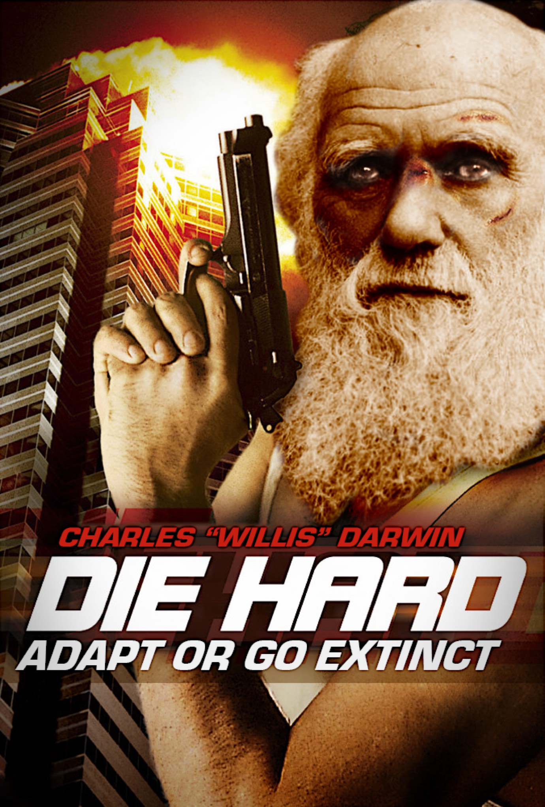
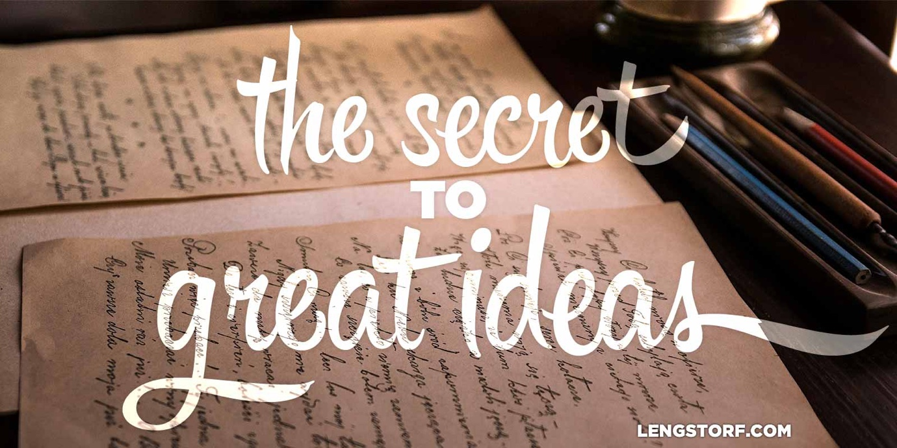

import { Image } from '$components';

If I've had one Big Idea™ in my life so far, it's this: **careers and income are
_tools_, not _goals_.**

Currently, my goals are:

1. to live a life where I'm not obligated to do anything I haven't chosen to do;
2. to have the personal and financial freedom to do the things that sound
   interesting to me;
3. to live a life where every day I'm saying, "I can't imagine any way I'd
   rather be living right now."

That idea wasn't born whole. For anyone who's been reading along, I've slowly
built this idea, starting in late 2013 when I realized how unhealthy my working
situation was, gaining steam in early 2014 when I
[wrote about my workaholism](https://medium.com/digital-nomad-stories/the-cult-of-work-you-never-meant-to-join-cd965fb9ea1a),
and evolving ever since as I've shifted into a new lifestyle of [permanent
travel](/one-year-of-world-travel) and far [more balance](/goldilocks-zone-avoid-burnout).

I can't point to an exact moment where I suddenly "got it" with work. If you
asked me to pinpoint a date when I realized I was killing myself, I
can't.[^beard]

[^beard]:
  I always simplify this by saying, "When my beard died...", but the actual timeline is more ambiguous. It took months for my beard to fall out, and I spent a long time feeling unhappy about work without realizing I was unhappy about work. I had gut feelings and hunches, but I couldn't tell you when any of that became my current approach to [work-life balance](/work-happier).

## Some of the Best Ideas Have Nothing to Do With Inspiration

Since I grew up watching American television, I'd always imagined the discovery
of evolution a little differently:

<Image
  align="right"
  caption="1 trillion species. 21 islands. 1 scientist."
>

  

</Image>

It's 1857. Charles “Willis” Darwin is just trying to get home to his wife and
daughter for Christmas, but he unwittingly stumbles into a secret lab on a
remote archipelago in the eastern Pacific — and there's trouble brewing.

Only Darwin stands between the terrorists and global destruction,[^non-specific]
so he grudgingly accepts the call to adventure. For 85 action-packed minutes,
Darwin banters, beats, and blasts through unspeakable odds.

[^non-specific]:
  How the terrorists plan to do this is glossed over with a few lines of non-specific dialog because who cares, right? There'll be explosions!

In the climax, the terrorist leader dangles a hundred feet above a rocky
shoreline. His eyes are wide with terror as he screams, “This is murder!”

“No,” grumbles Darwin, lifting his boot from the rope and letting the terrorist
plunge to his death. “This is natural selection.”[^tagline]

[^tagline]:
  You know, I started this as a joke, but now I kind of want to watch this movie.

The world is saved. And also he developed the underlying theory behind _On the
Origin of Species_.

### Of course, the reality was nothing like that.

The only remarkable thing about Charles Darwin developing the theory of
evolution is how _utterly uninteresting_ it is.

Darwin never had a _eureka!_ moment. No chance encounter or happy accident. He
just... kept scratching an itch. And after several years, the pieces finally fit
together in a coherent way — and he had a theory.

[Steven Johnson](https://stevenberlinjohnson.com/) calls this a "slow hunch",
and attributes several great breakthroughs in history to it. His argument,
really, is that very few ideas happen suddenly and without warning; rather,
"they fade into view."

## The Tragically Short Half-Life of Ideas

For a month in early 2016, I lived in Hanoi, Vietnam.

<Image
  align="right"
  caption="How to cross the street in Vietnam."
  creditLink="https://www.reddit.com/r/gifs/comments/2ke7hz/crossing_the_street_in_vietnam/"
  credit="Reddit"
>

  

</Image>

The sidewalks in Vietnam are used for everything _except_ walking; the corners
are packed with people sitting on tiny stools, enjoying street food and
[bia hơi](https://en.wikipedia.org/wiki/Bia_h%C6%A1i); scooters weave through
the pedestrian press, blasting horns,[^horns] carrying everything from families
of four to refrigerator-sized boxes, somehow staying upright and avoiding the
thousand other quick-weaving, horn-blasting scooters.

[^horns]:
  Honking in Vietnam is its own language, as far as I can tell.

Drivers honk for _everything_. "Hey! I'm here!" _honk_ "I'm driving!" _honk_
"I'm outside!" _honk_ "I'm parking!" _honk_ "I have parked!" _honk_

While waiting for a banh mi sandwich, a guy pulled up behind us and laid on his
horn for a solid fifteen seconds. Then he put down the kickstand, took off his
helmet, and walked inside. Twenty minutes later he hadn't come back out.

Marisa and I have spent _far_ too long wondering what that honk was meant to
convey.

On a walk through this chaos one evening, I had an idea. It was a good idea. I
know this because I remember the giddy-silly excitement I felt after it hit me.

And then? I fucking _forgot it_.

When I got home, I could remember being excited, but I could _not_ remember what
I had thought of.

Had I taken a few seconds to put a note into my phone, I'd still have it. But I
couldn't be bothered, and now I'm sans-idea.

<Image>

  

</Image>

## Trends from a Long Time Ago That Can Power Slow Hunches

Losing that idea wasn't the first time this has happened to me. And apparently
I'm not the only one who does this.

> Keeping a slow hunch alive poses challenges on multiple scales. [...] Most
> slow hunches never last long enough to turn into something useful, because
> they pass in and out of our memory too quickly[...]. So part of the secret of
> hunch cultivation is simple: write everything down. **Steven Johnson,
> [_Where Good Ideas Come From_](http://amzn.to/1QOSd4A)**

Darwin was very good at taking notes. He had notebook after notebook filled with
ideas, quotes, sketches, and whatever else came to mind as he wrote.

He reread those notes, which allowed his new ideas to mix with his old ideas,
and that led to new lines of inquiry and thought. Most importantly, the ideas
were able to marinate without being forgotten, because there was a record of
them.

### Eighteenth-century aristocrats had Tumblrs. No, for real.

Darwin's note-taking was similar to a trendy seventeenth- and eighteenth-century
practice called
"[commonplacing](https://en.wikipedia.org/wiki/Commonplace_book)", which was
essentially the act of writing down things that were interesting or inspiring,
along with the commonplacer's independent commentary and thought.[^ye-olde-blog]

[^ye-olde-blog]:
  Which means that having a cool blog has been cool for _way_ longer than we originally suspected.

The goal was to **keep a written record of the transient thoughts that we catch
and release each day, in hopes of preserving them beyond the limits of our own
memories** — giving us a better chance to find connections between our current
ideas and those we've had before.

### Most of my ideas have been slow hunches.

Most of what I write about is the product of slow hunches. I've only had a few
moments of blinding clarity — like [this one](/how-to-be-positive) — where I believed one thing one moment, and
another things the next.

Instead, most of my ideas slowly emerged as bits and pieces that I'm still
working to fit together properly.

A few examples:

* I was still [advocating 12-hour days](/no-distractions-results) in early 2014 — which is [exactly the wrong
  idea](/overtime-hurts-productivity).[^distractions]
* I was in the [nascent stages](/too-busy) of [the ideas](/better-productivity-work-less) that currently inform my style of
  working back in early 2014.
* I wrote several posts like [this one on magic](/magic), in
  which I've _almost_ articulated a thought, but I'm still not able to fully
  explain what I was getting at.

[^distractions]:
  I was, however, starting to realize that I needed to limit my distractions. Baby steps, I guess.

Every month or so I scan through my older writing and take a pulse on where I
was versus where I am. Sometimes I get an idea for a new post. Other times I
cringe at an awkward phrase.

But revisiting previous ideas _always_ helps me refine my current thinking — and
in a lot of cases it **leads me to solutions that I most likely would have
missed otherwise.**

## The Revolution Will Mostly Go Unnoticed

Taking notes is not a new idea. It's not a revolutionary idea. I'm not arguing
that I've stumbled upon some deep secret of the universe.

However, **taking notes _will_ improve your ability to track multiple ideas over
longer periods of time.**

And _that_ just might change everything.
