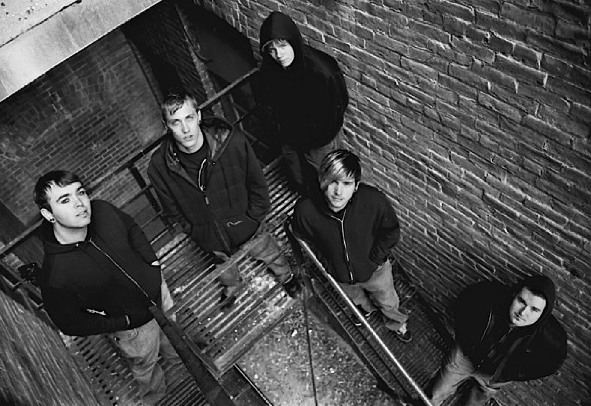
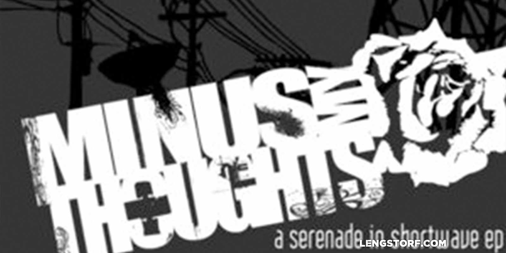
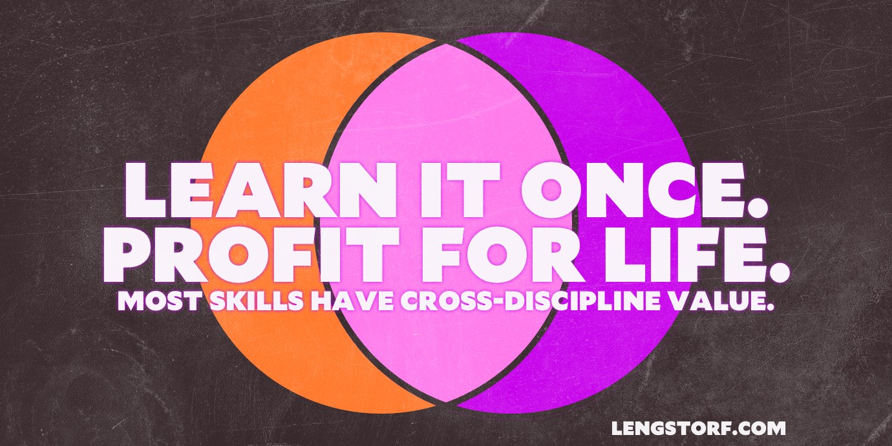
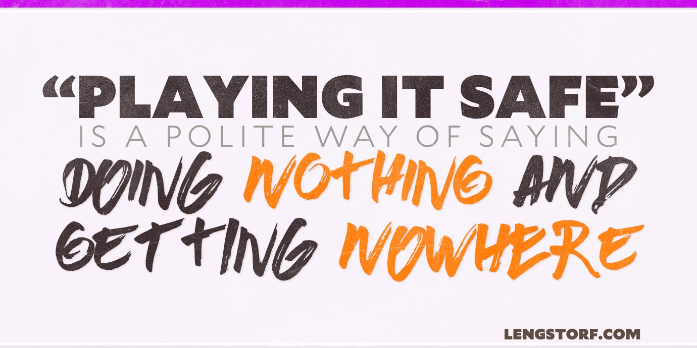
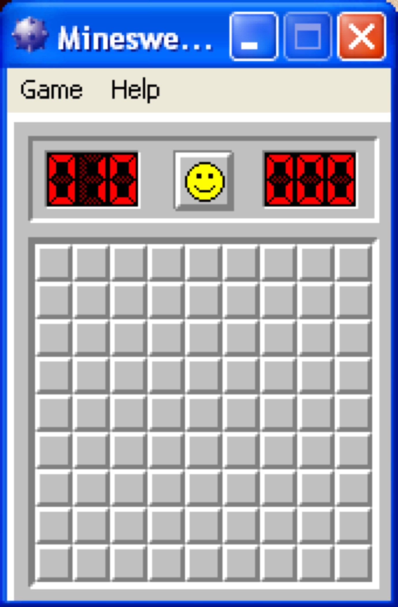

import { Image } from '$components';

In high school I wanted to be a rockstar.

In the pursuit of that goal, I eventually managed to drop out of college, become
more or less unemployable,[^unemployable] ruin most of my relationships, and —
most notably — _utterly fail_ to become a rockstar.

[^unemployable]:
  "Yeah, hi, can I work here for two weeks, then have three weeks off, then work here for, like, two more weeks before I leave again?"

It might be tempting to consider 2004–2007 "wasted time".

After all, I set out with a goal to make a living as a musician. And despite
hundreds of days touring the country, living in a van, and making ramen in
styrofoam cups,[^broke] after a few years the band broke up — and I was nowhere
near a professional musician.

[^broke]:
  I learned that gas stations won't charge for cups full of hot water while living off about $60/month (earned by working for a week or so in a minimum wage job that I knew wouldn't call my references) and the charity of others.

  We couldn't afford hotel rooms, so we begged from the stage for living room floor space to sleep on. If that failed we'd sleep in Walmart parking lots or on sticky venue floors.

  We ate _so much_ gas station ramen.

And yet, I would never call that time wasted. In fact, **those "wasted" years
were a critically important step in my early journey toward building a
successful career.**

<Image creditLink="http://tysonvick.com" credit="Tyson Vick">

  

</Image>

## What Did You Learn?

Trying to make it as a musician threw me into the deep end of several new skill
sets.

I wasn't just a musician; I was a promoter, a manager, a designer, an
accountant, and a dozen other jobs we couldn't afford to pay someone else to do
for us. We needed shows booked, and t-shirts made, and payments negotiated (and
collected). Equipment needed repairs and replacement. Concert posters needed to
be designed and printed and mailed to people — and those people needed to be
convinced to hang them up around town.

<Image
  align="right"
  caption="One of my early design projects: a CD cover for a demo recording."
  credit="Jason Lengstorf"
>

  

</Image>

**Even though I was failing to make it big as a musician, I was gaining a lot of
valuable information**: I liked the business part of the experience; I really
enjoyed designing posters and building websites; I wasn't terrible at promotion
and [sales](/how-to-sell-without-selling).

I also learned to rely on myself; each day on the road was [sink or swim](/set-yourself-on-fire). And despite the frustration and
near-hopelessness of it, I found that I deeply enjoyed the attempt at taking an
unknown, generally unimpressive entity (my emo band) and trying to get people to
support us with downloads and dollars.

<Image
  caption="What you learn for one task will also help you in others."
  credit="Jason Lengstorf"
>

  

</Image>

## The Skills We Learn Cross Over to Other Areas

**Every single skill I learned during my rockstar days has proven useful in
other areas of my life.**

Convincing someone to buy an album or a t-shirt is awfully similar to selling
web design or consulting services.

Collecting payment from a broke promoter when my options were A) I get $100 for
gas money, or B) I live in Tucson now — that was a _stellar_ crash-course on
chasing down overdue invoices.

Learning to customize my band's MySpace page started me down the path toward
what I do for a living today.[^myspace]

[^myspace]:
  MySpace was the Facebook of yore, for all you youngins.

In light of that, it's hard to call my musical pipe dreams "wasted time".
Instead, **that so-called "wasted" time was more of a roundabout discovery
process, during which I learned about things I liked and/or was good at** (e.g.
business, design, [travel](/remote-work-travel), challenging
environments), and things I didn't like so much and/or was terrible at (e.g.
singing and playing an instrument, living in a van, wearing eyeliner).

<Image
  caption="Share this: <a href='https://twitter.com/intent/retweet?tweet_id=781215427997290496'>Twitter</a> · <a href='https://www.facebook.com/jlengstorf/photos/a.171796939556882.41687.107496345986942/1103492916387275/?type=3&theater'>Facebook</a>"
  credit="Jason Lengstorf"
>

  

</Image>

## If You're Learning, No Time Is Wasted

From all this, I've realized that looking at anything ambitious as "wasted time"
is a serious error.

Life is a process of discovery. We start with a tiny spark of consciousness and
_absolutely no fucking idea what is going on elsewhere_. Over years of
experience, we [chip away at the mysteries of life](/growing-up-vs-growing-older), learning what things make us happy, what
things make us sad; what things we care about, and [what things don't
matter](/taste-doesnt-matter).

**Every new project — foolish, doomed, or otherwise — furthers that discovery
process.** Every time we follow through[^follow-through] on a new venture, we
can add to the pro/con lists that inform our decision-making processes, and our
lives become a little (or a lot) better for the experience.

[^follow-through]: Follow-through is critical. Starting and abandoning something before we learn anything doesn't do anyone any good. It actually makes things worse because we feel like quitters.

## Remember Minesweeper?

<Image
  align="right"
  creditLink="https://www.microsoft.com/en-us/store/p/microsoft-minesweeper/9wzdncrfhwcn"
  credit="Microsoft"
>

  

</Image>

When I was in high school and trying to avoid homework, I used to play a lot of
[Minesweeper](https://www.microsoft.com/en-us/store/p/microsoft-minesweeper/9wzdncrfhwcn).

The game starts with a blank board: we have zero information; our world is 100%
mystery and chance.

But then we try something: we click a square. **We get new information.**

Sometimes it's not much. We reveal a 5 and learn very little other than, "Don't
click near that square."

**Other times it feels like half the board is revealed, and suddenly we have
tons of new information and ideas about where to go.**

### Life is a lot like Minesweeper...

**Every single action we take in our lives gives us more information about what
we do and don't want — what we do and don't enjoy.** Each decision and action
clears a square in a life-spanning game of Minesweeper.

Often we try dumb shit, like sticking our fingers into electrical sockets. Aside
from learning not to do that again, we don't get too much insight into our own
version of happiness.

Every once in a while we do something new and the whole board seems to open up.
That was me and booking my first tour as a musician. That was Marisa and
[leaving a comfortable corporate job to go freelance](http://thenuschool.com/how-to-get-over-fear/).

Most of the time, though, we clear a few squares and at get a little more
clarity about what we want to try next. We try out a new skill or hobby. We take
on a new responsibility. We try food we've never tasted before.[^food-reference]
And with each of those squares cleared, we learn more about what will make us
[happy going forward](/finding-happiness).

[^food-reference]:
  You didn't think I'd make it through a whole post without talking about food, did you?

### ...but mistakes don't end the game.

Where the Minesweeper analogy breaks down is with the mines. **When we hit a
mine — when we screw up; when we fail; when we do something stupid and humiliate
ourselves; when we try something and _hate it_ — it's not game over.** We don't
have to start all over with a blank board.

Instead, we get to keep everything we've learned, dust ourselves off, and _pick
another square_.

## Game On

We only get one life. One shot. One round of Minesweeper.

While we can't hope to clear the board entirely, we _can_ make an effort to
always be learning. To always be curious. To keep choosing squares and using
that information to make better decisions. And — most importantly — to see
setbacks not as _Game Over_, but as one more piece of information to help us
make better decisions moving forward.

**If we worry about wasting time — if we freeze up and wait for the perfect
moment, idea, or opportunity to come along — we're leaving the board blank.**
We're not learning. We're not gathering more information to help us steer toward
happiness — and away from the stuff we don't like.

As far as I'm concerned, the only way to _really_ waste time is to leave the
board blank.
