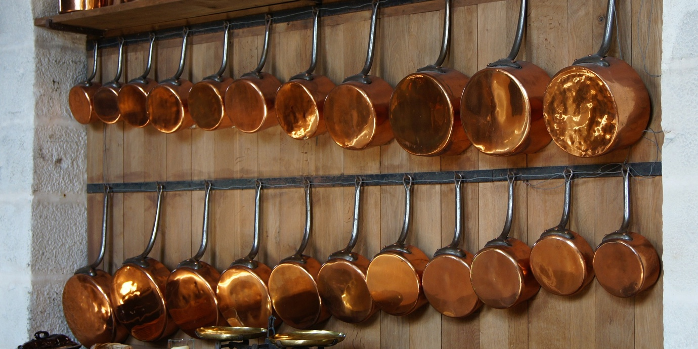
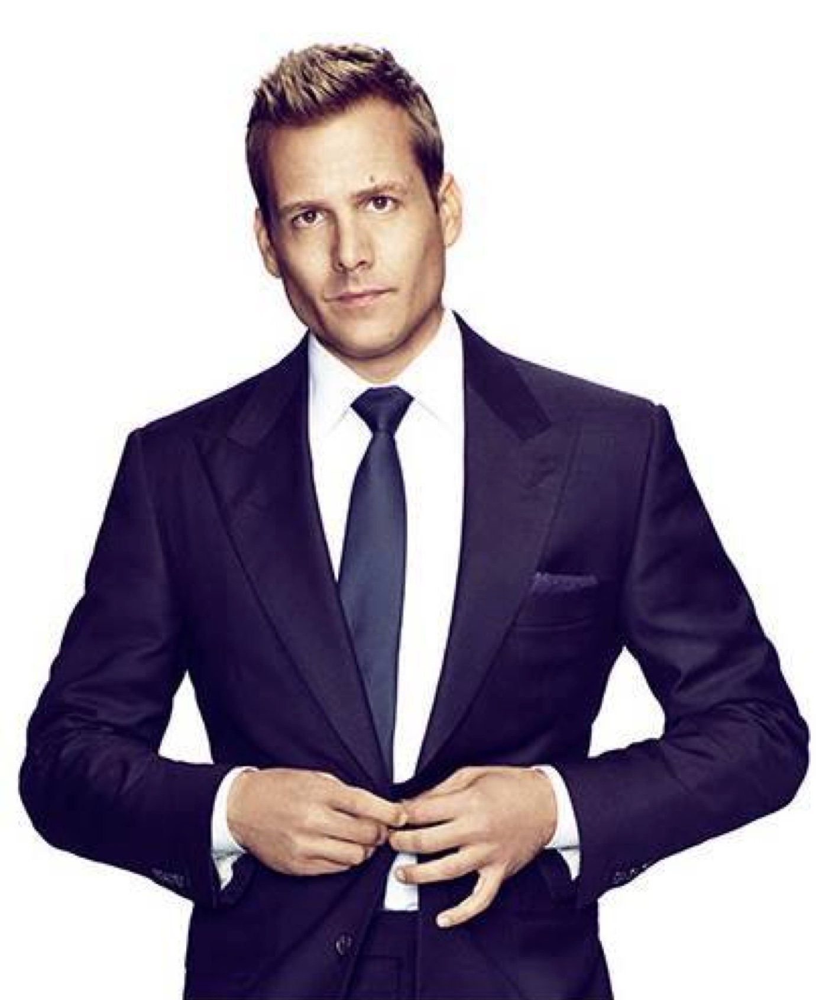

import { Image } from '$components';

How do we know when we're successful?

There's no formal award ceremony denoting success. There's no set quantity of
_stuff_ we can acquire and suddenly we're sure.[^housewives] We can't inherit
our parents' success — only the results of it. We can't buy or steal success,
either.

[^housewives]:
  <Image align="right" className="footnote-image footnote-image--right" >

  

  </Image>

  If you've ever subjected yourself to the horrors of reality television, a few minutes of the petty nonsense on _The Real Housewives of Wherever_ is all the proof we need that having a bunch of fancy crap doesn't correlate with success _at all_.

<Image
  align="right"
  caption="This guy felt like a goddamn champion for all of six seconds."
>

  

</Image>

Worse, what feels like success _now_ can slide out from under us and feel like
stagnation or failure, like a kid who feels so proud of her B+ on the math test
until her parents ask, "Why didn't you get an A?"

The fluidity of success — or, more precisely, of _feeling successful_ — has been
on my mind recently, due mostly to
[some big changes](http://www.2ftat.com/episode/07-change-and-labels/) I'm
navigating.

The _feeling_ of success is a maddening subject: **everyone wants to feel
successful, but how we define and measure what success feels like is infinitely
varied.**

So let's try to pin it down, yeah?

## Objectively, It's Hard to Argue Against Our Success.

At first blush, success doesn't seem hard to nail down. After all, **don't we
have perfectly valid, objective definitions of success?**

Let's do a quick run-down of all that ways I'm _really_ successful, shall we?

* **Nothing tries to eat me.** Ever.
* It's below freezing and snowing outside, but **I live in a heated box with a
  hot beverage and access to an army of delivery drivers.**
* The likelihood that I'll be knocked out of my spot at **the top of the food
  chain** is so low that it would be a legitimate reason to doubt my grasp on
  reality if I started to worry about it.[^bears]
* Thanks to the internet and the [growing ability to do _almost everything_
  remotely](/how-to-become-location-independent), I have
  **virtually unlimited options** for what I do to earn a living. When I wanted
  to make money [building websites while living on an island in Thailand](/one-year-of-world-travel), _that was a perfectly fucking
  realistic option*.
* I had the **freedom to "find my passion"** — and to learn (the hard way) why
  that's a bad idea.[^passion]
* I make more than USD $32,000 per year, so
  [**I'm in the top 1%** of global wealth distribution](http://www.investopedia.com/articles/personal-finance/050615/are-you-top-one-percent-world.asp).

[^bears]:
  “You _don’t_ understand!” The shrill note to his voice rose toward hysterics. The growing crowd watched in embarrassed silence. "There are fucking _bears!_ They can _eat_ us! _How is no one concerned about this?!"_

[^passion]:
  This is something Nate and I talk about at length in [Refocus](https://getrefocus.com), but the short version is this:

  We're told to follow our passion, which will allow us to build a livelihood where we're masters of our craft _and_ happy in our work. But that's not how it works; instead, **we have to work toward mastery — and at first it's a [miserable fucking slog](/why-ideas-fail) — but out of that mastery we gain a deep satisfaction with our work, which _becomes_ happiness and passion.**

Of course, this isn't true for everyone — but since you're reading about feeling
successful, I'll make an educated guess that most of this list applies to you as
well. All of which makes a pretty fucking compelling case that **we were _born_
objectively successful, and will likely stay that way unless something goes
horribly wrong.**

## The Problem With Objective Success

But despite being — y'know — _true_, **measuring success objectively is met with
eye rolling and near-instant dismissal.** When someone interrupts us
mid-complaint-turned-angry-rant to [remind us how lucky we are](/how-to-be-positive), it feels less like a confirmation of our success
and more like a lecture from our parents about "starving kids in Africa" when we
don't want to eat our spinach.[^todd]

[^todd]:
  _Yes_, the world is awful. _Yes_, most people have it worse than I do. _Yes_, I'm really lucky. But also, _fuck off_ with your sanctimonious bullshit, because they just promoted goddamn _Todd_ over me, okay?

A conversation about _why_ this happens inevitably spirals outward and downward
until eventually we land on the greatest conundrum in the human tragedy:
**people don't like _facts_; they like _feelings_.**

All the objective truth around us proves that — simply by being born in the
first world — **we've already won life by any reasonable measures. But since
everyone we know has _also_ won life, it doesn't _feel_ very good.**

What _feels_ good is being a winner among losers. And since the reasonable
criteria for success are "too easy",[^subjective] we had to make up
_unreasonable_ criteria.

[^subjective]:
  Sometimes I hear words come out of my mouth, and I think about what I just said, and I realize how easy it is to become a total shitbag.

  "Look, it's _fine_. Okay? But as far as foie gras goes, it's not blowing me away."

### Success by ownership: there's a pile of shit in my house to prove I'm not a piece of shit.

Five or six years ago I found myself in a fancypants kitchen store looking at
pots and pans. At this point in my life, I cooked meals _maybe_ three times a
year.

Logically, I knew this. _Hey, self,_ I thought with my smart brain, _you don't
need much, here. Grab a decent frying pan and get out of here._

_Now wait a damn minute, here,_ chimed in my Idiot Lizard Brain, _**if you don't
have the best pans money can buy, who will ever fuck you?**_[^lizard-brain]

[^lizard-brain]:
  Did I really believe that the right cookware would get me laid? Logically speaking, of course not. But, as this [black pit of existential despair masquerading as a book](http://amzn.to/2fpyYCJ) will tell you, a concerning amount of consumerism is driven by a vestigial urge to prove we're worth bumping uglies with.

I felt the damp sheen of fear sweat. Felt my lungs shrink and my heart thump and
my mouth go dry. I set down the perfectly-fine frying pan I was holding and
reached for one with a special copper core that was guaranteed to distribute
heat more evenly or something. I imagined perfectly-cooked meals, the booming
success of my imaginary dinner parties, the awed respect in my imaginary guests'
voices as they gasped, "My god — is that the skillet with the special copper
core?"

**When the dust settled, I'd spent over a thousand dollars on a complete set of
pots and pans. I didn't have a thousand dollars to spend; I spread the purchase
across two credit cards.**

<Image
  caption="This is <em>perfect</em> for my once-a-year scrambled eggs!"
  creditLink="https://pixabay.com/en/kitchen-copper-pots-pans-shelf-85270/"
  credit="David Mark"
>

  

</Image>

I probably used the stock pot once. The skillet less than a dozen times. A year
and a half later I [sold it all](/do-more-with-less) for maybe
20% of what I paid for it.[^debt]

[^debt]:
  It was another year before I'd finish paying off my credit cards.

What happened? To be perfectly honest, I have no fucking idea. I just felt that
I _needed_ the nicest set. Or at least the nicest set out of all of my friends.

**How else would everyone who came to my apartment know how _successful_ I
was?**

### Success by comparison: that guy has a thing, so obviously I need the nicer version of that thing.

I was in an upscale bar in Vancouver, BC a couple weeks ago, drinking a $12
cocktail. It's 4pm. Marisa and I are both out of todo items, so we've packed up
and left the coffee shop we'd been working in to kill time until our dinner
reservation. I'd later make an offhand comment about the reasonable price of the
drinks.

(I know. I'm a snob and a bougie asshole. But I need to set the scene for what's
about to happen.)

To my left, a couple guys walk in, fresh from the office. One is rocking a
perfectly tailored three-piece suit, a fantastic trench, and a hat that belonged
on a film noir detective. The other is dressed even better.

<Image
  align="right"
  caption="Sure, you’re rich and successful and fashionable, but you’re still a miserable workaholic."
  creditLink="http://www.usanetwork.com/suits"
  credit="USA Network / Suits"
>

  

</Image>

For the briefest of moments, I am _utterly convinced_ that **unless I have a
nice suit, I'll never be as successful as these guys**, and all the men like
them who show up in _Esquire_ and _James Bond_ and _Mad Men_.

It feels bad.

Which is ridiculous, because I _know_ how good I have it. **The smart part of my
brain has no doubt that I'm happiest where I am right now, but I still sit there
feeling jealous** of this bro with a power tie and a haircut like he's Harvey
fucking Specter.

Later, I spent some time reflecting on exactly how much I like my life. But this
is pretty new for me; **historically I wouldn't have realized I didn't
_actually_ want a suit until after I'd bought it, worn it once, and left it in
my closet for a year.**

## How to Feel Successful: Stop Keeping Score

There's this scene burned into my memory, and whenever I replay it I can feel
the blood rushing to my face: I'm at dinner with the
[Precision Nutrition](http://precisionnutrition.com) team, where **the topic of
conversation wanders onto the idea of success. As the scene opens, I am
haranguing the group.**

I'm feeling slighted because strangers dismiss me as an "average human". This is
_obviously_ an unforgivable offense.

In the course of my rant, I use the phrase, "...and I could _buy and sell that
guy_, and he doesn't even know it!" I mean this in the same douchebag sense that
one might screech, "Don't you know who I _am_?"

Someone at the table remarks, **"You're awfully concerned with how you stack up
to other people."**

I'm humiliated. I sulk about it. I probably push my food around my plate like a
sullen teenager.

It was much later when I realized that **my constant worry over comparison was a
disturbing insight into my contentment — or lack thereof.**

### Who are you measuring against?

**If our self-worth is tied to what other people are capable of, we'll always be
miserable.**

If we're looking to beat ourselves up, someone is more impressive. Natalie
Portman graduated from fucking Harvard at the same time she was making _Garden
State_, for chrissakes; we're not going to top that.

<Image
  align="right"
  caption="We’re all definitely having a better day than this dog."
>

  

</Image>

Or, if we're looking to comfort ourselves, we can always find someone doing
worse. If all we're looking for is someone to make us look good by comparison,
Kanye's latest meltdown[^meltdown] is all we need.

[^meltdown]:
  I assume there was a Kanye meltdown recently.

**Someone will always be better, and someone will always be worse.**

### There are too many variables.

If I were to spend the rest of my life practicing my breakfast sandwich
technique, I could _maybe_ get to the point where someone called my breakfast
sandwiches the best breakfast sandwich in the world. That's success, right? I'd
be the best!

Except someone else is vegetarian, and someone else doesn't eat gluten, and
someone else doesn't like mayonnaise. So to _them_, I'm not the best. And of
course, if I'm asked to make Eggs Benedict, I'm going to be mediocre at
best.[^tire]

[^tire]:
  And if I had to change a tire, I'd die of starvation before I finished.

We all have strengths and weaknesses. We all started at different times, with
different levels of background knowledge. Comparing our success to someone
else's is apples and oranges; it all boils down to opinions and rhetoric in the
end.

Instead, **the only way we can realistically measure our success is to measure
against ourselves — and _only_ ourselves.** Am I better than I was yesterday?
Than I was last year?

_That_ is progress. _That_ is success.

## Success Is Cumulative

If we're only measuring against ourselves, the conversation becomes very
different. We're no longer looking at other people and panicking because they
have things we don't have, or know things we don't know. We're already sure of
it — and that's okay.

Instead, we're looking at what we're working toward, and answering a single
question each day: **Did I do something today to take me closer to where I want
to be?**

**Success means answering "yes" more often than we answer "no".** And that's
_all_ it means.

Success is not the stuff we own, or our bank balances, or any of the other crap
we get fed by advertising or social norms or The American Dream™. Success is
having a target and knowing that you're putting most of your effort toward
hitting that target. And then setting a new target once you've hit the first
one. Because [the target is always moving](/finding-happiness).

Because if we can stop evaluating success as a subjective measure of us vs.
them, we can leave the panic of "keeping up with the Joneses" behind.

And that leaves us free to define success by what makes us _happy_, instead of
what keeps us competitive.
