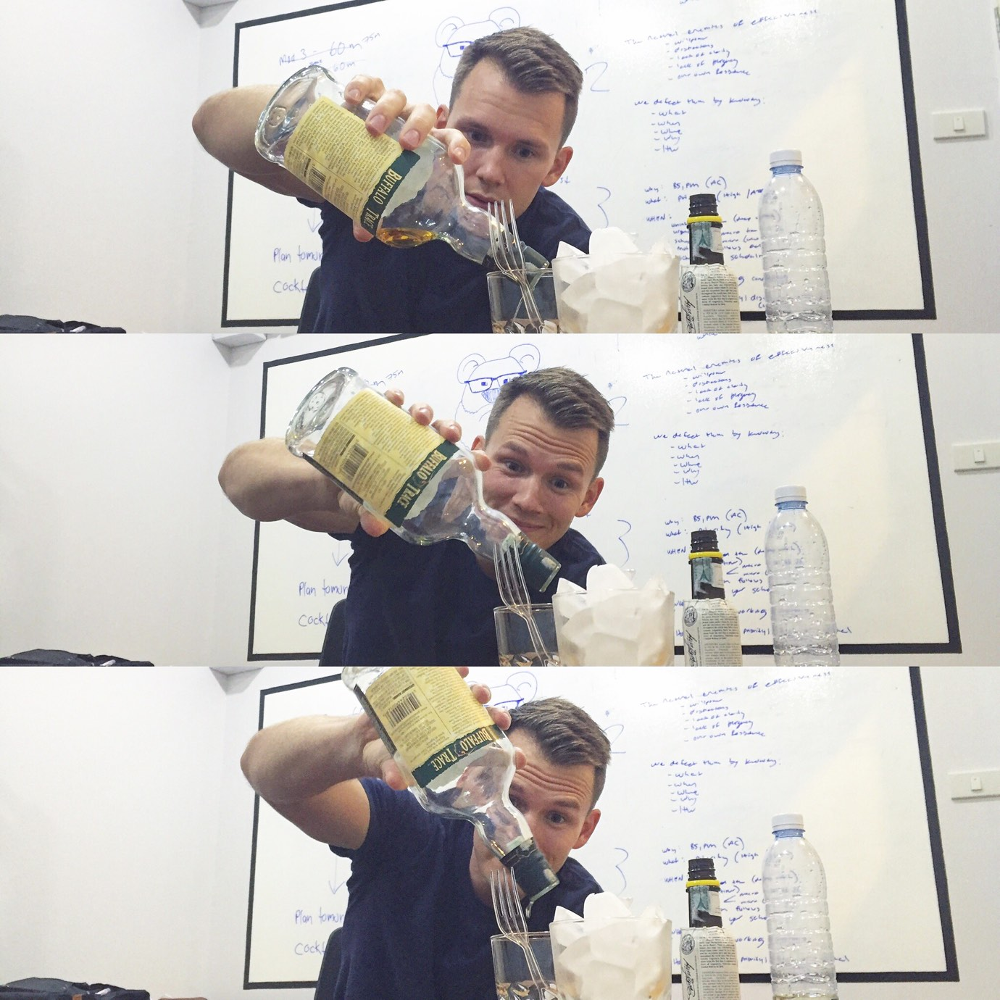
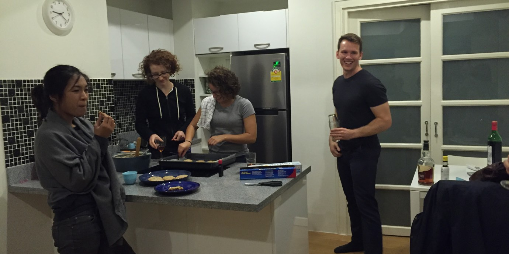
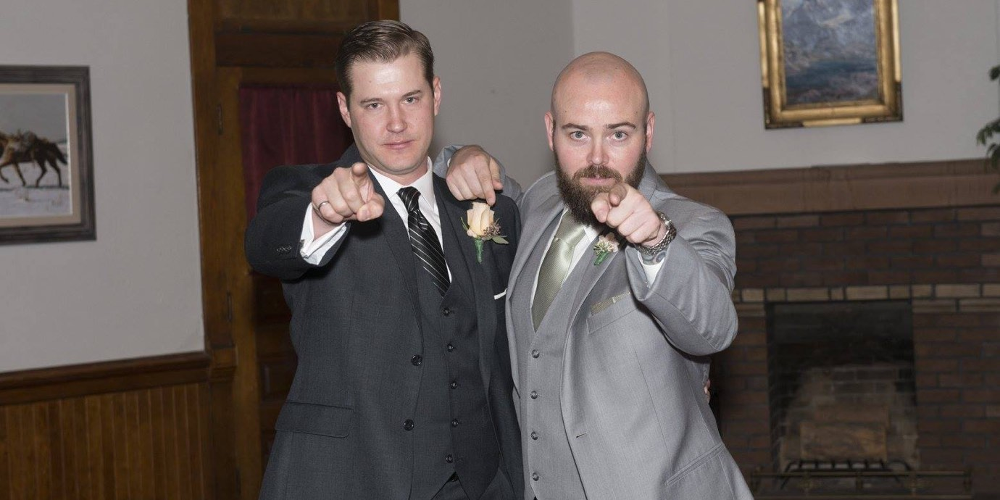
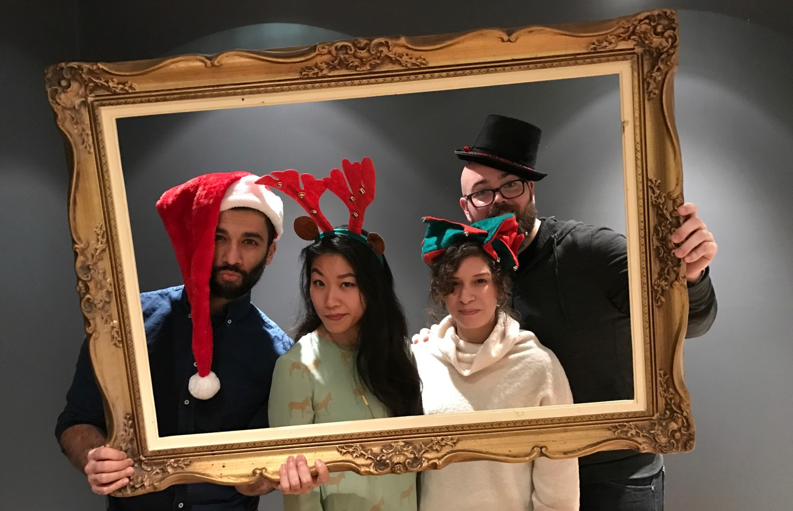
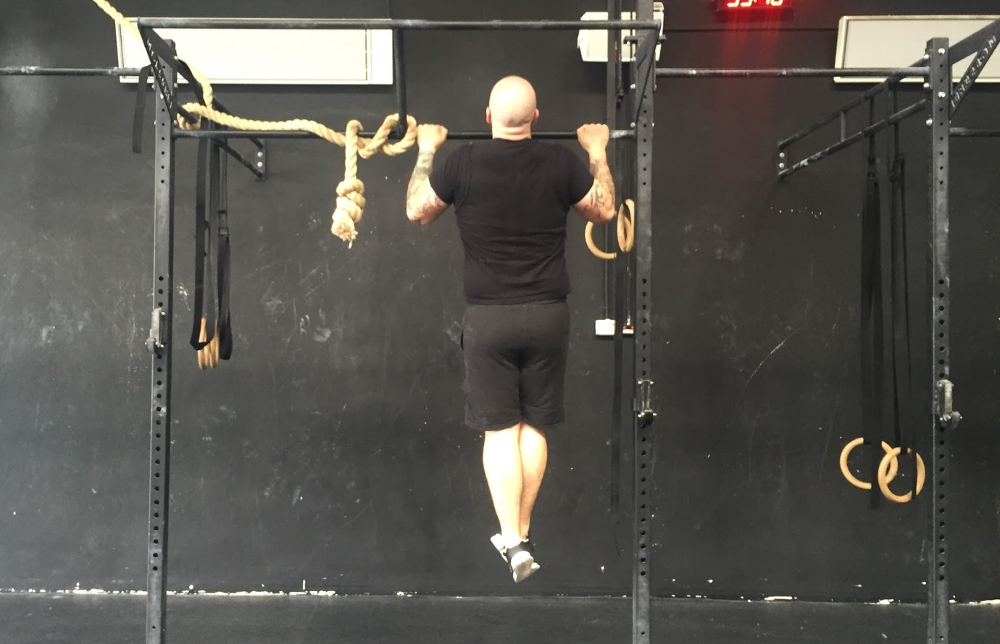
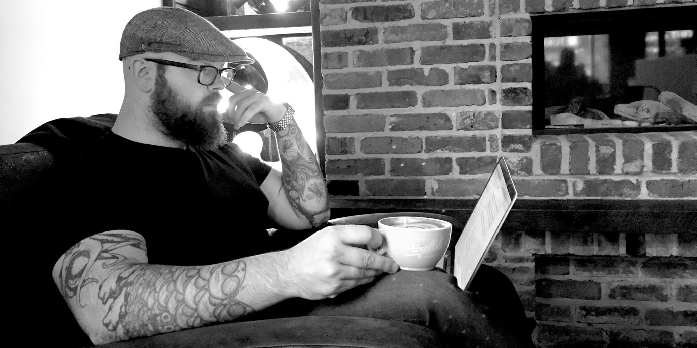

import { Image } from '$components';

I didn't make any New Year's resolutions for 2017.

Honestly, I wasn't really planning to say anything at all about
2016.[^momma-says] Then
[Nate wrote a retrospective](https://nategreen.org/2016-personal-retrospective/),
and I decided that was a good idea.

[^momma-says]:
  If you [can't say something nice](https://www.facebook.com/theoatmeal/photos/a.10150413121115078.628758.220779885077/10158020247080078/?type=3&theater) and all.

A good idea that I intend to steal outright in this post.[^timeline]

[^timeline]:
  "Wait," you might be thinking, "isn't it almost February? Aren't you a little late to the 2017 party?"

  Indeed I am, dear reader. Indeed I am. I'll talk more about this later in the post.

## Why a Retrospective? (Also, What Is a Retrospective?)

<Image
  align="right"
  caption="Nate being smart."
  credit="Jason Lengstorf"
>

  

</Image>

One of the more valuable strategies I picked up from my time as a contractor for
[Precision Nutrition](http://www.precisionnutrition.com/) is the idea of holding
a retrospective[^post-mortem] after each project (or phase of a project).

[^post-mortem]:
  I first heard the concept described as a _post-mortem_, which tickled the dormant emo kid lurking in my subconscious. I pictured black veils and sullen silences set to AFI's _Sing the Sorrow_.

A project retrospective follows a simple-but-effective format that aims to
answer three questions about the given project:

1. What went well?
2. What could have gone better?
3. What will we change to improve our next attempt?

As a business strategy, this is _huge_. It [frames things positively](/how-to-be-positive) and calls out the good parts in addition to the
bad. It gives the team a platform to share negative feedback in a structured,
expected way. And — this is the most important part — it [creates a plan](/effective-project-planning) for getting better.

### Wait. Is this a post about business?

No.[^business] I'm trying to provide context. Calm down, Sparky – I'm getting to
my point.

[^business]:
  But it _could_ be. I've got a [discussion about building great teams](https://github.com/jlengstorf/lengstorf.com/issues/6) that will evolve into a post soon(-ish). I'd love to get your input — I _am_ a TEAM PLAYER after all. Ha! Eh? Anyone?

### How does this apply to our personal lives?

Nate said this well, so I'm just copy-pasting his words here:

> If we don’t learn from our past, we we won’t be able to identify our biggest
> opportunities to make life better. Which means we’ll likely suffer through the
> same situations and thought-patterns again and again.
>
> **Nate Green,
> [_My 2016 Personal Retrospective (And 2017 Action Plan)_](https://nategreen.org/2016-personal-retrospective/)**

People say things like "learn from your past" all the time. But this is one of
those vaguely idea-shaped truisms: it's cute and inspirational and all, but it
isn't really _useful_ without a plan.

**A retrospective creates a plan for learning from the past.**

## My 2016 Retrospective

Overall, 2016 was a great year for me. My personal and professional lives grew
in ways I'm proud of, I made choices I'm happy to defend, and I can't think of
anything I regret.

However, everything I just said is fluffy, and not particularly useful. So let's
dig into specifics and see if I can **come up with a plan to make 2017 a great
year** — even if that plan ends up being, "Just keep doing what you're doing."

<Image
  caption="Homemade dinner and cookies with Gai, Richelle, Marisa, and Nate in Chiang Mai, January 2016"
  credit="Jason Lengstorf"
>

  

</Image>

### What went well in 2016?

I had a lot of things to be happy about in 2016:

* [Marisa](https://marisamorby.com) and I continued [our traveling
  adventures](/one-year-of-world-travel) for the second year.
* Nate and I released an
  [online workshop/course for gaining better focus and productivity](https://getrefocus.com/).
  We also recorded a [half-dozen episodes of 2FTAT](http://www.2ftat.com/).
* I launched a [code blog](https://code.lengstorf.com) to share (far geekier)
  content about building better software.
* With help from great people like
  [Mackenzie Child](https://www.youtube.com/user/mackenziechild), I learned a
  bit about making videos and launched a
  [YouTube channel for nerds](https://www.youtube.com/lengstorf).
* I started cooking again after years of almost exclusively eating out (or
  buying pre-made meals).
* With help from the incredible people on my newsletter list, I went on dozens
  of Small Adventures.[^small-adventures]
* I was more consistent in the gym than I've ever been in my life.

[^small-adventures]:
  If you're _not_ on my newsletter list, I ran a series of emails where I talked about Small Adventures: quick, inexpensive things we can all do to switch things up and add a little adventure back into our lives. (Also, [consider getting on my newsletter list so you don't miss fun stuff like this](/about). You'll get a free guide with three tips for being happier, too.)

  If you _are_ on my newsletter list, I'm still working on something cool that combines my ideas with the dozens of incredible ideas you sent me — stay tuned.

### What could have gone better in 2016?

Even though I don't have regrets about last year, I _do_ see some room for
improvement. So let's run through a quick list of my shortcomings, shall we?

#### I did a bad job of keeping up with friends.

If something's not at the front of my mind, I tend to forget about it entirely.
And while this is [great for productivity](/scheduling-maximum-productivity), it's _terrible_ for keeping up with
people I don't get to see very often.

<Image
  align="right"
  caption="I was in Scotty’s wedding, and we talk <em>maybe</em> once a year."
>

  

</Image>

Left unattended, I can go months without calling my parents. _Years_ without
talking to people I consider close friends.

And while part of that results from a (typically mutual) disinterest in forcing
a catch-up call "just because", a good deal of the blame falls on me for
straight-up _never_ thinking about things that aren't in front of my face —
whether it's a project I forgot I was working on, or a person I really like but
haven't thought about in a while.

Whether or not anyone but me has noticed, I don't like this.

#### I wasn't proactive about public speaking.

In the years before I [started traveling](/remote-work-travel),
I was constantly speaking at conferences. For a couple years I was averaging a
talk every month or so.

After leaving, though, that number plummeted: I gave maybe three talks in 2015,
and only one or two in 2016.

<blockquote class="twitter-tweet" data-lang="en">
How to make it (from anywhere) by <a href="https://twitter.com/jlengstorf">@jlengstorf</a> in <a href="https://twitter.com/PHPSevilla">@PHPSevilla</a> <a href="https://twitter.com/hashtag/PHPSevilla?src=hash">#PHPSevilla</a> <a href="https://twitter.com/workINcompany">@workINcompany</a> <a href="https://t.co/9r1r2Nr9Xk">pic.twitter.com/9r1r2Nr9Xk</a>
&mdash; Juan Luis Garcia (@JuanluGarciaB) <a href="https://twitter.com/JuanluGarciaB/status/745672145490022400">June 22, 2016</a></blockquote>

That bums me out, because I enjoy challenging myself to learn something well
enough to teach it. And I _really_ enjoy watching the light come on in someone's
eyes when they comprehend a new idea for the first time.

There were events everywhere, so I _could_ have made it work. I just... didn't.

#### I fell out of my writing habit.

In 2015 I wrote a whole post about [creating a writing routine](/how-to-stay-consistent). The short version is that I was
keeping myself consistent with writing by doing it first thing in the morning,
before the gym. Part of that included leaving my phone away from the bed to
avoid the temptation to waste time on social media or games.

Sometime last year, I broke this routine. The phone has been showing up in bed
in the mornings, and my 90 minutes or writing time has degraded to 45 minutes of
wasted phone time.

As a result, my publishing frequency has gone _way_ down. And since I'm not
writing every day, a lot of posts die as drafts because I either argue myself
out of the point I was trying to make[^arguing] or lose the thread of the post
and end up scrapping it.

[^arguing]:
  I like to play Devil's Advocate with everyone. Including myself. This means that, given sufficient time, I will successfully overthink any point I'm trying to make until I've taken the opposite stance.

This is bullshit, and I know it.

### What will I work to improve in 2017?

After going through the process of complaining about 2016, there's a critical
step left to make this productive: I need to make a plan to keep the good things
good, and improve on the things I wasn't so happy with.

<Image
  caption="Sol and Calla pulled this photo off way better than Marisa and me."
  creditLink="http://verk.space"
  credit="Verkspace"
>

  

</Image>

#### I will dedicate time to keeping up with the people I care about.

Last month I was in Toronto, where I watched [Sol Orwell](http://www.sjo.com/)
network like a fucking magician.[^cookielife] He showed me his spreadsheet for
organizing an upcoming charity event, and I realized how much effort goes into
keeping up a strong network.

[^cookielife]:
  I hung out with Sol three times while we were in Toronto. On two of those occasions, he had received a shipment of cookies from a stranger (or at least someone he only knew from the internet) — all because he does a _really_ good job of talking to people, learning what they're about, and connecting them with other people.

I should know this already; I used to watch Nate go _way_ out of his way to send
a small-but-thoughtful gift to someone he'd just met, or dedicate his time to
bringing together a few people for lunch who stood to benefit from knowing each
other.

Both Sol and Nate have built incredible networks. Nate's entire livelihood is
built on the back of his outstanding networking skills.[^me-too]

[^me-too]:
  And, if we're being totally honest here, a pretty decent portion of _my_ livelihood has roots in Nate being roughly 1,000,000x better at networking than I am.

So in 2017, I'm actually going to schedule time for keeping up with people. And
not just for professional networking; I'm going to make sure I've set aside time
to call my mom, or send a card to my grandparents, or follow up with my friend
who just got a new job.

I don't need to be a networking genius like Nate or Sol, but I definitely need
to _stop_ being an out-of-sight-out-of-mind jerk like I have been.

#### I will submit proposals so I'm speaking at one conference per quarter minimum.

It's important to me on both a professional and personal level to continue
speaking.

Professionally, speaking gigs help me increase my value to the companies that
want to work with me, and it establishes me as an expert on a variety of
subjects. This gives me more freedom to negotiate on rates and specifics — such
as [working remotely](/how-to-become-location-independent).

Personally, it feels really good to know that someone is going to have a better
career — and hopefully, a [better life](/work-happier) — because
of something I helped them understand. I may not be changing to world, but for a
small handful of people, I have the chance to spark an idea or offer a little
insight that can help them get where they want to go.

It's why I write, and it's why I speak. Or at least, it's why I _want_ to speak.

Most conferences open up a request for proposals, where people can submit talk
ideas.[^rfps] I need to be more proactive about looking for these and submitting
ideas if I want to continue speaking regularly.

[^rfps]:
  If you're interested in getting into speaking, Lanyrd has a [round-up of open calls for proposals](http://lanyrd.com/calls/), and [PaperCall](https://www.papercall.io/cfps) is a tool used by conferences looking for speakers. You can also check out [We Are All Awesome](http://weareallaweso.me/) for resources to help you build confidence and get your proposals accepted.

<Image
  caption="My favorite gyms are more or less extremely dangerous playgrounds."
  creditLink="https://nategreen.org"
  credit="Nate Green"
>

  

</Image>

#### I will stay consistent in the gym, even though things are going to be a little different now.

For the last two years I've been really consistent in the gym. At _least_ twice
and usually three times a week, Marisa and I have been in the gym. We worked
with great coaches to build a remote program, including remote programs from
[Chris Bathke](http://www.elementalfitnesslab.com/),
[Precision Nutrition](http://www.precisionnutrition.com/) and
[Craig Weller](http://trainrogue.com/about/coaches/). I'm in better shape now
than I've probably _ever_ been in before — I can do _pull-ups_ now.[^pullups]

[^pullups]:
  This is a new development for me. I was always the kid in gym class who just hung on the bar and looked hurt that I was expected to do anything.

However, we had an advantage: we were halfway around the world, so if we felt
like sleeping in and working out at 10:30 am, that was okay.

Now we're in Austin, working regular business hours. We have to be at the gym by
six most mornings or we won't have time to work out.

This is where I've struggled in the past: when things get busy, my health slips
first.

So I'm not going to do that. This year, I'm going to make sure I continue with
my good habit of hitting the gym three or more times a week.[^so-far]

[^so-far]:
  A month in, this has worked out well. Early mornings suck, but I've found I tend to sleep better, have more energy, and just generally feel less like a damp sack of shit when I make it to the gym early.

#### I will make time to continue working on videos and tutorials for my code blog.

Writing a blog post like this one is therapeutic; I have a thought, wrestle with
it, and flesh it out in a few words.[^few-words] The process is simple: write
until something that makes sense is on the page.

[^few-words]:
  Ha. I say "few words" as if I've ever written anything shorter than 2,000 words.

Code posts, by contrast, are _fucking difficult_. There's research, testing,
demo applications, and rounds of feedback — and _then_ you write the post. And
after that, you record the video, edit it, and post it on YouTube.

A blog post for this site might take me two hours if I'm fucking around, or
having a hard time articulating myself; a code post will easily take days.

So I can't just sit down and throw one together. I need to [~~make~~ _find_
time](/find-time) to work on these if I plan to release more
than two or three a year.

And that's exactly what I plan to do: I want to spend a few hours every week
working on a code tutorial.[^nerds]

[^nerds]:
  Fellow nerds: I'm looking for ideas, so [open issues for topics that interest you](https://github.com/jlengstorf/code.lengstorf.com/issues).

<Image
  caption="As you can tell by my furious typing, I was writing <em>so hard</em> in this photo."
  creditLink="https://marisamorby.com"
  credit="Marisa Morby"
>

  

</Image>

#### I will replace my morning phone habit with writing (again).

I don't really remember how this happened — I was kicking ass with waking up
phoneless and writing and then... I don't know. We moved somewhere that changed
my schedule? I was hungover one day?

Whatever it was, I fucked up and started bringing my phone into the bed after I
woke up. So my _Boom Beach_ ranking went up, but my writing output tanked.

(For example, I started this post on January 4. Three weeks later and I'm _just
now_ getting back to it. Like a slacker.)

I didn't notice at first. That's how bad habits tend to work: we don't notice
the slide; we just wake up one day and realize, _Holy shit, I've made a huge
mistake._

**But noticing the problem is the first step toward fixing it.** So as long as I
take this as an opportunity to get a little better,[^again] I can feel confident
that I'm making progress.

[^again]:
  Even if I'm getting a little better _again_.

To that end, I'm going to leave my phone outside the bedroom _at all times_, and
put my computer next to my coffee stuff. If I Make the Right Thing the Easy
Thing™, I'll have a much better chance of succeeding.

### Making it real: how I'll turn these thoughts into action steps.

Based on the ideas I've just listed, I need to make a list of todo items that I
can follow every day. I'll call it **Jason's List of Habits for 2017:**

* **I will schedule two hours every week to connect with friends, family, and my
  professional network.**
* **I will submit at least one talk idea for every conference that fits my
  calendar.**
* **I will stay consistent with my existing gym routine of 3–4 mornings per
  week.**
* **I will schedule 2–3 hours each week to make progress on writing and/or
  recording a code tutorial.**
* **I will resume my habit of writing for 30 minutes minimum before looking at
  my phone in the morning.**

## Your Turn: Do a 2016 (+ January) Retrospective

Even if you've already made your New Year's resolutions,[^broken] **take 15
minutes to do your own retrospective.** Remember: you're asking and answering
three questions about the last year of your life.

[^broken]:
  And even if you've already _broken_ those resolutions.

1. What went well?
2. What could have gone better?
3. What will I work to improve in 2017?

**Share one or two of your answers in the comments.** Here's to continuous
improvement — and our best year yet!
