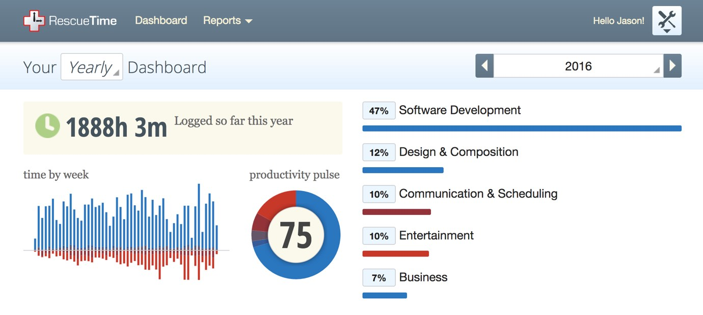

import { Image, Tweetable } from '$components';

For the last two years, [Marisa](https://marisamorby.com) and I have been living
outside the United States, staying exclusively in Airbnbs. In strangers' homes.

When we first set off on our [grand travel and remote work experiment](/remote-work-travel), we had several hypotheses about how things would
go. Here's a quick recap of what we expected:

1. **We don't have to wait until we retire to start traveling.**
2. **It's possible to be productive during sustained periods of travel.**
3. **It's just as cheap (or cheaper) to live abroad.**
4. **It's healthier to live abroad than it is to live in the United States.**
5. **Living abroad for extended periods of time means _huge_ tax breaks.**

## Two Years In: Were My Hypotheses Correct?

When I [boarded a one-way flight to Milan](/leaving) at the end
of 2014, I had no idea whether or not I was right about _any_ of these
hypotheses. Sure, I had my gut feelings and I'd done my research, but without
putting it into practice, I was still making educated guesses at best.

<Tweetable quote="Knowing a thing and doing a thing are two very different things." retweetId="829004323338190848" />

Now it's been two years, and I've been testing these hypotheses the whole time.
So... was I right?

<Image
  caption="Thanks to world travel, Marisa and I have taken the exact same selfie in front of dozens of landmarks around the world!"
  credit="Jason Lengstorf"
>

  

</Image>

### 1. Is it possible to travel extensively before retirement?

**tl;dr:** _Abso-fucking-lutely._

There are only two prerequisites for long-term travel:

1. a willingness to spend an extended period of time exploring the world, and
2. a stable source of income that never (or rarely) requires physical presence

If you _don't_ have a location-independent source of income, it's easy to throw
your hands up and say, "Well, that works for _programmers_, but not for [INSERT
PROFESSION HERE] like me."

**Bullshit.**[^probably]

[^probably]:
    Hold your fucking horses before you jump down my throat here — I'm getting to the fine print. Don't begrudge a guy his flair for the dramatic, okay?

While there are obvious exceptions — hard skills like carpentry and transmission
repair don't travel well — a huge number of jobs in the western world have moved
online.

In my travels I've met trademark lawyers, stock brokers, accountants,
journalists, customer service reps, marriage counselors, and real estate
consultants; if your job is performed on a computer, it's _extremely_ plausible
that [you can become a remote worker](/how-to-become-location-independent).

However, there is a caveat to all this: **you need to have your network in place
_first_.**

<Image
  align="right"
  caption="My network meant I always had contracts — even in Chiang Mai."
  creditLink="https://marisamorby.com"
  credit="Marisa Morby"
>

  

</Image>

When I left, I had already been in my industry for a decade, and I have an
amazing group of previous clients who have always sent interesting opportunities
my way. I've also put a fair amount of time into meeting other people in my
industry and building a professional network.

My network meant I could rely on my [sales pipeline staying full](/how-to-sell-without-selling) when my existing contracts wrapped up. It
meant I had people who could send me leads if I needed work. Most of all, it
meant my income was _stable_.

#### Freelancers: you need a network first.

Marisa, however, had just switched industries when we left. She realized that
most of what she'd been doing in her role as a human resources director crossed
over with user experience, and she was _way_ more interested in working in user
experience.

When we started traveling, she was trying to _build_ her network. **It's not
impossible to create a network while traveling — she pulled it off — but it _is_
way more difficult.** There were a few tough months where she didn't have
anything in her pipeline and wasn't sure where her next contract would come
from. There were times she felt hopeless because no one was responding to her
cold emails. There were a crying jags in the bathtub. And since we were in
Vietnam or wherever, she couldn't just roll down the street to a business meetup
and use her trademark combination of giant sexy brain + irresistible curly
cuteness to win clients over in person.

<Image
  align="right"
  caption="Could <em>you</em> resist this much charm?"
  credit="Jason Lengstorf"
>

  

</Image>

So if you aren't already established with a network, **spend time building your
network first**: go to meetups, attend conferences, meet people, and create a
solid pipeline. It may take a year, but when you're in Thailand and your current
contract ends, a network means the difference between dropping a few lines to
let people convince you why you should work with them, and trying to decide
exactly how close you're willing to get to broke before you pull the rip-cord
and head home.

### 2. Is it hard to stay productive while traveling constantly?

I closed my eyes and let the _déjà vu_ wash over me. I was having _this_
conversation. Again.

"I'd never get _anything_ done," she said with a self-deprecating chuckle. "I'd
be too distracted by the sand and the ocean."

In an alternate reality where my filter is all the way broken,[^filter] I clunk
my beer down and turn to face her. "Listen," I snap, "if all it takes to keep
you from getting your shit taken care of is a beach, then I'd say the beach is
the _least_ of your fucking problems."

[^filter]:
  In _this_ reality, my filter is only mostly broken.

But I'm a coward, so instead I just nod and smile and look for a way to politely
exit the conversation.

Here's the thing: **staying productive on the road is _easy_.** Once you [get
your productivity habits sorted](/productivity-habits), hitting
"office-standard" productivity goals for an eight-hour day takes _at most_ six
hours. Probably four.[^time]

[^time]:
  The industry's dirty little secret is that [working longer hours makes us less productive](/overtime-hurts-productivity), and the constant distractions in an office add up to [huge amounts of wasted time while working](/scheduling-maximum-productivity).

**For the last two years I've averaged roughly 37 hours a week on a computer —
that's _including_ Netflix time – and my productivity sits at 75%[^email]
overall.**

<Image
  caption="If you're not already using RescueTime, <a href='https://www.rescuetime.com/rp/jlengstorf'>go download it now</a>. Knowing where your time goes is the first step to killer productivity."
  creditLink="https://www.rescuetime.com/rp/jlengstorf"
  credit="RescueTime"
>

  

</Image>

[^email]:
  I categorize email, chat, and all meetings as unproductive time. That accounts for an additional 10% of my screen time in 2016.

#### However, productivity goes to hell if you travel too fast.

A few times over the last couple years we decided to make "quick trips". A long
weekend in Berlin; a couple days in Budapest; five days in Istanbul. Had we
looked at these trips as vacations, things would have been fine. But we didn't —
we thought we'd be able to get things done on these short trips.

Fast travel makes productivity _hard_. If you're in a place for a few months,
there's time for both work and seeing the city. But **when your time is
restricted, you have to start making choices between a thing you want to do in
the city and a thing you need to do for work — and work typically loses.**

<Image
  caption="On our five-day trip to Istanbul, we accomplished <em>nothing</em> — except learning that Marisa doesn’t like Turkish coffee."
  credit="Jason Lengstorf"
>

  

</Image>

Everyone will have a different [Goldilocks Zone](/goldilocks-zone-avoid-burnout) for balancing experience, productivity, and
exploration,[^goldilocks-zone] but it's important not to get antsy and try to
see everything in a hurry. Working and traveling is a way to _avoid_
high-stress, high-speed vacations; don't forget to take advantage of that
freedom to maximize both your productivity _and_ [your level of
satisfaction](/baseline) about traveling.

[^goldilocks-zone]:
  For me, the Goldilocks Zone is about two months. If I stay longer, I start to feel listless and catch myself settling into the kinds of routines that spurred me to leave in the first place.

  A month can work, but I usually feel like I've just started to make friends and know the neighborhood at that point. For the last year Marisa and I have aimed for about 6–8 weeks in a location, and we've been happy with that result.

### 3. How much does it actually cost to travel the world for two years?

When I left the United States in 2014, my only experience of traveling abroad
was a short trip with [Nate](/best-friends) to Belgium, the
Netherlands, and the UK.

That trip nearly bankrupted me.

Over the course of ten days or so, I managed to spend every penny I had (and
quite a few that I didn't). After Nate left a couple days early for a work
thing[^borrow] I was forced to ration food for the last 36 hours because I'd
maxed out all my credit cards and only had about €8 or so to my name.

[^borrow]:
  Which meant I couldn't borrow any additional money from him.

My experience isn't uncommon. My dad always grumbles about travel because it
costs too much. Friends are always putting off vacations because they can't
afford them.

So naturally, most of us — myself included until mid-2015 or so — immediately
assume that long-term travel will be _expensive_. Prohibitively so.

But that's simply not the case. For most people living in the United States,
[long-term travel is significantly cheaper than our current living costs](/cost-of-living-remotely).

#### My cost-of-living for 2016–2017: $54.80/day

<Image
  align="right"
  caption="This Airbnb cost us $874 for a month, including utilities, wifi, a gym, and weekly cleaning."
  credit="Jason Lengtorf"
>

  

</Image>

For the last two years, I've averaged $1,666.88 per month to live. And that's
not just rent; that's rent _plus_ utilities _plus_ cable and internet _plus_
electric _plus_ property taxes or hotel taxes or whatever taxes.

In that time, I've lived in a dozen or so different countries, ranging from
oceanside resorts in Koh Samui (~$22/day) to a courtyard apartment in Rome
(~$79/day) to a kitschy apartment in the heart of Zagreb (~$34/day).

For reference, my cost of living in Portland was ~$88/day.[^portland]

[^portland]:
  My rent was on the higher side in Portland at $1,950/month — I was happy to pay a little more for a nice place in a great location. However, it's worth noting that most of the Airbnbs we were renting for less were just as nice (and in some cases nicer) than my Belmont loft in Portland.

#### It's also cheaper to eat (and do other stuff, too).

Beyond just the cost of rent and utilities and other living expenses, we also
saved a _ton_ on food. Most of my disposable income goes toward eating well, so
this was not an insignificant savings.

For example, in Vietnam we regularly ate banh mi sandwiches that would cost
about $10 in the United States for less than VND 25,000 — which is roughly a
U.S. dollar. A _fancy_ meal — a multi-course affair for two — would cost _maybe_
$20. **Most of the time Marisa and I both ate for less than $5 total.**

<Image
  caption="This is enough food to fill me up, and it cost $2.50."
  credit="Jason Lengstorf"
>

  

</Image>

Thailand was astonishingly cheap as well.[^thai-food] Ditto Croatia.[^split]

[^thai-food]:
  One of our favorite meals was marinated pork grilled in the back of a truck. It cost 50 baht (USD $1.41). When we felt like eating a Western breakfast, we went to the "expensive" brunch place — a restaurant that could have been plucked off any hipster street in a U.S. city called Rustic & Blue — and paid 200 baht (USD $5.65) for eggs Benedict or a breakfast sandwich that held up to many restaurants at home.

[^split]:
  In Split, Croatia, Marisa and I sat down to a five-course meal at one of the most expensive restaurants in the city. We ordered two drinks each. Including a fairly large tip — especially considering the European standard is 10% — the whole meal cost USD $125. (That's not exactly cheap, but for comparison, a meal of this quality in the U.S. would _easily_ run $400+.)

  Most meals in Croatia were closer to 25 kuna (USD $3.58).

The food wasn't an anomaly, either. Our gym memberships, mobile phone service,
and other day-to-day expenses all went down. The United States is _expensive_,
y’all.

#### Plus you can't buy new shit.

Probably the biggest impact on my spending was the fact that I couldn't store
anything. If I bought something, I either had to pack it every couple months or
leave it behind when we moved.

So my impulse purchasing dropped to near-zero.

### 4. Is it actually healthier to live outside the United States?

This is going to be a loaded question, I guess; it depends on who you are and
where you go.[^france]

[^france]:
  If you go to France and don't walk at all and eat croissants and cheese all day, you probably aren't doing your body any favors. There's a reason no one in California has started a fad diet based on the French way of eating.

  Then again, if you go to France and _don't_ eat croissants and cheese all day, I'm not sure you and I have much to talk about.

But for Marisa and me? _Yes._ Marisa is in the best shape of her life. I lost a
lot of weight without doing anything that would be considered a diet.

<Image
  caption="A picnic halfway up a mountain in the Slovenian Alps. Matej said it was a hike for old people; I almost died."
  creditLink="https://medium.com/@richelledevoe"
  credit="Richelle Devoe"
>

  

</Image>

A few things happened once Marisa and I left:

1. **We started walking _way_ more.** In 2016 I averaged 7,500 steps a day —
   which isn't all that much, honestly, but it's a hell of a lot more walking
   than I did before I left.

2. **The amount of processed food we ate dropped significantly.** This wasn't a
   conscious effort; there's just less processed food in a lot of the places we
   visited. We tried to eat local food, which meant there was a lot less bread
   and cheese, and a whole lot more veggies and fruit.

3. **We made it to the gym regularly.** This was much easier to do when there
   was no commute or early meetings to worry about; we weren't able to claim
   that we were "too busy" to make it to the gym.[^habit]

[^habit]:
  Now that we've built the habit, it's much easier to keep it now that we're on more of a schedule. But it still takes effort; that's why staying consistent in the gym is [part of my 2017 action plan](/2016-personal-retrospective).

It's also worth noting that portion sizes were notably smaller. Our typical
approach to a restaurant was to order three entrees: Marisa would eat all of one
and a few bites of the second, and I'd eat the rest.[^vegas]

[^vegas]:
  **Portion sizes in the United States are insane.** I spoke at a conference in Las Vegas in 2015, after we'd picked up the three-entree habit, and ordered three entrees in a diner — an egg dish each, with pancakes to share — and the waitress couldn't fit our order on the table.

  I'd never really thought about portion sizes in the U.S. being all that big, but **y’all they're fucking huge.**

In Japan, both Marisa and I noticed that we just plain _felt_ better eating
Japanese food. Western diets have a lot of bread and cheese, which — despite
being delicious[^food-group] — tends to make me feel gross and bloaty. Which I
didn't realize until I _wasn't_ eating bread and cheese all the time. Which
never would have happened if I hadn't left the U.S., because there's so much
bread and cheese available.[^back]

[^food-group]:
  I truly believe that, were it possible, I'd be perfectly happy eating nothing but cheese for the rest of my life.

[^back]:
  And let me be clear: I am by no means advocating a diet that doesn't include bread and cheese. Hell, I ate a sandwich an hour ago. I'm just saying that I'm now aware of the consequences of my high-cheese diet, and I'm choosing to accept them.

### 5. Are the tax breaks for long-term travelers real? And how much is actually saved?

<Image
  align="right"
  creditLink="http://www.hbo.com/silicon-valley"
  credit="HBO / Silicon Valley"
>

  

</Image>

This was the big one: my research and the advice from a couple accountants
seemed to imply that **anyone living outside the U.S. for 330 days or more
wouldn't pay federal income taxes** because of something called the
[Foreign Earned Income Exclusion](https://www.irs.gov/individuals/international-taxpayers/foreign-earned-income-exclusion).
And since I wouldn't be working in the countries I was living in, I used tourist
visas — which means I don't pay taxes to the country (except sales taxes).

**This means roughly 25% of my _gross_ income that usually goes to taxes goes
straight to my savings instead.**[^tax-note]

[^tax-note]:
  Keep in mind that you still have to pay Social Security and Medicare, which is roughly 15%. And each state has different rules about what you do and don't owe, so do your research — or move to one of the [states without income tax](https://ttlc.intuit.com/questions/1901267-which-states-don-t-have-income-tax) before leaving.

#### Is this legal?

**As far as I can tell, yes.**

How visas work for people in my situation is a legislative grey area. The laws
about working in foreign countries are in place to protect the local economies:
if I come in, take a job locally (which takes money out of the local economy),
and don't pay taxes, I'm creating a leak that could become a big problem.
However, if my job is in the United States, I'm not taking any money out of the
local economy — I'm only putting money into it. This is what tourists do, and in
many countries tourism is a large portion of the economy.

There are a few ways to interpret what a tourist visa allows, but in the case of
remote work, the rules are poorly defined: if I sit down in a coffee shop in
Thailand and working on a U.S.-based website that pays my U.S.-based company, am
I working _in_ Thailand? And if so, does that mean that everyone who goes on
vacation and checks their work email is also violating their tourist visa?

My feeling here is that remote work while traveling is still falling through the
cracks because a very small number of people take advantage of it. I'm willing
to bet that there _will_ someday be laws passed to cover this edge case, but for
now — especially considering the lower cost of living — **world travel is easily
the world's greatest savings plan.**

#### Okay, fine, but did it work?

It sure did. For 2015, I kept 25% of my gross income. The IRS still has time to
audit me, but my returns were all accepted without complaint, and I was able to
hold onto a significant portion of my income.

I'll be filing for the <abbr title="Foreign Earned Income Exclusion">FEIE</abbr>
again on my 2016 taxes, and I expect similar savings.

<Image
  caption="Barcelona, June 2016. No complaints."
  creditLink="http://www.laboutiquedelaluz.com/"
  credit="La Boutique de la Luz"
>

  

</Image>

## What I Know About World Travel From Two Years Living & Working Remotely

I had five hypotheses about travel, and all five held up to real-world testing.

1. **It's absolutely possible to travel extensively before retirement.** In
   fact, it's a really smart move to help save for your future if you've got a
   steady source of remote income.

2. **Staying productive is just as easy — probably easier — while traveling.**
   Being halfway around the world is a great way to limit your meetings and
   focus.

3. **The cost of living in Airbnbs around the world is significantly cheaper
   than paying a lease or mortgage in the United States.** You'll pay less in
   rent, utilities, and insurance. (And food, and entertainment, and...)

4. **Staying healthy is easier outside the United States.** Especially in Asia.

5. **There are enormous tax savings for long-term travelers.** 25% of your gross
   income stays in your pocket if you travel for 330 days a year.

There are a lot of reasons not to travel. Some of them are valid. Some of them
are excuses. Ultimately, whether or not travel is a good idea for you is going
to come down to you.

But if this food-loving, wanderlusting, turbonerding, friendly old bear can make
a suggestion: if you fantasize about traveling, lock down [your remote work
strategy](/remote-work-course) and _buy the fucking ticket._

I promise you this: you'll never regret taking the trip; you might regret _not_
taking it.
