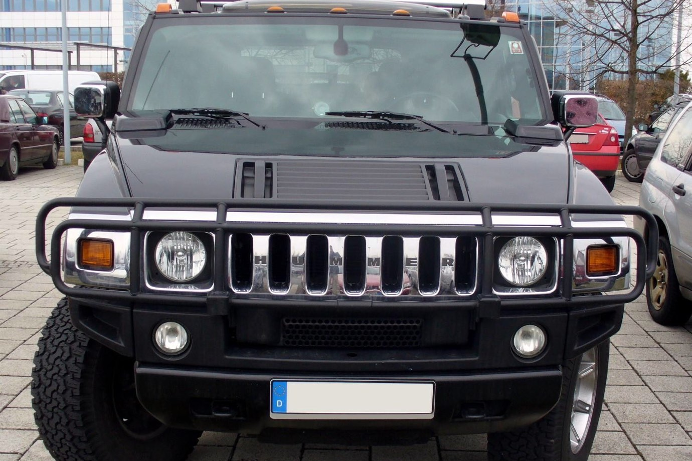
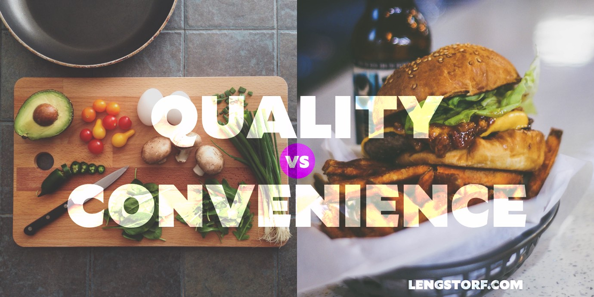
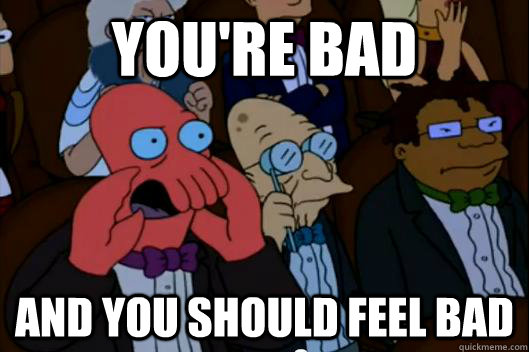
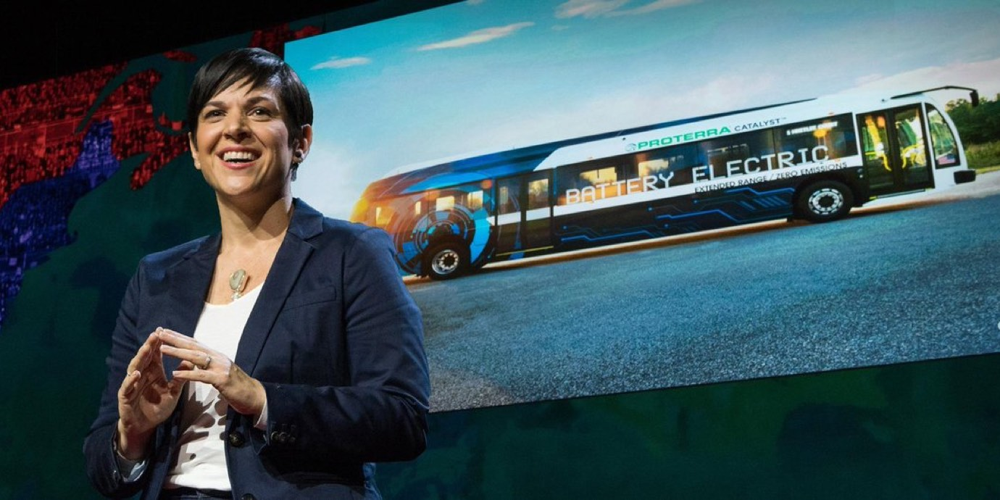

import { Image } from '$components';

For a year or so, I lived on the top floor of a fancy building in Portland's
Pearl District.[^yuppie]

This place was _dope_: giant balcony, concrete floors and walls for
soundproofing, a 24-hour concierge — this was the kind of apartment I signed a
lease on and thought to myself, "Clearly I've now arrived, and Jay-Z will be
calling any minute to discuss how our lives are very different but equally
awesome."

[^yuppie]:
  The Pearl, as far as I can tell, is where people who've just moved to Portland go, because they're convinced that all the cool stuff in Portland is there. Then, after a year, they move to the east side because they've realized that the Pearl is where the more expensive version of the cool stuff is.

  This story is from my days of paying way too much for things so I could be "where the action is".

<Image
  caption="If you can see past my buckets of class, this is the view from the apartment we’re talking about right now."
  credit="Chris Forbes"
>

  

</Image>

But there was a catch. **I was scared to take out my trash.**

It wasn't scared-for-my-safety scared. Or
scared-because-it's-dark-and-there-might-be-a-monster scared.

No, nothing like that.

I was scared someone might _see me_.

Because here's the thing: across the hall from my front door was a closet, and
that closet had a trash chute. **This was extremely convenient.**

The recycling, on the other hand, was a sixteen-floor elevator ride down, and
then you had to _carry_ the recyclables, like, a hundred feet to the dumpster.

Now, look: I don't hate the planet. **I like the planet.** I would very much
like for it to continue to be habitable for human beings.

But also, fuck changing out of pajama pants and putting on shoes just to get rid
of a couple cardboard boxes, _amirite_?

**I _did_ make an effort — at least at first.** But after a while, I
rationalized it: _There's probably someone who sorts the trash anyways, right?
I'm creating jobs! I'm a goddamned American hero!_

<Image
  align="right"
  caption="“Listen, bro: you <em>never</em> know when your commute can turn into an off-road adventure, okay?”"
  creditLink="https://commons.wikimedia.org/wiki/User:Thomas_doerfer"
  credit="Thomas Doerfer"
>

  

</Image>

**Eventually I just started taking out the trash late at night in hopes I
wouldn't see anyone in the hallway.** I'd be safe from judging eyes. Eyes that
would see me stuffing recyclables into the trash chute like one of _those_
people — you know the type — who drives a Hummer with vanity plates that say
ERTHFKR and tosses styrofoam cups out my window like confetti in a parade.

## I'm Not a Dick, I'm Just Lazy

Why would I consciously accept guilt and shame just to save myself a couple
minutes of inconvenience?

I could — and did — blame the building for its lack of forethought in designing
the trash rooms.[^leed]

[^leed]:
  "You're going to call yourself a LEED Platinum building and not even have a recycling chute? Get that weak-ass shit out of my face!"

I could — and did — come up with numerous other excuses for why this was a
failure of the management, or the system, or humanity in general.

But, obviously, this was _my_ failure. **I could have done the right thing, but
I did the wrong thing anyways. Because the wrong thing was easier, and I'm
lazy.**

Less obviously, though, is something more interesting: **this was a _completely
predictable_ failure.**

<Image>

  

</Image>

### In the long run, convenience always wins.

The frustrating trend in my life is that **I will nearly always end up doing the
most convenient thing.**

* Despite [all the shit I talk about great coffee](/taste-doesnt-matter), given
  a choice between instant coffee[^airbnb] with zero effort and walking 35
  minutes in oppressive heat for a really good cup of coffee, most mornings I'd
  end up making the instant coffee.
* Even though I've seen the documentaries and read the studies, after a
  particularly long day I'd go to a McDonald's in Japan instead of a local
  restaurant because I didn't have to think about the menu.[^mcdonalds]

[^airbnb]:
  Despite [my love for Airbnb](/use-airbnb-like-a-pro), you can always count on two things when you check in:

  1. Utterly terrible instant coffee
  2. All IKEA everything

[^mcdonalds]:
  Even though I was there, and I remember making the decision to do this, I'm still kind of outraged that I did this. Japan is easily top 3 places in the world for food, but somehow I decided Japanese menus were "too hard" and ordered a fucking Big Mac instead. _What the hell is wrong with me?_

This list could go on for days — I have dozens of examples of me making
bad-but-convenient decisions, and I don't expect that this is a trend that will
stop any time soon.

After all, I'm writing this early in the morning, and
[my willpower is high](/how-to-stay-consistent), so right now I'm up on my high
horse and judging my past self. But check in with me at 8pm most days and I'll
do just about _anything\* to avoid having to make an effort.

### So we're just fucked, then?

Of course not. But **we have to start looking at the problem differently.**

In each of these situations where I did the wrong thing:

* **I was completely aware of what the right thing was**
* I logically and rationally knew that **I _wanted_ to do the right thing**, and
  that the right thing would make me happier
* I also understood that **I'd feel shame and/or guilt about doing the wrong
  thing**

And yet **I did the wrong thing anyways.**

<Image
  align="right"
  caption="This doesn’t help."
  creditLink="http://www.cc.com/shows/futurama"
  credit="Futurama"
>

  

</Image>

I could chalk this up to me being a weak person with shitty willpower, but
that's not particularly productive. But if we look a little deeper and [Find The
Why](/find-the-why)[^ftw] another, more useful thread shows up: **these decisions are born out
of convenience, not ignorance or malice.**

[^ftw]:
  I have a [whole post about this](/find-the-why), but here's the short version: Find the Why is my shorthand for digging into the underlying cause of a feeling or situation. If we know what's happening underneath the feeling, we can find other things that help us seek out or avoid a given feeling without having to blindly try everything.

  For example, I like web design. Why? Because I get a lot of satisfaction from solving complex problems and helping people distill knowledge in a way that makes it accessible to other people. Knowing this, I'm also interested in teaching and coaching because the fundamentals are the same.

So I'm not choosing to throw recyclables in the trash because I don't want to
recycle; I'm doing it because I don't want to deal with the hassle of going to
the recycling room when there's a hole I can toss it down _right here_.

I'm not choosing McDonald's over a local izakaya because I prefer fake cheese
and extra preservatives; I'm eating there because the izakaya would require me
to translate a menu and decide between unfamiliar preparations of ingredients,
whereas McDonald's will serve me a 100% predictable meal with **zero mental
effort.**

## Make the Right Thing the Easy Thing

The fact that people default to convenience over doing the right thing might
sound discouraging at first, but it's actually great news.

**It means that people aren't stupid or cruel; they're just lazy.**[^stupid]

[^stupid]:
  Well, let me back that off a bit: many of the choices we would potentially chalk up to stupidity or cruelty can be chalked up to mere laziness. But that doesn't mean that some people aren't _also_ stupid and/or cruel.

So if we're aiming to change behavior — whether it's our own behavior or the
behavior of other people — we don't need to convince them that something is The
Right Thing To Do.

Instead, we just need to make it easier to do the thing we want done than to do
anything else.

**We need to Make The Right Thing The Easy Thing™.**

### Okay, but how does that actually work?

Theoretically, this all sounds great. But can this really work in practice? How
do we make it easier to study math than to _not_ study math?

And let me be the first to admit that this is not a miracle cure for all the
world's problems. But I _do_ think that this is a powerful tool that can change
an unproductive, negative feeling — "I'm shitty and I have shitty willpower" —
into a productive, positive solution: "I need to make it easier to do this the
right way."

And I think this works on and individual basis _and_ at global scale.

#### An anecdotal example: smoking.

You could argue that cigarette use is decreasing because more people know how
bad it is for them, but I don't know if I believe that.

I'd argue that
[cigarette use in the U.S. has declined](https://www.cdc.gov/tobacco/data_statistics/tables/trends/cig_smoking/)
for two reasons:

1. People will openly scold you for smoking now.
2. It's _really fucking hard_ to find a place to smoke.

In the past, everyone smoked and smoking was allowed everywhere — it was _easy_
to become a smoker. These days, it's far easier to just not bother at
all.[^cigarettes]

[^cigarettes]:
  When I played in a band, half or more of the people I met smoked. I slipped into the habit, and I became a pretty heavy smoker.

  Then the band broke up. Continuing to smoke would mean regularly interrupting my workflow to go outside and smoke — where I'd get dirty looks from people on the street — then come back inside and get yelled at by my girlfriend for smelling bad. I quit for _entirely_ convenient reasons; health never even entered the conversation.

<Image
  creditType="Credit"
  creditLink="https://www.ted.com/talks/monica_araya_a_small_country_with_big_ideas_to_get_rid_of_fossil_fuels"
  credit="TED / Monica Araya"
>

  

</Image>

### A real example: electric cars in Costa Rica.

Monica Araya is working to get Costa Rica off fossil fuels entirely. But she's
not doing it by running a smear campaign against oil. She's also not focusing
all her efforts on educating people about the environmental "rightness" of
eliminating fossil fuels.

Instead, she's working to make electric cars cheaper than gas-powered cars.

**If she succeeds, Costa Rica will become the
[first country to completely eliminate fossil fuels](https://www.ted.com/talks/monica_araya_a_small_country_with_big_ideas_to_get_rid_of_fossil_fuels).**
Not because it's "the right thing to do", but because Monica Araya realizes that
most people will do the easy thing by default. If electric cars are the easiest
and cheapest option, electric cars win.

## Ideas and Strategies for Making the Right Thing the Easy Thing

Here are a few ways I'm trying to Make The Right Thing The Easy Thing in my own
life:

1. **Create social pressure to do the right thing.** I recently signed up for a
   group fitness class. I did this, despite preferring a different style of
   training, because I knew that if I didn't show up, people would ask why — and
   I'd rather haul my ass out of bed and get to the gym than explain how I'm a
   lazy sack of shit who didn't feel like working out.

2. **Make it more work to skip it.** If I have something I want to take care of,
   like folding laundry, I'll dump the pile on the bed. Sure, I can now make the
   effort to pick up the pile and move it somewhere else so I can go to bed, but
   the part of my brain that harps on
   [boosting efficiency](https://lengstorf.com/tag/efficiency/) shorts out — so
   instead, I just fold the clothes so that I can go to bed.

3. **Remove the temptation altogether.** I don't keep snack food in my house. I
   know that if I have access to a bag of chips, I will eat that bag of chips.
   Not because I want it, but because it's there.

4. **Make it hard to procrastinate.** To keep myself from going off-task, I kill
   all notifications and
   [turn on FocusTime](https://www.rescuetime.com/rp/jlengstorf/focustime) so
   that I can't even _load_ Facebook, let alone use it to put off doing
   work.[^nuclear]

[^nuclear]:
  Or, if you want to get _really_ serious, you can [schedule distraction-free time in advance](https://zapier.com/app/editor/template/5874?selected_apis=RescueTimeDevAPI,ScheduleAPI) — what Nate and I have started calling [Nuclear Mode](https://nategreen.org/self-discipline/).

## How Will You Make the Right Thing the Easy Thing?

What choices are you making right now that you _know_ are bad, but you make them
anyways because it's more convenient?

How could you tweak things so the right choice becomes more convenient?

[Let’s talk about it on Twitter.](https://twitter.com/intent/tweet?url=https://lengstorf.com/right-thing-easy-thing&text=%40jlengstorf)
