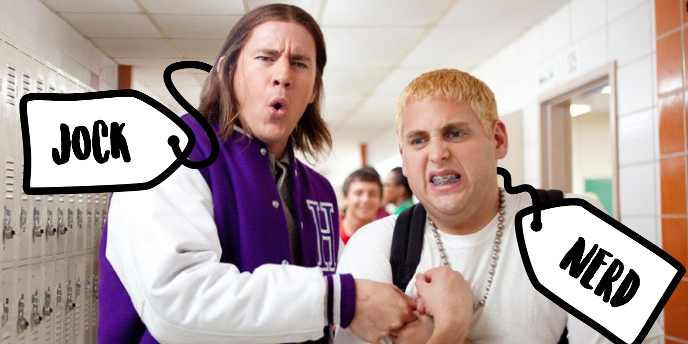
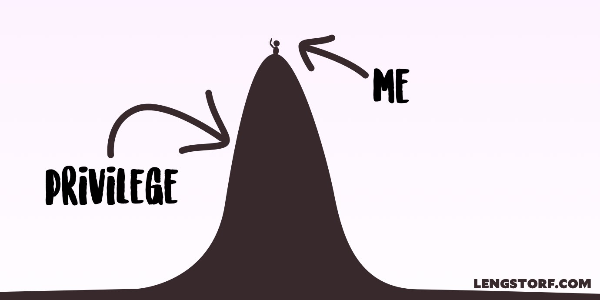
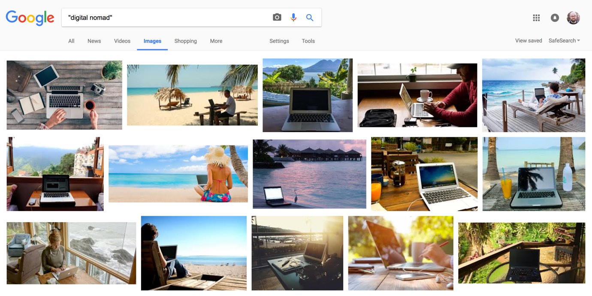
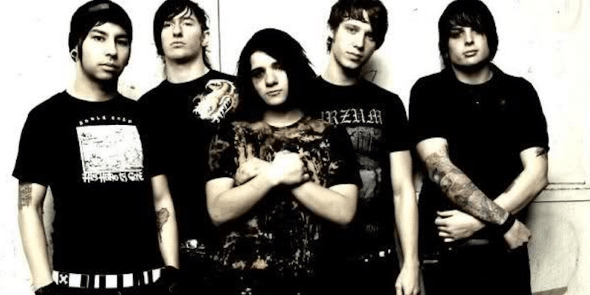
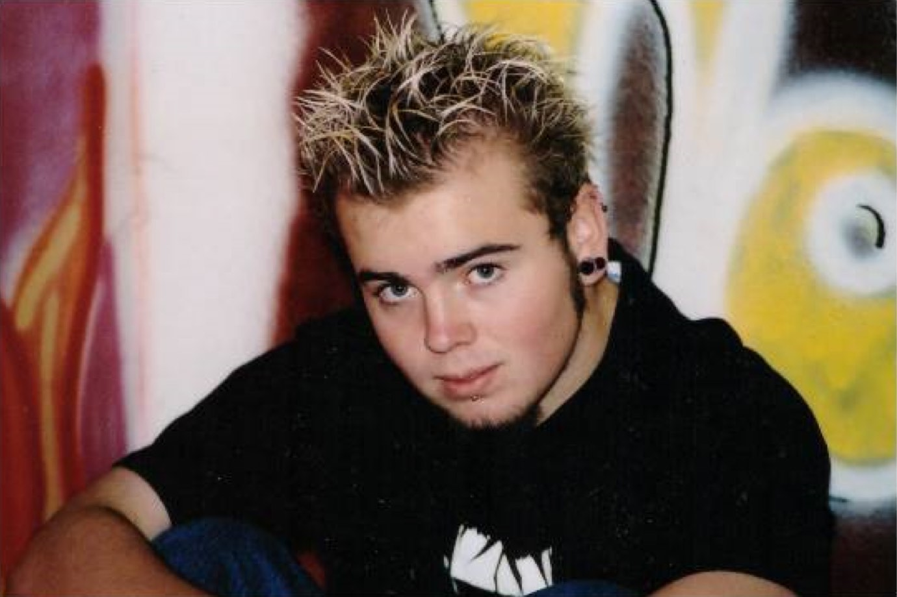
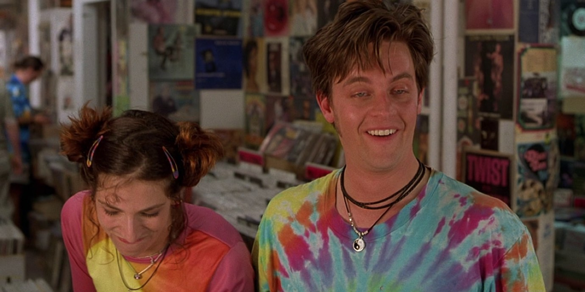
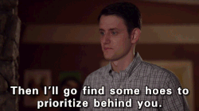
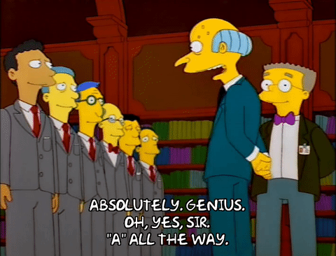
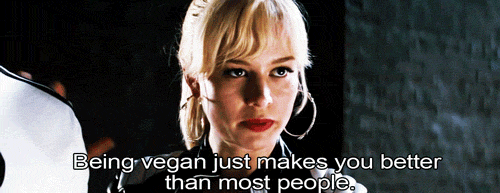
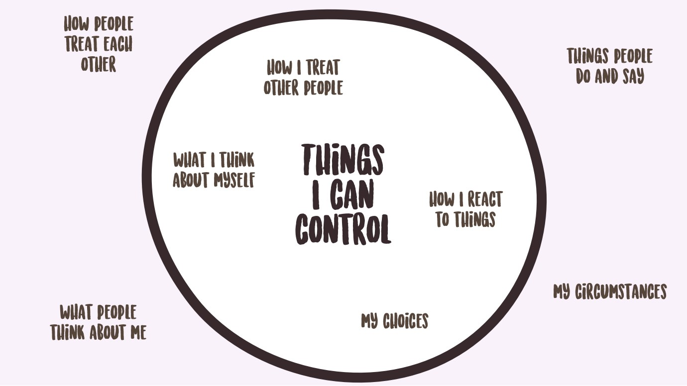

import { Image } from '$components';

My entire adult life, I've tried to avoid being labeled.

When I wrote my
[retrospective on a year of full-time travel](/one-year-of-world-travel/), I
included a section about my distaste for the label "digital nomad":

> It became immediately clear to me upon leaving that I'm skittish about labels.
> I've used the phrase "digital nomad" when referring to my lifestyle, but the
> novelty is gone. It feels clique-ish — like calling yourself a "jock" or
> "goth" — and creates this illusion that there's a secret Digital Nomad Society
> that only the elite can join, which is about as far from the truth as you can
> get.

Since writing that,[^long-time] the idea of labels has been rolling around in my
head.

[^long-time]:
  I've been working on this post for a _long_ time.  Well, actually that's not true; I did a lot of work on this post in early 2016, and then panicked because I was worried people might not like it, so I sat on it for almost a year.

<Image
  caption="In high school, labels (a.k.a. cliques) are obvious — but do they go away as we become adults? Or get worse?"
  creditLink="http://www.sonypictures.com/movies/21jumpstreet/"
  credit="21 Jump Street"
>

  

</Image>

## Why I Get Squeamish About Labels

Until recently, however, I'd never [asked myself _why_](/find-the-why) I was uncomfortable with
labels.

Why, when I started a company, wouldn't I call it a startup?

When I talk about what I do, why do I shy away from terms like "founder" or
"entrepreneur"?

What's my aversion to becoming "a CrossFitter" or "a Digital Nomad"?

Of course, the _obvious_ reason is that I'm such a goddamned special little
snowflake that no label can adequately express my excellence. But — debilitating
narcissism aside — **I just don't feel comfortable waving the banners of a
group.**

Why is that? And if you're in the same boat, what can we do instead?

### But before we start, let's talk about me and my mountains of privilege for a second.

There are two discussions we can have about labels:

1. The labels we apply to ourselves.
2. The labels other people apply to us.

<Image align="right">

  

</Image>

I have _way_ too much privilege to talk about external labels — so I won't. In
this post, I'm _only_ talking about self-imposed labels, and my own strong
opinions about why that's usually a bad idea.

Also, **I'm not intending this to be a "here's how everyone should live their
lives" kind of thing. I want to kick off a discussion about the way we perceive
and present ourselves.**

So if you think what I'm saying is a bunch of bullshit, let's talk about it
(like adults)
[on Twitter](https://twitter.com/intent/tweet?in_reply_to=854848198694883330).

## But Isn't "Anti-Label" a Label?

"Whoa whoa whoa," I can hear you thinking. "Isn't saying 'I'm anti-label' just
another label that contrarian douchebags like you use to make themselves feel
unique?"

And despite your hurtful tone,[^mean] it's hard for me to argue with that,
because the difference between what I'm advocating here and a rebellious
teenager claiming "anti-label" as his label may just be a matter of opinion.

[^mean]:
  Why are you so mean to me? Who hurt you?

But my goal isn't to get people to describe me as "the anti-label guy". More
importantly, I would never call myself that.

## Labels Are Shortcuts That Sell You Short

> Once you label me, you negate me.
>
> **Søren Kierkegaard**

People are bombarded with information on all fronts from the time they wake up
until the time they fall asleep. So we take shortcuts, substituting clichés,
proverbs, aphorisms, maxims, and precepts for in-depth analysis. And in many
cases these shortcuts are helpful: they provide shorthand for behavioral codes
of conduct, pass down general wisdom, and encapsulate complex ideas in a compact
phrase (e.g. "a bird in the hand is worth two in the bush").

But when we take these shortcuts with people, things get weird. **Labels become
stereotypes become prejudices, and we stop seeing someone as an individual —
instead, we see her as a member of whatever group we've lumped her
into.**[^white-guys]

[^white-guys]:
  I know I said I wouldn't touch this, but it pisses me off.

  Here's an example: most of the time, if Jenny is on the news or being interviewed, Jenny can't just be Jenny — **she's Jenny of the Women and therefore is burdened with all the preconceived roles and assumptions that society has placed on All Women.**

  As I've been thinking more and more about this — specifically about how **labels supercede our personalities when we allow them to take over** — it hit me in a real way (as opposed to the dim understanding that something is true) that labels sit at the foundation of sexism, racism, and all the other -isms. And more importantly, I realized that _these issues have never affected me_. The idea that I, Jason, could somehow be a representative of All White Men is absurd — and it sounds absurd to everyone.

  Yet we see a woman or a black person or a Muslim in an interview, and they're asked to answer questions on behalf of All Women or All Black People or All Muslims, as if it's somehow _not_ absurd to expect them to speak for "their group", as if there's a cabal of All Women that meets every second Thursday to hash out what they stand for, and which major events count as "big wins for women everywhere".

  My exemption from this kind of bullshit is what "privilege" means.

### We should never sell ourselves short.

The most damaging effect, though, is when we take these shortcuts with
ourselves. **When I cop out on defining who I want to be and just adopt a label,
I've relinquished control of my own identity.** Rather than being an individual
with my own unique assortment of ambitions, tastes, and idiosyncracies, I've
removed my own will and chosen to let the group make those decisions for me.

**If [the story I tell myself](/stories/) is that I am my labels, I've cut off
huge areas of opportunity for personal development, exploration, new ideas, and
growth.** Not because I have an aversion to becoming better, but because I took
a shortcut that prevented me from even seeing that those opportunities existed
in the first place.[^traveler]

[^traveler]:
  The concept of travel was one of these moments in my life. I had always assumed that long-term travel was for Rich Travelers — a label that didn't apply to me. I believed I wasn't part of the group who could travel, so I never gave any consideration to whether or not I could do it.

  As soon as I challenged the assumption that labels dictate possibilities, I was able to see the opportunity, and it resulted in one of the [greatest adventures of my life so far](/two-years-in-airbnbs/).

<Image
  caption="Apparently becoming a Digital Nomad means beaches and orange-colored beverages."
  creditLink="https://www.google.com/search?q=%22digital+nomad%22&tbm=isch"
  credit="Google Image Search"
>

  

</Image>

## Adopting a Label Means Adopting a Set of Rules

Becoming a Digital Nomad — if you believe the articles about it — would imply
that you must meet certain criteria in order to officially belong to the group.

You _must_ sell all your stuff and travel the world. You _must_ visit certain
"DN hubs". You _must_ choose which faction you belong to: the Programmers, the
Marketers and Drop-Shippers, or the Travel Bloggers.[^factions]

[^factions]:
  This in itself is a "rule" that bothers me: there is no real limit to what you can do remotely for work. If your job is based on the computer and/or conversation, [you can work from anywhere](/remote-work-course/).

**And while none of these rules are real,[^canon] they all create mythos, which
becomes a label, which creates artificial barriers and social pressure.**

[^canon]:
  Mostly they're the opinions of early-adopting writers. These articles get cited by the next wave of writers (who are then cited by the mainstream writers who've started hearing about this "hot new trend"). Eventually things get repeated often enough that the ideas become canon.

In the [Digital Nomad subreddit](https://www.reddit.com/r/digitalnomad/) there
are frequent questions about "becoming a Digital Nomad" asking if one itinerary
or another would qualify someone as a _Real™_ Digital Nomad.

But asking whether you're _truly_ a Digital Nomad — as opposed to what? someone
who works remotely and regularly travels? — is similar to asking if you're
_truly_ a vegan: it depends who you ask, and what kind of mood they're
in.[^veggies]

[^veggies]:
  If you're not located in a city where vegans can be overheard infighting, picture a religious debate about whether yeast can feel pain.

Trying to subscribe to a label brings with it all the stresses and anxieties of
chasing "cool" — the rules of inclusion are constantly changing, sometimes
contradictory, and always half-buried under a snowdrift of asterisks.[^cool]

[^cool]:
  Men can't wear capri pants; that's just _unthinkably_ uncool.\*

  \* Except Andre 3000. That dude can wear whatever he wants. Except some of his more questionable hats; big stupid hats are always uncool.\**

  \** Unless you're Pharrell. He wore the shit out of that big stupid hat.

### Following rules is inherently uncool.

This is the paradox that labels present: we presumably want to join these groups
so people think we're cool. But we all look at people who join groups and
mindlessly follow their rules as "sheep" or "drones" — _never_ as cool.

I learned this — much like I've learned most of my lessons — by refusing to
accept it until it was far too late to redeem myself.

<Image
  caption="Holy shit, is that Skrillex?"
  creditLink="https://www.facebook.com/FromFirstToLast/"
  credit="From First To Last"
>

  

</Image>

My band came on the tail end of a trendy sort of music called "emo". Emo emerged
from the death throes of pop punk music, when kids got sick of songs about house
parties. These were _emotional_ songs, with _feelings_ that _mattered_.[^blood]
But we weren't just _emo_; we were part of a post-emo movement called screamo,
which was an evolution of post-hardcore that wasn't veering toward butt rock,
and then — hey, are you asleep? Sorry. Moving on.

[^blood]:
  Just kidding. It was the same as pop punk, except we replaced lyrics like, "well I guess this is growing up," with, "jet black, the blood that's in your veins!" and [screeched like goats](https://www.youtube.com/watch?v=1paueaTWFRE) instead of singing from the top of our sinuses.

<Image
  align="right"
  caption="WHY DIDN’T YOU TELL ME I LOOKED SO TERR— oh, you did? Repeatedly? Are you sure? I thought you said I looked great."
>

  

</Image>

We wanted to make it, and "making it" as an emo band meant we had to _look_ like
an emo band: black hair falling in our eyes, black eyeliner, tight t-shirt,
white belt, skinny jeans — **it was a full-on uniform.**

I'd look at the cool kids in the emo scene and figure out how I could look more
like them, which — presumably — would make me more emo (and therefore more
cool).

With the benefit of hindsight, I can see how absurd this all was. At the time,
however, this seemed _critically important_.

## Adopting a Label Makes You a Stereotype

Picture an Herbalife salesperson. A "legalize marijuana" activist. A yoga
fanatic. A CrossFitter.

<Image
  caption="Legalize it, man. Like, fully!"
  creditLink="http://www.imdb.com/title/tt0120693"
  credit="Half Baked"
>

  

</Image>

Each of those labels carries stereotypes:

* Herbalife salespeople are get-rich-quick suckers who get pulled into
  multi-level marketing schemes
* Legal weed proponents are unwashed hippie burnouts (or aspiring burnouts)
* Yoga fanatics spout starchild bullshit like, "Feel the universe tingle on your
  skin like a thousand tiny kisses from the stars"
* CrossFitters eat Paleo, work out so hard they puke, and judge the holy Christ
  out of you because you don't do CrossFit.

Accurate or not, these are the stereotypes that haunt the people who choose to
lead with their labels.

### Why would anyone voluntarily become a stereotype?

If your Tinder bio reads, "I ❤️ CrossFit and Steve Jobs," **you've effectively
outsourced your entire personality to two labels and their accompanying
stereotypes.** The person reading knows nothing about who you are, but they've
now made sweeping assumptions based on their opinions about CrossFit and Apple.

<Image
  align="right"
  caption="We like what we like, amirite?"
  creditLink="https://pixabay.com/en/users/anned-1166062/"
  credit="anned"
>

  

</Image>

Sometimes this can work in your favor. People who live in the country and only
want to meet other country folk can use a site like
[Farmers Only](https://www.farmersonly.com/) to seek out other people who define
themselves as farmers — a perfectly valid way to find people with shared
interests.

But more often than not, our self-applied labels isolate and limit us in ways we
didn't intend.

### One human. Three labels. Vastly different assumptions.

Pat the Human is a blank slate. We can make some basic assumptions — Pat most
likely consumes food, sleeps, and occasionally goes on a Netflix binge — but
beyond that we'd have to actually _meet_ Pat to make any judgments.

But if we add labels, shit gets weird.

Pat the Anti-Vaxxer is a helicopter mom trying to shake up the monotony of
upper-middle-class motherhood with attempted filicide.

Pat the Startup Developer is a white dude who's ignorantly strengthening the
patriarchy and only making the world better for other white dudes who prefer
smartphones to people.

Pat the Digital Nomad is living in Southeast Asia, broke and socially inept,
because an ebook claimed you can live there for $300/month and make a fortune
selling ebooks to ~~marks~~ <ins>people</ins> who want to become digital nomads.

When a label is applied, we will most likely make a sweeping judgment about the
content of Pat's character. For all we know, the Pat behind all three of these
labels might be the same person.[^super-pat]

[^super-pat]:
  Pat the Anti-Vaxxing Digital Nomad Developer: currently renting a Balinese hovel, selling ebooks on how to make money as a digital nomad to fund the creation of a "killer app" that helps parents find the nearest [measles party](http://thinkprogress.org/health/2015/02/09/3621020/measles-parties-california/). Some people — mostly Pat — are calling it "the Uber of intentionally infecting children with diseases". He's currently confused because he's catching shit from "haters" who think his company slogan — "giving your kid measles now so he can grow up and get mad bitches later, bro" — is sexist.

That's the insidious thing: **rather than enhancing who we tell the world we
are, labels tend to overwrite us.** Instead of letting our own actions and words
and beliefs define us, labels let people define us with a set of culturally
defined presumptions — meaning we're now defined by the actions and words and
beliefs of whatever that label means to the person judging us.

## Adopting a Label Means a Bunch of Strangers Can Fuck Up Your Reputation

Closely related to stereotypes, another problem with adopting a label is the
risk of letting other members of the group — total strangers in many cases —
make decisions about how the rest of the world views you.

In one of the saddest examples of how the actions of other people, imagine a
Catholic priest. What just came to mind?

In probably 99.9% of cases, members of the clergy are decent people with good
intentions. But there's a reasonably good chance that's _not_ what you just
thought about.

A lot of us probably just connected Catholic priests with pedophilia, because a
few dirtbag pedophiles were _also_ priests.

Thanks to a few perverts, a good portion of the world is giving _all_ Catholic
priests the side-eye, like, "I don't know about those priest types... I heard
they're all kidfuckers."

<Image
  align="right"
  caption="...except the sexism is far less endearing in real life."
  creditType="Credit"
  creditLink="http://www.hbo.com/silicon-valley"
  credit="HBO / Silicon Valley"
>

  

</Image>

Similarly, startup dudes everywhere are expected to be socially inept,
micro-aggression-lobbing twenty- and thirty-something white males. The world
sees _Silicon Valley_ and the
[tragic bro-show nosedive happening at Uber](http://www.latimes.com/business/technology/la-fi-tn-uber-bad-month-20170224-story.html)
and the idea sinks in that the people at startups are basically frat
boys[^another-one] that passed math class.

[^another-one]:
  And another one: "frat boys". I didn't have to add any real description, because we're all already picturing a certain type of behavior.

Sometimes these strangers are the figureheads at the epicenter of the label,
like in the case of Donald Trump giving renewed life to a caricature of
Republicans as bigoted, out of touch, and largely solipsistic, leaving a lot of
conservative-leaning Americans without a party to support.

Other times — in the digital nomad movement, for instance — the strangers are
bandwagon jumpers who exploit an angle and taint the entire community: hucksters
who stay in Prague for three weeks before launching their _How to Become a
Digital Nomad in Prague_ ebook, attempting to capitalize on the media's current
fascination with location-independent workers.

In either case, **people who have nothing to do with you other than affixing the
same label to themselves are now wielding influence over your reputation.**

## Applying a Label Creates an "Us vs. Them"

I'm not much of a gamer, but it was hard to miss the media shitstorm surrounding
[Gamergate](https://en.wikipedia.org/wiki/Gamergate_controversy) a few years
back.

In the spirit of this article, I'm choosing not to research what _actually_
happened; I want to share the stereotypes that leaked out to me — a non-gamer —
that are now attached to Gamers in my brain.[^wifi]

[^wifi]:
  That, and I'm writing without a wifi connection right now and can't be bothered to look it up on my phone.

Here's how I understood Gamergate:

1. Concerns were raised that women have been represented in sexist ways in most
   video games: scantily-clad, dependent on male heroes, and so on.
2. Game studios started to include more diversity in games' heroes.
3. Male gamers did not like this, and got _real_ upset about the "oppression"
   this represented.
4. Females in the gaming sphere started speaking out in favor of diversity in
   games.
5. Angry male gamers started cyber-stalking these women, publishing sensitive
   personal information like home addresses, and making rape and death threats.

It's hard to imagine that many of the (who I assume to be) teenaged boys who
stalked and threatened people as part of Gamergate would ever do anything like
that on their own.[^clarification]

[^clarification]:
  What I mean by that is that the average video-game-playing teenaged boy is very unlikely to receive new information about video games and, with very little preamble, respond with, "I WILL RAPE AND KILL YOU."

<Image
  align="right"
  caption="If everyone around you agrees with you, that’s a bad sign."
  creditLink="http://www.simpsonsworld.com/"
  credit="The Simpsons"
>

  

</Image>

However, because they're "gamers", the group felt threatened by change, and —
galvanized by their label — they started kicking ideas around in an echo
chamber. Since there wasn't much by way of dissenting opinion, the ideas were
able to amplify and mutate, changing from a probably-innocuous-at-first idea ("I
disagree with Felicia Day") to something horrifying ("We should kill Felicia
Day").

### The most dangerous place to live is in an echo chamber.

**Labels create closed communities, and those communities become breeding
grounds for extremism.**

Even on an ostensibly open platform like social media, people are able to create
curated lists of _only_ the people who match their labels, and as a result we've
seen
[misinformation and hate spread _faster_](http://www.cnn.com/2017/01/22/health/facebook-study-narrow-minded-trnd/),
despite unprecedented access to facts and varied opinions.[^fake-news]

[^fake-news]:
  When I first started working on this post, the "fake news" epidemic hadn't happened yet. I'm sincerely hoping that this is the terrifying conclusion to a dark moment in the early years of the Information Age, and not the harbinger of the death of critical thought.

**Finding our "tribe" (_see also: fellow label adherents_) online gives us the
illusion of control, but really it's an Orwellian form of mob justice. The tribe
stands in for our conscience, substituting its own agenda for our moral
compass.**

When I was in my emo phase, I didn't respond to new situations by asking, "How
do I want to respond to this?" Instead, I asked,
"[What's the emo way to handle this?](/no-one-is-coming-to-save-you/)"

In my case it was silly, but this line of reasoning becomes fucking terrifying
when the labels belong to extremist groups (see also: the "God Hates Fags" sect
of Christian terrorists).

## The Difference Between Doing a Thing and Being a Thing

At this point it's probably safe to say I've offended — among others —
CrossFitters, Christians, digital nomads, and the startup crowd.

But if I've offended you (and you didn't close this tab in anger already), allow
me to draw an important distinction before you assume I'm saying CrossFit,
Christianity, or location independence are bad things.

**There is a _huge_ difference between "doing a thing" and "being a thing".**

There are people who go to a CrossFit gym. And then there are _CrossFitters_.

<Image
  align="right"
  creditLink="http://amzn.to/2oeBOed"
  credit="Scott Pilgrim vs the World"
>

  

</Image>

There are people who don't consume meat or animal products. And then there are
_Vegans_.

There are people who travel often and work remotely. And then there are _Digital
Nomads_.

We can _do_ a thing without all the trappings of _becoming_ a thing.

**Drawing that line is critically important.**

### If we leave off the label, we can take only the good parts.

I love to eat food; it's one of my key motivations for traveling. I choose
destinations based on how appealing the cuisine sounds.

But I wouldn't call myself a Foodie or a Gourmet.

This means I can love food, seek out great dining experiences and new flavors
and dishes — but avoid all of the bullshit (I don't have to write food reviews,
remember the names of famous chefs, or pretend I'm too good to eat fast food
sometimes). I eat, enjoy myself, and go home.

I've also adopted my favorite parts of tech culture, music culture, travel
culture, tattoo culture, and myriad other groups — all with their own labels —
that make me the person I am now. But I do my best to skip the label, and for
better or worse that lets me leave behind the pressure, the rules, the bullshit,
the _externalization_ of what I stand for.

**Because I don't apply labels to myself, I get to do my best to define myself
as _myself_, and not as a patchwork of outsourced identities.**

## Other People May Label Us, but We Should Never Label Ourselves

My friend Richelle showed me this fantastically simple way of choosing things to
worry about: draw a circle and label the inside, "Things I Can Control". The
outside is "Things I Can't Control". Then write down all the things that are
bothering you and place them either inside or outside that circle.

<Image
  caption="If it’s not in the circle, it’s not worth stressing over."
>

  

</Image>

Worrying about anything outside the circle will stress us out and frustrate us —
for no gain. No amount of struggle, effort, or complaining on our part will
affect things we can't control.

Someone out there may call me a Digital Nomad or a Brogrammer or a Foodie or any
number of other labels, both flattering and unflattering.

I can't help that. Everyone gets their opinion.

**I can't control what people believe about me; I _can_ control what I believe
about myself.** Do I choose to believe that I'm restricted by the labels I've
applied to myself? Or do I choose to make my decisions based on what will
actually make me happy?

I won't always get it right, but I'm sure as shit going to choose the things
that make me happy — and I'm certainly not going to worry about a label that
might contradict that choice.

Maybe I'm not "supposed to" do a certain thing because of what other people assume I should do and be, but when the chips are down, **I'll choose happiness over perceived appropriateness. Every. Fucking. Time.**
