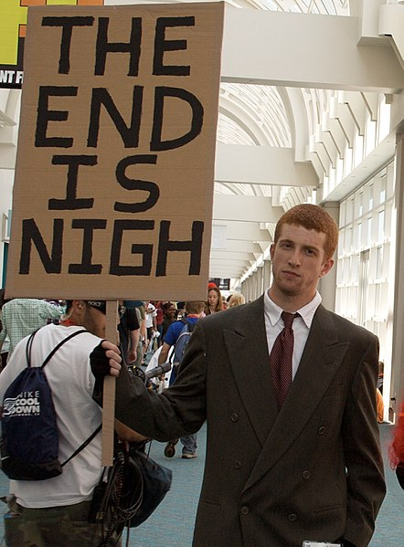
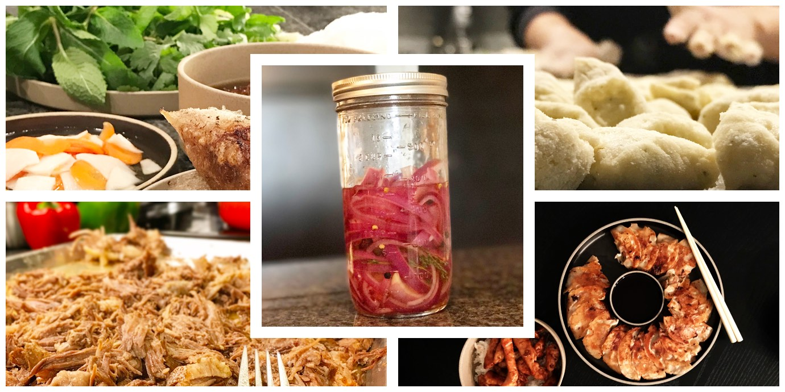

import { Image } from '$components';

2017 was... weird.

I don’t know that the world _actually_ went to hell — in fact, there are a lot of reasons to argue that [the world in 2017 was the best it’s ever been](http://nyti.ms/2myrgI2) — but holy shit if my Twitter feed didn’t make me feel like I needed to move to New Zealand and stockpile non-perishable food.

<Image
  align="right"
  caption="My Twitter feed most days."
  creditLink="https://www.flickr.com/photos/donabelandewen/"
  credit="Ewen Roberts"
>

  

</Image>

But what was 2017 _actually_ like? If I step back from the chaos in the media, **what did 2017 mean for me and the people I care most about?**

As we roll into a new year, I want to continue a tradition I’ve [stolen from Nate](https://nategreen.org/2017-personal-retrospective/) and write up a retrospective[^retrospective] on 2017.

[^retrospective]:
    If you’re not familiar with the concept of a retrospective, the core idea is this: whenever you’ve come to the end of something — a project, a sprint, or, in this case, a year — you sit down and review it by asking three questions:

    1. What went well?
    2. What could have gone better?
    3. What will I change next time?

    This is an incredibly effective tool for teams because it allows you to regroup, [call out the good stuff](/how-to-be-positive/), notice potential problems, and make adjustments to correct them before they fester into full-on crises.

    However, it turns out that it’s an excellent tool for individual development as well. I run a retrospective for pretty much everything I do: projects, contracts, relationships — hell, I’ve even run retrospectives on _recipes_.

    The point is: they’re useful. You should use them.

Over time, I hope these retrospectives help me form a story arc of who I’ve been, where I wanted to go, and where I actually ended up. For example, my [2016 retrospective](/2016-personal-retrospective/) shows me rekindling an interest in teaching people to code and starting to cook again — both things that I did a lot of in 2017.

It also reminded me that I started a project called Small Adventures and then never finished it. So I should get on that.

So with that in mind, let’s jump in and break down how my 2017 went, and **how I’ll use that information to make 2018 a great year.**

## What went well in 2017?

Overall, I’d call 2017 a pretty good year from a personal development standpoint.

### I played well with others.

One of the biggest changes I made in 2017 was switching to full-time employment for IBM. My long-time friend [Robin](https://medium.com/@shinytoyrobots) is a development manager there, and — despite my initial skepticism — he convinced me that there was a lot of opportunity for large-scale change at IBM.

So I moved to Austin, started working from an office a few days a week,[^commute] and joined a team of 12 developers.

[^commute]:
    This introduced a commute, about which I have _nothing_ nice to say. More on this later.

<blockquote class="twitter-tweet" data-lang="en">
Planning software with a team is like juggling 15 balls except some of the balls need to be cubes for backward compatibility and other balls are on vacation until after Thanksgiving and due to a strange edge case one of the balls is an octopus.
&mdash; Jason Lengstorf (@jlengstorf) <a href="https://twitter.com/jlengstorf/status/933071716959571968?ref_src=twsrc%5Etfw">November 21, 2017</a></blockquote>

Prior to this, I’ve always worked on small teams, and my projects have _always_ been pretty much just mine. Learning to work on a team was a struggle, but I’m probably a much more pleasant person to be around these days.

### I learned a ton about convincing others to adopt new ideas.

When I first joined IBM, I saw a problem, did some research, came up with a solution I knew would work, and then ran face-first into a brick wall. Another team technically owned the thing I wanted to fix, and they weren’t super excited about some brand-new hotshot coming in and touching all their buttons.

Something I thought would take a couple weeks to fix ended up taking a couple months _just to convince all the necessary people that we should try to fix it._

This was a new and uncomfortable experience for me; in all of my previous roles I’ve either been working alone or the highest-ranked person in the room. I’d only ever had to sell ideas to clients, who generally couldn’t care less _how_ I solved a given problem, so long as it ceased to be a problem at the end of the project.

I spent a lot of time this year learning how to present, how to package ideas, how to frame things to get the best response,[^framing] and how not to [set the building on fire](https://www.youtube.com/watch?v=tj0xtdN0_tA) when I didn’t immediately get my way.

[^framing]:
    For example, I learned that **when I talk to my team about building something, I should focus on the big changes and wins**: faster turn-around times! fewer bottlenecks! more control! improved workflow!

    However, **when I was trying to convince another team to let us touch their code, I needed to highlight how much things _wouldn’t_ change**: no extra work, no additional responsibilities, no added risk.

    And **when I was talking to an executive, I needed to ignore any details and focus only on their bottom line**: improved Net Promoter Scores! more features shipped faster! lower turnover!

    This probably deserves its own blog post. I’ve added it to [my idea list](http://bit.ly/2mEMK60).

As much as this felt like pulling teeth, **one of my long-term goals is to start consulting for large companies to help institute broad technical changes**, so this experience is going to be absolutely critical as I work toward that goal.

### I rekindled my speaking career.

In 2016, I didn’t do much speaking. Partially because I was [gallivanting around the world](/two-years-in-airbnbs), but also because I just didn’t feel like I was working on anything exciting enough to speak about.[^exciting]

[^exciting]:
    This is a tangent that probably deserves its own post, but I’ve realized that the reason we never think we have anything worth saying is that people are attracted to novelty, and there’s nothing novel about the things we _already know_. But we’re looking at our ideas as if we were going to watch them — and that’s not the case. **Everything we know now is something we _didn’t_ know before**; if we decide to write or talk about it, it will be new to the vast majority of people.

<Image
  caption="Me + a giant projected image of my face at the 2017 GraphQL Summit."
  creditLink="https://orangephotography.com/"
  credit="Orange"
>

  

</Image>

In 2017 I made an effort to get back on the speaking circuit, and made ten conference appearances between March and November, either speaking or teaching a workshop (or both, in some cases).

I didn’t notice it until I got back on stage, but I really missed it during 2016. **Sharing knowledge, talking with highly intelligent, highly motivated people, and watching the lights come on in someone’s eyes when a new idea clicks for them — that means quite a bit to me.** It felt great to get back out there and do it again.

### I released an open source project I'm really excited about.

In line with sharing knowledge, I was able to release some software I built at IBM as open source software, which is pretty exciting.

<Image
  align="right"
  caption="I also got to design the logo."
  creditLink="https://gramps.js.org"
  credit="GrAMPS"
  border={false}
>

  

</Image>

I’ll spare you all the nerdy details,[^nerds] but it’s called GrAMPS, which deeply satisfies my love of punny names. Since releasing it, I’ve had developers from companies like Target, the New York Times, and the NHL look into it as a solution for their large-scale projects.

[^nerds]:
    The short version is that it’s a tool that makes it easy to create and share data sources in GraphQL servers. For a technical overview, [check out the docs](https://gramps.js.org/).

I have no idea if it’ll make it into production anywhere (other than IBM, that is), but dammit **it felt _good_ to know that my work was helping other people with big problems to solve to do so a little faster.**

### Marisa and I got pretty good at cooking.

<Image
  caption="Some meals Marisa and I have cooked: bún chả and eggrolls (top left), gnocchi (top right), pulled pork (bottom left), gyoza (bottom right), pickled onions (center)."
  credit="Jason Lengstorf"
  border={false}
>

  

</Image>

From 2010–2014, it’s safe to assume that I probably cooked fewer than ten meals. It’s just not something I was ever really into.

I mean, I like cooking. But I don’t like grocery shopping. Or cleaning kitchens. Or leftovers. Plus there are dozens of apps that will just bring food directly to my mouth.

But in Texas, it’s not easy to eat healthy. Everything is fried, soaking in butter, covered in cheese, or — in many cases — all three.

<blockquote class="twitter-tweet" data-lang="en">
Things you don&#39;t notice until you leave and come back: the Portland food scene is really good at vegetables.  Corollary: Austin is... not so good at vegetables.
&mdash; Jason Lengstorf (@jlengstorf) <a href="https://twitter.com/jlengstorf/status/943383326592602112?ref_src=twsrc%5Etfw">December 20, 2017</a></blockquote>

This meant that we could either see how long it takes for me to regain all the weight I lost back in 2014, or we could start cooking healthy meals at home.

It turns out that we _really_ enjoy cooking. And we’re not half bad at it. In fact, if I can toot my own horn for a minute, we’ve got a few meals that we make better than most restaurants.[^steak]

[^steak]:
    For example, I’ll put my steak alongside most restaurants any day of the week. Trained chefs who focus on grilled meat will definitely kick my ass in a taste test, but still — it’s pretty damn good.

We started inviting friends over for dinner and taking turns cooking, which helped push us to perfect new and different recipes, and expanded our knowledge of cooking.

And, of course, we leaned on smart people to help us along. We’ve just about worn out our copy of [_Six Seasons_](http://amzn.to/2DhxZzA), which I’d highly recommend you pick up a copy of — I’ve sent at least three people copies of this book as a gift because I like it so much.

## What could have gone better?

A retrospective is a lot like a compliment sandwich: you start with something good, then launch into what was terrible, then loop back around to positive things.

This is the part where I dig into what I _didn’t_ like about my 2017.

### I introduced a commute.

There were a lot of good things that came with taking a job at IBM: I met more people in the industry, landed better speaking gigs, increased my income, and grew my skills in new and challenging areas.

But there were a few downsides; most notably, **I have a fucking commute now.**

<Image
  align="right"
  caption="This is not how I want to spend my time."
  creditType="Credit"
  creditLink="https://unsplash.com/photos/Jk3-Uhdwjcs"
  credit="Nabeel Syed"
>

  

</Image>

Not every day, but at least two days a week I have to drive 45 minutes _each way_ to my office.[^car] This isn’t the worst commute I’ve heard of by a long shot, but my previous commute was a thirty-second walk to my couch — I really felt the pain of losing 90 minutes a day to sitting in a car.

[^car]:
    I also had to buy a car, which I was really trying not to do. Unfortunately, public transit in Austin is laughably terrible, and it’s hot enough to make long walks dangerous for half the year.

That time cut into my mornings and had a domino effect that I really dislike: I had to start setting an alarm, had to make a choice between writing and hitting the gym,[^gym] and had to choose between coffee and breakfast.

[^gym]:
    I chose the gym, because it’s about the only physical activity I get these days. More on that in a second.

### I sucked at writing. Like, _really_ sucked at it.

In 2017, I published four posts. _Four._

I could make excuses, but what it really comes down to is that my commute screwed up [my morning ritual](/how-to-stay-consistent) and I never recovered. And while I _can_ say that I don’t regret choosing my health over my writing, I am _definitely_ unhappy about my lack of output in 2017.

### My day-to-day walking dropped off hugely.

Texas is not a walking-friendly state: everything is built with giant parking lots; sidewalks were more of an afterthought; Austin isn’t geographically constrained, so it spreads out [like a dude on the subway](https://twitter.com/DrHalfPintBuddy/status/951496490731655168); and even if all of that _wasn’t_ the case, it’s too goddamn hot to be outside for about six months every year.

Because of this, my daily walking took a nosedive. If it wasn’t for the gym, I might have spent the entire year in a seated position.

I paid for it, too. We visited Portland over the holidays and stopped by [Elemental Fitness Lab](http://www.elementalfitnesslab.com/), where Chris and Blaine spent a few hours undoing some of the damage I did to myself.

## What will I change in 2018?

**The true value of a retrospective is in using the information to improve the next iteration.**

To that end, the final step is to look at the problems of 2017 and come up with a plan to make improvements in 2018.

Here are mine.

### I will walk a lot more often.

It’s currently cool in Austin, so Marisa and I have been taking advantage and walking everywhere while we can. Whenever it’s not dangerously hot, we plan to walk whenever the destination is 30 minutes away or less.

When it gets too hot for that, I’ll spend 30–45 minutes walking on a treadmill and reading a book. Not necessarily my favorite thing to do, but better than nothing.

### I will reduce my commute to two or fewer days per week.

I just can’t handle my commute anymore, so I’m only going to do it a couple days a week to minimize the impact.

I really like my team, and enjoy doing things like team lunches or getting into a room and brainstorming or pairing up with someone to work on a problem, so I don’t want to stop going into the office altogether. However, at least one day a week my team and I can meet somewhere off-site — preferably walking distance for me — and work in a coffee shop. And the other days I can work from home.

I worked from home a couple days a week in 2017, so my plan is to bump that number up from 2–3 days to 3–4 days — the majority of my time will be spent out of the office so I can use the time I’d otherwise lose to my commute on more productive things.

### I will rededicate a couple mornings a week to writing.

One of the things I plan to dedicate the time I’ll take back by not commuting is to start writing more regularly.

On days I don’t commute, I can put at least 45 minutes toward writing with no net change in my ability to work and hit the gym. Ideally I can push that closer to the 90 minutes I prefer, but I’ll be happy as long as I can get back to a more regular publishing schedule.

## What Does Your 2017 Retrospective Look Like?

If you’ve never tried it before, I would _strongly_ encourage you to do a retrospective for your 2017. Feel free to share it publicly on a site like [Medium](https://medium.com/) or your own blog, or to share it privately with people you trust (or someone like me, if you’re not sure who else to share it with). Or just write it, think about it, and burn it.

**The value is in doing the thing, not having the thing.**

If you _do_ decide to share yours, I’d love to hear about it: hit me up [on Twitter](https://twitter.com/intent/tweet?related=jlengstorf&text=Hey%20%40jlengstorf%2C%20I%20have%20things%20to%20say.).

Here’s to a great 2018!
