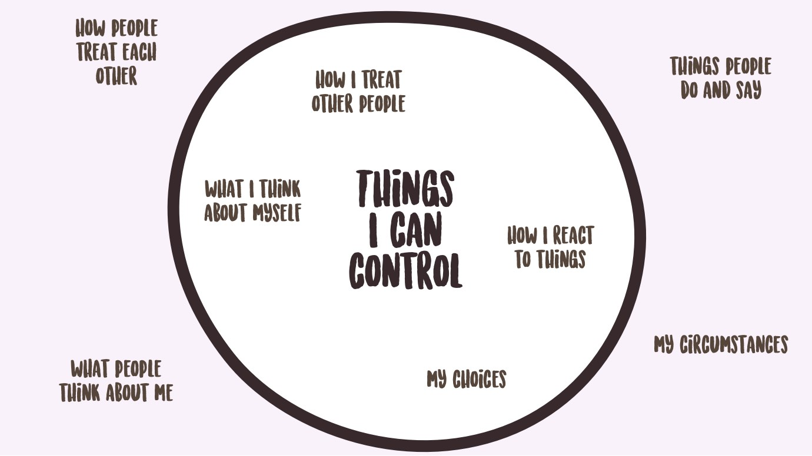

import { Image, Tweetable } from '$components';

In some of my [previous](/right-thing-easy-thing) [posts](/balance-for-first-year-entrepreneurs), I use the phrase **“Find the Why”**[^prior-art] as a kind of shorthand for the process of digging deeper into our behaviors, feelings, and ideas to figure out what’s _really_ going on: how we react to events, the way we behave at work and with friends, our fears and habits and vices — all of them have an underlying Why.

[^prior-art]:
    This isn’t a new or novel concept: the [Five Whys](http://www.startuplessonslearned.com/2008/11/five-whys.html) was put into practice by Toyota many years ago; companies were conducting [root cause analyses](https://smartbear.com/learn/performance-monitoring/what-is-root-cause-analysis/) for decades. This article is my interpretation of a widely used practice for ensuring that problems are solved for realsies.

In this post, I want to unpack what I mean by that, and offer up **a framework for Finding the Why on your own.** This is a framework we can use to build a deeper understanding of _why_ we are the way we are.

**When we Find the Why, we take back control of our behavior.**

<Image
  creditLink="https://pixabay.com/en/users/TeroVesalainen-809550/"
  credit="Tero Vesalainen"
>

  

</Image>

## Why Is Finding the Why Important?

Not too long ago, I was in a [retrospective](/2017-personal-retrospective) for a project, and there were a few things that had just plain failed to work. After collecting everyone’s opinion on what went wrong, I started asking _why_ things went wrong.

Someone interrupted me and said, “It doesn’t matter _why_ it went wrong; we need to focus on how we’re going to fix it.”

In certain circumstances, I can see the point: if your pants are on fire, you should focus on putting them out, not asking whether they started burning because you are, in fact, a liar liar.

The problem with only solving the problem, though, is that **problems are often just a symptom of something deeper.** If I put out the fire, but don’t ask why it started afterward, what’s to stop me from hanging my pants over a scented candle to “freshen them up” again?

**If we don’t understand _why_ the problem occurred, we have no way of knowing if our fix has actually solved the problem**, or just temporarily covered it up.

## How Will Finding the Why Make Life Easier?

By taking the time to examine the underlying causes of problems, we gain subtle but **extremely powerful advantages.**

### We become proactive instead of reactive.

There are a few people I work with on a daily basis who stress me out just to be around. Their entire existence, as far as I can tell, is spent careening from one fire to the next, desparately trying to stay on top of an endless stream of fire drills.

<Image
  align="right"
  caption="No matter how fast you grab ’em, those chocolates will keep coming."
  creditLink="http://www.cbs.com/shows/i_love_lucy/"
  credit="CBS / I Love Lucy"
>

  

</Image>

This is a **reactive approach**, and it’s basically a waking nightmare: the world is constantly happening _to you_. Chaos reigns, and every problem is a surprise.

Living reactively is like an endless game of whack-a-mole where you’re the one taking all the lumps.

If, however, you take a **proactive approach**, life starts to look a little different: because you’re making the effort to understand _why_ problems are occurring, you start to see patterns. Problems that previously felt novel start to resemble each other, and you can apply your previous experience to help solve new problems more effectively.

**The biggest advantage to a proactive approach is that your deeper understanding allows you to [see problems before they happen](/see-tree-coming)**: because you’ve worked out the underlying cause of previous issues, you can spot potential problems early — and correct them _before_ anything breaks.

### We can find patterns that make problems easier to solve.

By thinking through to the deeper causes of our problems, we can start to see that **a whole lot of problems share similar root causes**.

Part of my job is building processes and tools to make teams more effective. When I first started looking at the bottlenecks and time drains our teams were up against, they seemed like unrelated challenges — this made it feel like the effort was doomed.

After taking time to Find the Why, however, we found a few common culprits:

 -  There was a lack of clarity about goals, so teams were being forced to make
    educated guesses about what was expected of them.
 -  People were being asked to do things that fell way outside of their job
    descriptions and/or comfort zones.
 -  Many core pieces of information were completely undocumented, meaning teams
    had to wait for the one or two people who understood it to have time to help them.

**These three problems were causing the vast majority of the bottlenecks, performance problems, interpersonal conflicts, and other issues we were trying to solve.** By realizing this, we were able to focus our efforts in a way that actually made an impact.

Had we instead looked at these as unique technical, tooling, and interpersonal problems, we would have wasted a huge amount of effort treating the symptoms — and wouldn’t have made much progress.

### Sometimes noticing is all it takes.

When people start working with nutritionists or dieticians, a really common first step is to ask them to write down everything they eat throughout the day. And in many cases, this simple act causes people to make improvements in their diet.

I ask something similar of myself and the people I coach: take note of where your time goes during the day.[^productivity]

[^productivity]:
    If you’re interested, I have a whole write-up on [how I keep myself productive](/scheduling-maximum-productivity) that goes into more detail on this.

**When we’re paying attention, we tend to make better choices.**

If we take the time to Find the Why behind our problems, we’re able to notice when something has the potential to become problematic.

If you’ve ever burned out an electric motor,[^juicer] you probably now know that there are certain sounds and smells that mean something’s about to go horribly wrong. By recognizing that, you’re able to turn off the machine _before_ an expensive failure happens.

[^juicer]:
    I mean, _I’ve_ never done that, of course, but I have this friend who is _definitely not me_ that may have tried to cram a few too many carrots into a juicer and learned _all about_ the intricacies of its manufacturer warranty.

Sometimes paying attention is all it takes to eliminate problems.

## How Do You Find the Why?

As with most things, there’s no foolproof formula or ironclad process; every situation will vary in subtle ways, so coming up with a universal solution is impractical. However, there are some general guidelines that will make it easier to Find the Why in most situations.

### 1. When you notice a problem, pause and assess the situation.

At arm’s length, this may seem like an obvious statement, but it’s important to keep in mind that we exist in a culture of [self-destructive work ethic](/overkill-cult) and [unhealthy commitment to our own ideas](/labels): when we’re in the middle of a project, our instinct may be to just power through.

<Tweetable
 quote="When you hit a wall, sometimes it makes sense to plow through it. But most of the time there’s a solution that hurts less."
/>

Before you put your head down and try to smash it through whatever the problem is, take a beat and try to get a sense of what you’re up against.

### 2. Try to see the whole picture.

While assessing the problem, try to spot all of the symptoms: is there just a puddle on the floor? Or is there a leak in the ceiling, too?

A broad understanding of everthing that’s going wrong provides a more complete context for problem solving. **Making decisions with incomplete information will likely lead to incomplete solutions.**

### 3. Think about why it happened.

It’s tempting to stop at the symptoms: “Why did I snap at my friend today? Because I was having a bad day.”

Having a bad day is a symptom of something. _Why_ was it a bad day? Did something happen? Am I frustrated? Is there something common in all of my bad days?

Digging beyond the symptom can help us recognize the _cause_, which is what we need to address if we hope to fix the symptom permanently.

### 4. Ask “Why” again.

If you asked [Taiichi Ohno](https://en.wikipedia.org/wiki/Taiichi_Ohno) how to Find the Why, he’d tell you to ask “Why?” five times to make sure you’ve reached the root of the problem:

 1. **Why was the project late?** The team couldn’t deliver on time.
 2. **Why couldn’t they deliver on time?** There were last-minute changes to
    the deliverables.
 3. **Why were there changes to the deliverables?** Management was undecided
    about what to prioritize.
 4. **Why was management undecided?** There was a lack of clarity about what
    should be built.
 5. **Why was there a lack of clarity?** The team wasn’t included in the
    planning process.

In this example, what initially looks like a performance problem (missed deadlines) may actually be caused by poor communication and planning.[^caveat]

[^caveat]:
  The catch with this approach is that different people will get different answers. If this team has a particularly disfunctional management chain, it could have gone more like this:

   1. **Why was it late?** The team screwed around and missed the deadline.
   2. **Why did they screw around?** Because they’re nerds who secretly hate me
      and waste their whole day on YouTube or something.
   3. **Why do they spend their days on YouTube?** Because they’re stupid
      _nerds!_
   4. **Why are they nerds?** Why all the questions, nerd?

  It’s a tool. Tools can be misused. Use your judgment.

### 5. Keep asking until you’ve reached the deepest reason you can control.

Going back to the example where I’m having a bad day, maybe I find a chain of causes like this:

- I’m having a bad day.
- **Why?** I feel like I wasted the whole day.
- **Why?** I didn’t accomplish any of my tasks.
- **Why?** I spent the whole day in meetings.
- **Why?** People keep inviting me to meetings.

In this chain, the cause of my grumpiness is that I feel like I lost the whole day to meetings. The final cause — that people keep inviting me to meetings — appears to be the root cause, but it’s beyond my control: I don’t control other people, so how can I stop them from inviting me to meetings?

<Image
  caption="Only the things inside the circle are worth your effort."
  credit="Jason Lengstorf"
>

  

</Image>

If I take one step back, however, I _showed up to those meetings_. This is within my control, so I can ask a new set of questions:

- I spent the whole day in meetings.
- **Why?** Because I had a buttload of meetings on my schedule.
- **Why?** Because I accepted every meeting invite, even if they were
  irrelevant to my work.
- **Why?** Because I didn’t want to seem rude by declining.[^rabbithole]

[^rabbithole]:
  Beware the rabbit hole here. You can _always_ go deeper, but there’s a point of diminishing returns.

  Why don’t I want to seem rude? Because I’m worried it’ll get me fired. Why? Because I have self-worth issues. Why? Because I [feel like a phony](/not-a-phony) sometimes. Why? Because...

  After a certain point, the “deeper cause” becomes so general — e.g. “I don’t value myself” — that it’s almost a symptom in itself. This is a problem with asking subjective questions: they allow you to talk yourself in a circle if you don’t choose a logical stopping point.

  Because — get ready for this — **why don’t I value myself?** Because I let people abuse my time, _which they often do by scheduling too many fucking meetings_.

  If you chase any strand of logic far enough, you’ll eventually [end up staring at the back of your own head](https://science.howstuffworks.com/dictionary/astronomy-terms/space-shape2.htm).

Now that I’ve explored this new line of questioning, there’s a new potential root cause: I’m accepting meetings even when I shouldn’t be.

This means I’m no longer helpless; I can control the way I respond to irrelevant meeting requests.

If we dig too deep, we end up with problems that are either so broad they’re not solvable in a reasonable time frame, or that extend beyond what we’re able to control, which removes our ability to solve them entirely.

**We need to Find the Why at the deepest level we can control.** This way, we can come up with a solution _and actually implement it_. Because — remember — [no one is coming to save us](/no-one-is-coming-to-save-you).

## Life Is Easier When We Know Why

Even though it can be frustrating, stressful, or even frightening to Find the Why, there have been few things that improved my life more dramatically than adopting this as a core strategy for being alive.

If something makes me angry or sad, digging deeper helps me find a healthy and/or productive way to process that emotion.[^destructive] If I’m stressed and irritable, I can dig deeper and figure out where that stress is coming from and how to address it. If something goes wrong at work, I look for deeper patterns that will prevent it from ever happening again, rather than just putting out the fire and pointing fingers at someone else.

[^destructive]:
  This is a big change; I used to respond to strong emotion by verbally abusing the people around me to vent and/or eating pizza and ice cream until I couldn’t feel feelings anymore.

**After I learned to Find the Why, I became a happier, healthier, less volatile person.** (Or, as many of my friends would put it: “He’s less of a dick now.”)

If you put this into practice, maybe your friends will think you’re less of a dick, too.

And _that’s_ a worthy goal if ever I’ve heard one.
