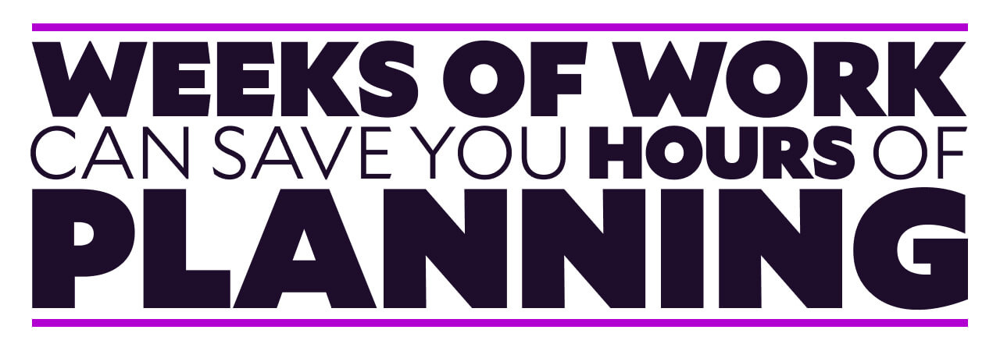

import { Image, Tweetable } from '$components';

One of my favorite phrases in the tech world is “yak shaving”.

It’s commonly used to reference the tedious chores that need to be performed before the Real Work™ can be done.[^etymology] Most of us have run into this before: we want to make coffee, then realize we’re out of beans and need to make a run to the store, so we jump in the car — only to realize that we’re almost out of gas and need to make a pit stop if we want to make it back home again.

[^etymology]:
  The phrase was [coined by Carlin Vieri](https://en.wiktionary.org/wiki/yak_shaving), who was riffing on a _Ren & Stimpy_ gag.

<Image
  caption="I spent far too long Googling yak images. I’m not even sure this is actually a yak."
  creditLink="https://www.pexels.com/@liam-gant-619294"
  credit="Liam Gant"
>

  

</Image>

## Is yak shaving always a bad thing?

“Yak shaving” gets tossed around as a pejorative in meetings to imply inefficiency or wasteful work: “This is a bad idea because it’s going to introduce a shitload of yak shaving we don’t have time for.”

But sometimes we describe “any work that I don’t personally find enjoyable” as yak shaving — things like planning and measurement, for example. This decreases the perceived value of really important work, and sometimes leads to skipping it altogether.

**Not all meaningful work is fun. Not all boring work is meaningless.** This is a lesson that’s dangerously easy to forget, because the modern attitude toward work makes it extremely easy to confuse “motion” with “progress”, and “busy” with “productive”.

<Tweetable quote="Yak shaving is an unfortunate side-effect of having survived to adulthood." />

To put that another way, nothing is ever all fun, all the time. We have to pay bills, run errands, clean up after ourselves, and dozens of other mundane tasks that are just part of [being a grown-up](/growing-up-vs-growing-older).

By devaluing important-but-not-fun tasks as useless yak shaving and skipping them, we might create the illusion of progress — but we also might miss the [dirt floors](/dirt-floors), potentially burning countless hours on meaningless-but-fun Real Work™.

## There’s more than one way to shave a yak.

Some chores are just that: chores. We have to do the dishes sometimes; bills need to be paid if we want the lights to stay on; we probably ought to shower every once in a while.

But other chores fall into a different category, which I like to call “meta-work”.

**Meta-work is the work we do before the Real Work™ to make it more efficient and productive.**

This is something like installing a dishwasher or putting the bills on auto-pay.

On the surface, “set up auto-pay” seems like just another chore on a list of yak-shavey bullshit work, but there’s a key difference: **when executed well, meta-work requires an up-front investment, then little (or no) additional effort afterward.**

Paying bills isn’t hard, but it takes time an attention every month. By contrast, setting up auto-pay takes a bit more work to set up, but afterward requires _zero additional work_ to ensure bills get paid on time.

Put another way, **putting in the meta-work means the yak _stays shaved_.**

## Are you grinding? Or getting things done?

It’s common to hear successful people credit their success to things like hard work, ambition, grit, and hustle.

<Image
  creditLink="https://unsplash.com/photos/513dBrMJ_5w"
  credit="American Public Power Association"
>

  

</Image>

More and more, I’ve started to think of these qualities like sunlight: they’re warm and bright and powerful and hold incredible potential, but they don’t accomplish much on their own.[^analogy]

[^analogy]:
  If you just bristled at this claim and are yelling at the screen about all the things sunlight accomplishes just by being sunlight, hold your dang horses.

Meta-work is the solar panel that harnesses the power of sunshine to make it productive. It directs the solar energy toward a goal, which ensures the energy actually _means_ something.[^analogy-pt2]

[^analogy-pt2]:
  Plants needed to develop photosynthesis for sunshine to be useful to them. The world couldn’t exist without sunlight, but that’s because the world learned how to _use_ sunlight.

**Potential means nothing on its own. Without direction, we run an extremely high risk of [working really hard and not getting much done](/overkill-cult).** And while we tend to hold up high-potential people as “the best of us”, someone with high potential who grinds themselves to dust on low-impact work will lose against someone who thinks hard about what needs to be done and makes perfectly average progress toward the most important goals.

**In order to be _truly_ effective and make meaningful progress, we need to do the meta-work _and_ the Real Work™.**

## Skipping the meta-work means frustration, inefficiency, and wasted time.

Throughout my career, just about every team I’ve worked on handled new projects something like this:

1. An idea comes up that gets everyone excited
2. The team immediately gets to work on the <abbr title="Minimum Viable Product">MVP</abbr>

We jumped straight into Real Work™, riding high on our excitement and trusting our brilliance to push us through to victory.

And in nearly every case, we ended up stalled, discouraged, not making much progress, feeling like maybe this wasn’t such a great idea after all.[^bad-ideas]

[^bad-ideas]:
  Sometimes the ideas really _were_ just plain terrible, to be fair.

These projects often resulted in dead ends, ripping out features that turned out to be a waste of time, and sometimes giving up altogether.

**In every case, we failed to do the meta-work and paid the price.**

<Image border={false}>

  

</Image>

## Getting meta-work right makes all the difference.

On a few glorious occasions, I’ve been on a team that followed a different process:

1. An idea comes up that gets everyone excited
2. We do research to validate the idea
3. Several meetings are dedicated to understanding (and limiting) the scope [at every level](/level-setting) and thinking through edge cases
4. Time is spent [creating a solid plan](/effective-project-planning)
5. Once we’re confident we know what we’re getting into, we start doing the Real Work™

In _every_ situation where this happened, we were dying to jump ahead and start building things. The research and planning meetings felt like yak shaving, and we had to fight the urge to skip them.

And in _every_ situation where we kept our discipline, the project was finished on timelines that seemed bureaucratically impossible.[^bi]

[^bi]:
  In one case, our team shipped a complete rewrite of a codebase in six weeks with improvements that our executive team didn’t believe were actually possible. Similar efforts elsewhere in the company had been ongoing for months and were seeing limited improvement and progress.

**Doing the meta-work is the most important part of making meaningful progress.** Instead of forging ahead on doomed tasks, we were able to carefully prune the idea down to just the meaninful pieces, which meant that — despite taking a little extra time up front — we were able to move fast with high confidence, and rarely found ourselves throwing away work or hitting dead ends.

## Are you willing to do the (meta-)work?

The most important question we face in our working lives is this: **am I working on the _right_ things?**

And unless we take the time to do the meta-work and understand what progress actually looks like, we’re unable to answer that question confidently. Without handling the yak shaving that ensures we’re pointed in the right direction, we have no way of knowing if we’re going in the right direction or merely grinding ourselves down with hard work that isn’t getting us anywhere.

We’re faced with a choice: **we can create the illusion of progress by “staying busy”, or we can do the meta-work — boring though it may be — and guarantee progress toward our goals.**

So what’ll it be?
