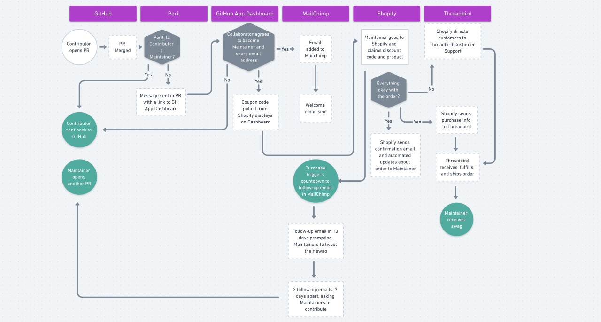

In user experience, there’s a concept from the Nielsen Norman Group called [“progressive disclosure”](https://www.nngroup.com/articles/progressive-disclosure/), which is an approach to designing better user interfaces (UIs).[^shout-out]

[^shout-out]:
  Shout out to [Chris Biscardi](https://christopherbiscardi.com/) for introducing me to this concept.

From their summary:

> Progressive disclosure defers advanced or rarely used features to a secondary screen, making applications easier to learn and less error-prone.

A common use of this pattern today is on user profiles. If you’ve ever seen a page that has a link to “advanced settings”, that’s progressive disclosure: most people don’t care about or need to touch the advanced settings, so those are moved to a secondary screen where only power users will bother to go. This simplifies the experience for most people without limiting the abilities of more advanced users.

What’s powerful about this approach is that it gives the UI the ability to “react” to feedback. An advanced learner can ask for more, and the “teacher” (the UI) can turn up the complexity to meet the learner’s needs.

## Progressive disclosure of complexity in systems

Outside of user interfaces, is progressive disclosure possible? How can we apply this approach to other areas?

### Provide abstractions for most decisions

The most important concept of progressive disclosure is **abstraction**.

Put simply, abstractions are a set of default decisions that allow someone to accomplish something while remaining blissfully unaware that any decisions were made at all. When done well, good abstractions are how we [make the right thing the easy thing](/right-thing-easy-thing/).

If someone wants to change the defaults, they opt out of the abstraction and make those decisions on their own — and this is where things get tricky. **To make sure we have _progressive_ disclosure of complexity, we need to avoid a scenario where the abstraction becomes all-or-nothing.**

In a lot of cases, we’re faced with the all-or-nothing dilemma: either I can accept the default options and make none of the decisions, or I can opt out of the abstraction and make _all_ of the decisions.

<Image
  creditLink="https://unsplash.com/photos/yW9DcLDYdMw"
  credit="Tuệ Nguyễn"
>

  

</Image>

### Layer abstractions: keep it “need to know”

To avoid this, we need to think about the defaults and make some decisions about them:

1. What kinds of decisions are being made?
2. Do those decisions fall into subgroups or themes?
3. Which defaults rely on each other?

By thinking through this, we can start to arrange the defaults in to _layers_ of abstraction, which gives the person using the system far more control. **With well-designed layers, people only opt out of the default decisions that _need_ to be changed. This gives them full control while still keeping as much of the complexity as possible abstracted away.**

## Progressive disclosure, layered abstraction, and dinner

Let’s keep going on this cooking metaphor to see if we can design a progressive disclosure of complexity around dinner. We’ll start with very little abstraction and add layers until we’ve created a fully abstracted version of dinner.

### No abstraction: home cooking

<blockquote class="twitter-tweet" data-dnt="true" data-theme="light">
We finally decided to get a grill and I’m regretting not doing this a *long* time ago. These burgers are unreal. The charcoal makes a big difference. 🤤🤤🤤 <a href="https://t.co/GsTXUNLRFq">pic.twitter.com/GsTXUNLRFq</a>
&mdash; Jason Lengstorf (@jlengstorf) <a href="https://twitter.com/jlengstorf/status/1099846347442728960?ref_src=twsrc%5Etfw">February 25, 2019</a></blockquote>

With no abstraction, dinner requires a lot of decisions and actions:

1. Grocery shopping for ingredients[^list]
2. Food prep: chopping, slicing, measuring, and so on
3. Cooking
4. Serving: setting the table, plating the meal

[^list]:
  This also skips things like “deciding what’s for dinner” and “making a list”, which also require effort and decisions to be made.

### Abstraction for shopping: meal kits/CSAs

Our first layer of abstraction might be to sign up for a [CSA](http://www.portlandcsa.org/what-is-csa/) or a meal kit service like [Blue Apron](https://www.blueapron.com/) that send over ingredients directly to our house. This abstracts away grocery shopping and leaves us with only the prep, cooking, and serving of the meal.

### Abstraction for food prep: frozen dinners and take-and-bake

If we don’t feel like prepping dinner, we might get a frozen meal or a take-and-bake pizza. This abstracts away the prep — we just need to put it in the oven and serve it.

It’s worth noting that this layer of abstraction doesn’t necessarily _include_ the previous abstraction. We might go grocery shopping for our take-and-bake pizza, or we might get one delivered by a service like [Instacart](https://www.instacart.com/). Since we’re layering abstractions, we aren’t stuck with all-or-nothing.

### Abstraction for cooking: drive-throughs, deli section, restaurants, delivery

On those nights where we don’t have time or energy to cook, we can abstract away the cooking process, too.

This layer of abstraction is a little harder to separate entirely from the prep layer — though I guess if you go to a Mongolian barbecue you prep your own meal but don’t cook it? — but it’s still independent of the shopping layer. We can _choose_ to abstract away all the steps and order delivery, or we can go shopping in the hot foods section of the grocery store and bring home a ready-to-serve meal.

<Image
  caption="Part of the chef’s tasting menu at Tusk in Portland."
  credit="Jason Lengstorf"
>

  

</Image>

### Full abstraction: chef’s tasting menu

To abstract away the entire process, we can go to a fancy restaurant and choose the tasting menu or [omakase](https://guide.michelin.com/us/chicago/features/kitchen-language-what-is-omakase/news). We don’t have to shop, prep, cook, or serve — we don’t even have to choose what we’re going to eat. Food will arrive, and we just have to eat it.

At a good restaurant, the chef’s tasting menu is a perfect example of making the right thing the easy thing: you make zero decisions, you don’t need to learn or do anything, and leave with a full belly and good memories.

## How to introduce progressive disclosure of complexity to systems

To roll out our own layered abstractions and introduce progressive disclosure of complexity to our systems, we need to:

### 1. Identify the decisions that have reasonable defaults

In any system, there will be decision points. If you’re creating a business system, you probably have a set of decisions that lead to the “happy path” (best-case scenario) for people using it.

<Image
  caption="A flowchart for <a href='https://whimsical.co/HrgMvcBZxyyWxcPPAUzPXf'>decisions made during fulfillment</a> in Gatsby’s swag store."
  creditLink="https://gatsbyjs.org"
  credit="Gatsby"
>

  

</Image>

Before any abstractions can be introduced, _at least_ the happy path needs to be mapped. One great way to do this is with a [flowchart](https://whimsical.co/), but how you map it doesn’t matter as long as you know:

1. all of the decisions that need to be made, and
2. which decisions have sensible defaults.

For example, it doesn’t really make sense to set a default for someone’s email address, but it might be useful to set defaults to opt out of paper statements.

### 2. Group the defaults into layers

Once we have a set of decisions with sensible defaults, we can group them into layers. Each layer should consist of logically related decisions. For example, color preferences might be one layer and flavor preferences might be another.

The goal is to find the balance between creating as few layers as possible while still allowing people to opt out of one set of defaults without being forced to make a bunch of decisions where the defaults were perfectly acceptable.

**We need to design abstractions that avoid overwhelming people while still giving them total control of their decisions.**

### 3. Introduce the layers to the people using the system

Once we’ve defined our layers, we need a way to expose them to the people using the system. In software, this might be an “advanced options” link or a section of the documentation describing advanced use cases. At In-n-Out Burger they have their not-so-secret secret menu. Online retailers like Bose have the floor models and the ability to fully customize the product.

The approach will vary from system to system — there’s no One True Way™ to share information, so our approach needs to be tailored to what we’re trying to accomplish and who the people are using the system.

### 4. Enable opting out of abstractions

Allow people to opt out of one layer of abstraction at a time while still keeping the rest of the defaults. In an ideal system, each default can be opted out individually, but that needs to be balanced against overwhelming people. This might be easier in software (the options pages can load with defaults, so only things that need to change require interaction), but definitely requires specific tailoring for each system.

However we get it done, once we’ve created the abstractions, people need to be able to opt out of them individually.
