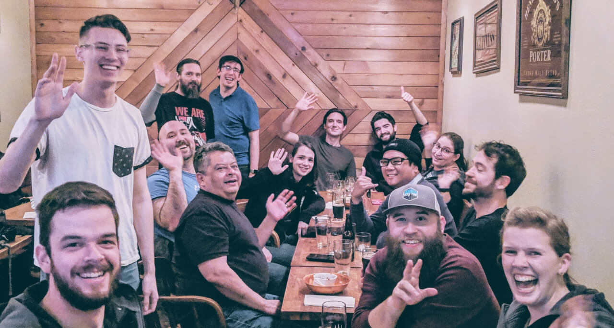
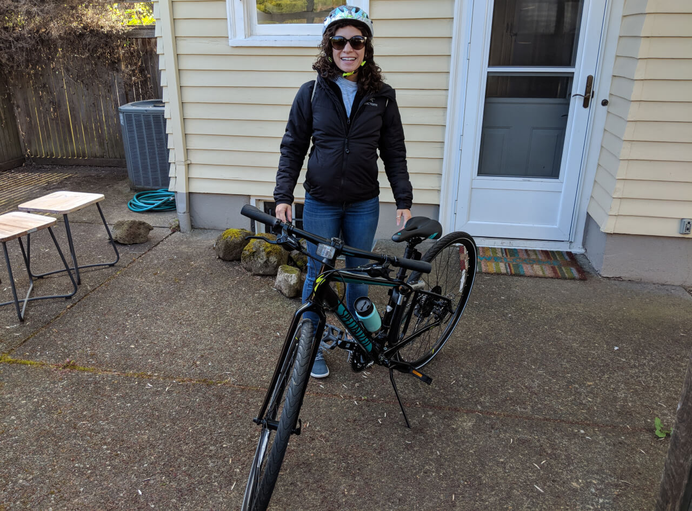

import { Image } from '$components';

I’m a firm believer in borrowing business ideas for personal life. At the beginning of 2019, I [held a personal retrospective](/2018-personal-retrospective/) and set goals for the year, and decided to do quarterly check-ins to see how I’m progressing against my goals.

## What are my goals for the 2019?

I [set goals at multiple levels](/level-setting/) in an effort to have a long-term vision of where I’d like to go as well as short-term tactical goals that I could work toward to make measurable progress.

### High-level goals

1. Be more creative off the computer.
2. Write more often.
4. Double down on community.

### 90-day tactical goals

1.  **Sign up for one class to learn a creative hobby.** (Status: ✅)

    I had originally planned to take a woodworking or music class, but I ended up signing up for salsa dancing lessons instead. This happened for a few reasons — it’s something I can do with [Marisa](https://marisamorby.com), it’s extra exercise, it’s something that I’m _definitely_ not comfortable with or good at — and wasn’t something I would have predicted I’d ever do, but it turns out that it’s a whole lot of fun to learn to dance.

2.  **Publish two articles per month.** (Status: 😕)

    I wrote two blogs on my main blog, one on my [code blog](/code/), and a few on the [Gatsby blog](https://www.gatsbyjs.org/contributors/jason-lengstorf/). This doesn’t quite average out to two per month. However, I _did_ end up starting a [weekly livestream](https://twitch.tv/jlengstorf) that I’ve been really consistent with, so I feel pretty good about the amount of content I’ve been creating.

    Really, though, I’m still not quite satisfied with the amount of non-work writing I’ve done. So I want to do better here.

3.  **Do at least two community events per month.** (Status: ✅)

    I had no problem hitting this goal because I absolutely love doing these community events.[^beers] Between local meetups and hosting a rotating dinner party series with friends, I’ve had no problem keeping my calendar full of great community events.

[^beers]:
  Do you live in Portland? [Join us for the next one!](https://tinyletter.com/beersatbeer-pdx)

<Image
  caption="A group of Portland friends at a “Beers at Beer” event."
  credit="Jason Lengstorf"
>

  

</Image>

## What do I want to change for the next 90 days?

For the most part, I’m pretty happy with how 2019 has gone so far.

However, there are a few things I’ve noticed that I haven’t loved.

### I get too many notifications from my phone

When I started at Gatsby, I installed Slack on my phone again. I left the notifications on, despite knowing better, because Gatsby is an early stage startup and things are volatile.[^lies]

[^lies]:
  These are the little lies I tell myself sometimes to justify doing something I know is bad for me. “But what if someone needs me?” “What if there’s a big problem?” Great question! What _would_ I do about that problem from the dinner table or a friend’s house?

  Probably nothing. So... do I need to hear about it _right now_?

None of the notifications have been an emergency. So, really, I’m just looking at my phone instead of paying attention to the world around me.

### I want to ride my bike more often

<Image
  align="right"
  caption="Marisa with her bike."
  credit="Jason Lengstorf"
>

  

</Image>

I bought a bike when we moved to Portland, but I’ve used it far less than I’d like to. Part of this is because I like to walk, even if the walk would take an hour, but far more often it’s because I get lazy and decide I’d rather deal with parking a car than carrying a bike helmet around.

And — as silly as this sounds — my bike is downstairs in the basement, and carrying it up and down the stairs is usually enough of a deterrent that I end up driving instead.

## What are my goals for Q2 2019?

Based on what’s happened so far and what I’d like to change going forward, here’s my next set of tactical goals for the next 90 days.

1. **Keep going to salsa lessons.** I’ve enjoyed these, so I want to keep them going. It’s a fun hobby that doesn’t involve the computer, so it seems like something I should continue.
2. **Carve out two hours a week for writing personal posts.** I feel better when I spend time writing out things that aren’t work-related, so I need to actively make space for it. However, I need to let go of my old routine where I had huge, uninterrupted chunks of time in the morning — that’s probably not going to happen for me anytime soon. Instead, I need to put dedicated writing time on the calendar and actually buckle down to do it.
3. **Keep Slack notifications turned off on my phone.** I don’t need them, and everyone at work has my phone number if there’s an emergency. I’ll be happier without the distraction.
4. **Find a way to store my bike upstairs.** I need to [make the right thing the easy thing](/right-thing-easy-thing/) here — if I pretend that I’m going to suddenly develop the self-discipline to haul a bike up and down stairs, I’m lying to myself. Instead, I need to make it just as easy to get on my bike as it is to get in the car.

## How’s your 2019 going?

Did you set goals for 2019? How are they going? [Hit me up on Twitter and share!](https://twitter.com/intent/tweet?url=https://lengstorf.com/2019-q1-retrospective/)
