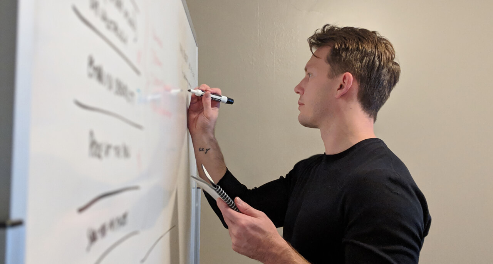
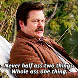
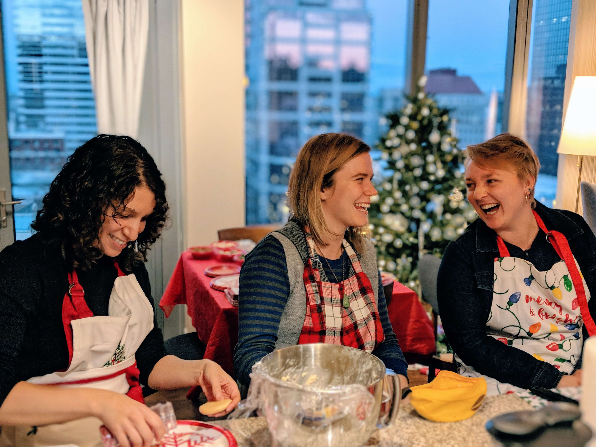
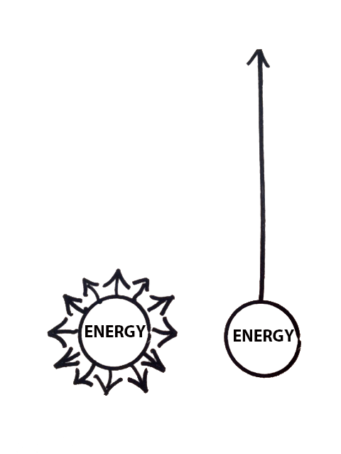

import { Image } from '$components'

My little brother and I used to play cars when we were younger. We grabbed our favorite Hot Wheels and staged death races, limited only by our imaginations.

“Blam! Blam! I’m shooting at you with spikey cannon balls!”

“Nope, you missed me! I activated my car’s wings to fly away.”

Our play battles were an endlessly creative effort. We added any feature, bell, whistle, or concept we could come up with to make ourselves unbeatable. Silly constraints like cost, physics, or reality couldn’t stop us — we were being creative!

“Nuh-uh! These are heat-seeking spikey cannon balls! They followed you into the sky.”

“No, my car has a freeze mode so heat-seeking stuff can’t see it.”

There were no limits. No rules. If you could imagine it, it was allowed.

“Oh yeah? Well *my* car has a laser cannon that shoots at the speed of light and has motion tracking, radar, satellite targeting, and a human spotter. I blast your stupid ice car out of the sky.”

“NOPE. My car has a laser reflecting shield. You just blasted yourself, idiot!”

These battles usually ended with one of us getting beaned with our stupid ice car.

## Without rules, imagination is ridiculous.

For most of us, “being creative” means unlocking the furthest reaches of imagination, plucking new ideas out of the ether, and inventing groundbreaking new ideas, products, or services.[^disruption]

[^disruption]:
  You may refer to this as “disruption” if you’re into Allbirds and Patagonia vests.

And, sure, a big part of creation *is* a swan dive into the Land of Imagination. For those of us who enjoy creative pursuits, this is the fun part.

But it’s not the only part. And — if we’re speaking from a strictly “using creativity to pay the bills” standpoint — it’s not the most useful part.

**Creativity happens in two stages: first, unbounded imagination; then — more importantly — ruthless editing.**

<Image
  credit="Jason Lengstorf"
  caption='My <a href="/best-friends/">friend Nate</a> editing down our master plan for a product we built together.'
>

</Image>

## Editing is how we transform imagination into creativity.

The fun part of a new project is scaffolding out into the stratosphere and thinking of all the endless possibilities. This is a decidedly good starting point; we should try to imagine what *could* be done with endless resources and bottomless support.

However, most businesses and side projects don’t have unlimited resources. So after we’ve done the fun part of imagining what’s *possible*, we have to sit down and do the much less fun part: deciding what’s *practical*.

**Think of creativity like a Pinkberry: imagination is realizing that we can put kiwi, cookie dough, or gummy bears on frozen yogurt; editing is what keeps us from adding all three at once.**

<Image
  align="right"
  credit="orentodoros"
  creditLink="https://pixabay.com/users/orentodoros-3240312/"
>

</Image>

## We willingly suffer to avoid decisions.

In an experiment made famous in the book *[Predictably Irrational](http://danariely.com/books/predictably-irrational/)*, Dr. Dan Ariely and Jiwoong Shin found that people were [willing to pay a cost to keep options available](https://www.nytimes.com/2008/02/26/science/26tier.html) — even when the option wasn’t actually a good one.

When we create things, we’re opening every door we can imagine. We’re zooming out to look at all of the options.

To be effective as creators, however, we have to choose the best options — and discard the rest.

In other words, after we imagine, we have to decide.

## To decide means killing your darlings

The word “decide” shares its roots with words like “homicide” and “patricide”; it literally means “to cut” or “to kill”.

The imaginative part of creativity is fun. We get to create as many options as we want with no rules or constraints! It’s a party! Each idea is special and precious and dear to us; we love them all.

But the editing part is (almost literally) *murder*.

> “In writing, you must kill all your darlings.” – William Faulkner

**After we see all the options spread out in front of us, we have to choose which ideas live — and which ones die.**

This makes editing uncomfortable. Each decision can feel like we’re boxing ourselves in, limiting our freedom, and locking ourselves into a course of action.

## Not deciding means we suffer for options

If we don’t make decisions, we can’t act. Taking action requires a clearly stated, clearly understood goal. You can’t tell the team, “We have a hundred amazing ideas and we might do any of them; let’s keep our options open.”

<Image
  align="left"
  credit="Parks and Recreation"
  creditLink=""
>

</Image>

In the words of Ron Swanson, “Never half-ass two things. Whole-ass one thing.”

Turning ideas into action requires clarity. This is true whether you’re a solo act or working on a team. Meaningful progress on knowing where you’re headed and why — but just as much (if not more) value comes from *knowing where you’re not going*.

**Editing turns idea soup into action steps.** It transitions from searching for new possibilities into focusing on probabilities. Your roadmap shouldn’t be a list of every possible idea; it should be a list of the ideas with the highest probability of success.

The process of editing ideas into a roadmap allows a team to move as a unit. It [sets expectations](/setting-expectations/) so the people around you know not only that the vision is to accomplish Goal X, but that the next steps are to complete Ideas A, B, and C. More importantly, this process of editing makes it clear to everyone that if Idea D arises, it can be considered at the next checkpoint, but it’s not part of the plan *right now*.

**If your strategy can’t be articulated with clear, concrete action steps, it’s not a strategy; it’s a mood.**

## What about agile? Move fast and break things? Startups?! Disrupt! PIVOT!

Committing to a course of action is not choosing to never learn or adjust course. Instead, it frees us up to stop *reacting* to every great idea, and instead to be *intentional* about which ideas are really worth doing the work of rewriting the plan.

The goal isn’t to stifle imagination, but rather to prevent us from chasing something shiny to the detriment of our progress. This new thing we’ve learned is super exciting! But if we do the thinking and editing, is it a big enough deal to upset the apple cart and change the entire direction of the project/team/company?[^protip]

[^protip]:
  Protip: it usually isn’t.

**A healthy strategy includes regular checkpoints where the team’s results and any new knowledge are held up against the strategy, and — if something sufficiently compelling has happened — the team can choose to update the strategy.**

On top of that, a healthy team is intentionally underutilized. This creates free time for chasing shiny things with low risk. A roadmap with this kind of slack built-in supports exploratory tinkering by defining a clear plan with clear boundaries: I know I need to complete these 5 tasks this week to keep us on track; I finish them by lunchtime Thursday; I now have a day and a half to do whatever I find exciting without hurting the overall strategic goals or slowing things down.

## Creativity two ways: a dinner party

Let’s imagine ourselves as part of a team that’s going to make a large dinner together. We want to create a memorable evening filled with great food, company, and conversation.

Now let’s imagine two different outcomes: one based on limitless imagination and possibilities, and one that combines imagination and editing.

<Image
  caption="Is this going to be a fun day or the last time we ever speak to each other?"
  credit="Jason Lengstorf"
>

</Image>

### Failure to decide leads to chaos

If we fail to edit, our dinner may go something like this:

- We list off cuisines that sound delicious: Thai, French, Italian, Mexican
- Everyone is excited about the potential
- Someone says, “What if we had a chocolate fountain?”
- There is much rejoicing
- We all high five and agree that dinner should happen

Our strategy here is... what? We know that we want to make dinner. We know that we like lots of different cuisines and that a chocolate fountain would be cool — but how do we get there?

*When* is dinner? Who’s getting the chocolate fountain? Is this a coursed dinner? A potluck? What is everyone cooking?

**There are so many great ideas here, but no decisions have been made.**

I’ve been in situations like these before, both professionally and as part of a dinner party planning committee, and it tends to shake out like this: eventually someone goes into Superhero Martyr Mode™[^martyr] and does all the work because no one is making decisions, and dinner is served with a heaping helping of bitter resentment over wilted trust with a delightful citrus-and-suck-it vinaigrette.

[^martyr]:
  Moms are so good at this. “Oh, don’t worry about me. I’ll just take care of everything. No no, don’t help. I’ve got it. You go enjoy yourselves while I do all the work. Oh no, I’m not upset at all.”

### Decisions suck at first but lead to strategy and happiness

If we follow through and edit, we might come up with our cuisines, then start making decisions:

- We throw out ideas for cuisines
- Our mouths water
- Someone proposes a chocolate fountain
- We fist bump and then blow it up, wiggling our fingers like flowing chocolate to show our excitement
- The question, “Okay, so what are our action steps?” is tossed out
- We all groan because the fun part is over
- There are 3 couples, so we’ll split the dinner into appetizers, a main, and dessert
- Jason likes making cocktails, so he’ll handle drinks
- We decide on Italian as our cuisine, so the chocolate fountain is out (boo!) but Leslie is making tiramisu (yay!)
- We all check our calendars; the Thursday after next works for everyone

Yes, it would be great to eat Thai food. Yes, it sucks not to have a chocolate fountain. But you know what *doesn’t* suck? **We have a date, a strategy, and clearly defined ownership — this means that we have a shared understanding of the desired outcome.** We can work toward our part of this dinner independently with confidence the others are headed to the same destination.

And because we’re flexible and ready to respond to new information, if we ruin the main, we can enjoy the appetizers and desserts while we wait for the pizza to arrive.

Our roadmap isn’t permanent, but it needs to be stable.

## Get comfortable closing doors.

The most effective people and teams I know are incredibly good at saying no to things. They pass on opportunities. They let good ideas wither on the vine.

In *[Essentialism](https://gregmckeown.com/book/)*, Greg McKeown makes the argument that **we only have so much energy in a given day, and we have to choose where we spend it.** We can put a little bit of energy into a lot of different things — chasing down every good idea we come across — or we can put all our energy into just a few really important things.

The difference in impact is huge.

<Image
  align="right"
  caption="You can spend your energy making a little progress in lots of directions, or lots of progress in one direction."
  credit="Essentialism"
  creditLink="https://gregmckeown.com/book/"
>

</Image>

Effective people don’t turn things down because they don’t want to succeed; they turn things down *specifically because they know they need to focus if they want to succeed.*

One of my favorite examples of this in practice is [Jeff Hawkins’s approach](https://www.wired.com/1999/10/the-philosophy-of-the-handheld/) to designing the Palm Pilot: he created a wooden prototype that he carried around and pretended to use to check his calendar or take notes. When his team proposed new feature ideas, he’d reach into his pocket and ask where the new idea would fit on the wooden block.

Hawkins wasn’t letting great ideas slip through his fingers by resisting feature creep on the Palm Pilot; he was *intentionally focusing on a small, ruthlessly edited set of strategic ideas* to ensure the success of his project.

## Are you creating something? Or just imagining things?

The next time you start brainstorming, planning, strategizing, plotting, scheming, or trying to take over the world, here are a few things to keep in mind:

1. **Imagining all the incredible possibilities is critically important, but it‘s only half the work of creating something.** After we imagine *all* of the opportunities, we have to edit our focus down to the *right* opportunities.
2. **Editing is a painful process that requires us to kill our darlings.** An idea can be great, but still be the wrong thing to focus on.
3. **No matter how good your ideas are, they’re worthless without action steps.** Once you’ve dreamed big, you *must* turn the ideas into a clearly defined roadmap; otherwise, you’re just dreaming.
4. **Don’t get distracted.** Assess your progress regularly — try a [retrospective](/2019-q1-retrospective/)! — to see if adjustments need to be made, but don’t change the whole strategy every time you see something shiny. Chasing exciting ideas is easy; consistently executing a well-defined strategy takes hard, disciplined work.

The ability to take Big Ideas™ and translate them into clear, actionable strategies is what turns a dreamer into a leader. It‘s what translates the vision into progress. It‘s what keeps teams motivated and making progress.

And if we get this wrong, the consequences are... well, I’ll just let you use your imagination.
