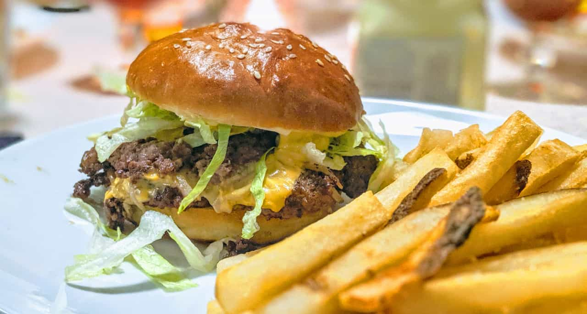
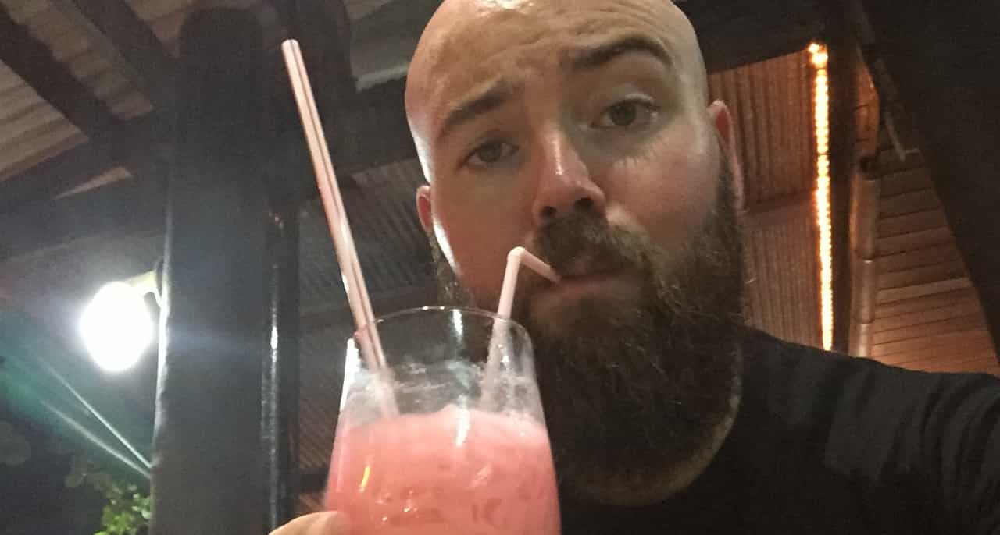

import { Image } from '$components'

An easy trap to fall into is believing that decisions have right and wrong answers.

"I have a good job now, but I have an opportunity to get a different job that I'm pretty sure will be better! What's the right thing to do?"

"I have the opportunity to travel for a year, but my significant other doesn't want to do the long-distance thing. Am I wrong for wanting to go?"

## What's "right" today may not be "right" tomorrow

One way to frame this is to think about it like choosing what to eat. Do I want a greasy smashburger and fries for dinner? Or do I want to eat something healthier like roast chicken and vegetables?

<Image
  caption="If you get invited to <em>my house</em> for smashburgers, though, YOU SAY YES."
  credit="Jason Lengstorf"
  creditLink="https://twitter.com/jlengstorf/status/1190826187943104512"
  creditType="Photo"
>

</Image>

The "right" decision here very much depends on a lot of personal context. What's my diet been like lately? Have I been eating pretty healthy and this is a reasonable indulgence, or am I three weeks into a binge? Am I trying to lose weight, or am I pretty happy with where I'm at right now? Do I have any upcoming dinner plans where I know I'm eating something particularly healthy or unhealthy?

Depending on my answers to those questions, the "right" decision will change. And — more importantly — if I find myself in this same situation six months from now, the "right" decision may very well be different, but *still "right"*.

If my diet has a cheat day every Saturday, then my answer on Saturday will be different than my answer any other day of the week.

## Every decision is partly right and partly wrong

Because we don't make decisions in a vacuum, we don't get to make clean-cut decisions. The best we can hope for is "mostly right, with minimal collateral damage".

My decision to pay a premium price for locally made furniture makes a small contribution to things I think are important: supporting local businesses, reducing the amount of cheap crap that gets mass-produced to break and end up in a landfill in a year or two, and so on. *However*, when I pay higher prices it drives demand that keeps locally made furniture out of reach for people who earn less money. So did I do a good thing and support local business? Or did I do a bad thing and empower capitalism to worsen wealth disparity?

Unfortunately, it's not an "or" — I did both. I don't get to exist without causing harm somewhere downstream from me.

The best I can hope for is to minimize harm and maximize benefit. But "harm" and "benefit" aren't absolutes, so really, what I'm doing is taking my own worldview, distilling it down into a model of what I consider to be beneficial and harmful, and optimizing my decisions to get the maximum benefit while causing the least amount of harm.

<Image
  credit="Grégory Roose"
  creditLink="https://pixabay.com/users/gregroose-2823595/"
  creditType="Photo"
>

</Image>

## Each decision point is a course correction

Because there are no "right" or "wrong" decisions, we're always optimizing for whatever's most important to us *right now*.

Each decision will [give us new information](/wasted-time/), and that often means making small adjustments to our worldview. This means each decision is an opportunity to adjust where on the spectrum we're aiming for.

It's like making bread: you start by combining the ingredients, and once you see how they're combining, you might need to add a little more of something to get the consistency right. The dough has to rise, and you might decide to add or remove some time based on how quickly it's rising. During baking, you start with a set amount of time, but you might pull it out early if it's getting too dark or leave it in for an extra few minutes if it's not quite done.

You always know where you're trying to end up — eating a delicious loaf of homemade bread — but as you move through the process and gain more information, you're able to make small adjustments to your decisions that improve the outcome.

On a more macro scale, this is what most of us would call "personal growth": as a teenager, I was so occupied with maximizing benefits for myself that I barely noticed when I caused harm; as an adult, I try my best to consider the trade-offs for myself and others before I make decisions.

I still get this wrong *all the time* — my goal isn't to be perfect, but to improve my averages so I'm [improving the baseline](/baseline/), not just for myself, but for everyone I come in contact with.

## What am I optimizing for?

Because it can be difficult to wrap your head around abstract concepts, I wanted to write out my own abridged career history and map the decisions I've made to what I was optimizing for when I made each move.

This isn't intended to be a guide for anyone, but rather an anecdote to illustrate the concept and how it influenced my own decisions.

### My optimizations started out broad and had wild shifts

The first thing that I *really* threw myself into headlong was music. I was optimizing for the success of the band, and everything else was secondary. I slept in vans and on concrete floors, ate instant noodles for weeks on end, and worked endless hours trying to book shows, build and grow a fanbase, and whatever else it took to become a rockstar.

When I saw the level of "rockstar" that was available to me,[^band] my priorities shifted. I didn't want to be broke and struggling and partying all the time. So I started optimizing for something else: I took all the things I'd learned to support my band and started looking for ways to use them more lucratively. I landed on web design and started an agency.

[^band]:
  The band I was in was on the shortlist for several record labels that were pretty popular at the time. What we learned about record deals, though, is that most of them are basically high-interest loans. Some of our friends who had been signed ended up paying back pretty large amounts of money to the labels after their band failed to sell enough records to break even. We tried to stay optimistic, but we all knew we weren't a good enough band to hit the sales numbers we'd need to pay back the advance.

As my agency grew, I was optimizing for control. I wanted to choose who I worked with, when and how I worked, how the projects were tackled, etc.

### Once I had a general direction, I had to learn what was valuable to me

As I got further along in my career, total control started to lose its shine; I was exhausted, beaten down, and [physically self-destructing](/overkill-cult/).

For my next role, I didn't want more of the same. I changed what I was optimizing for: time.

<Image
  caption='This was during my <a href="/two-years-in-airbnbs/">long-term travel experiment</a>. Optimizing for time was a must.'
  credit="Jason Lengstorf"
  creditType="Photo"
>

</Image>

I didn't mind giving up some of the creative control if it meant I could get back to a reasonable schedule. So my next role was a long-term contract for a client that I knew well, working on a single project that was more research than a real product, which meant the urgency was low. As a result, I found myself working about 35 hours a week — it was glorious.

Toward the end of that contract, we ran out of things to do. I offered to let them out of the contract early, but this was a dream client — they held up the last three months of the contract even though I had no tasks. And then I realized something: I don't want *all* of my time to be free.

Three months without anything to focus on caused me to drop into a full-blown existential crisis. I didn't have a project to give me direction, so... what *was* I going to do? I felt rudderless and spent several weeks on the brink of the most privileged depression[^privilege] I think anyone's ever had.

[^privilege]:
  This wasn't actual, real depression. This was *fancy* depression. "Woe is me! I get paid to do *nothing!* Do I serve a purpose? Am I but an expensive pet? Doth my existence merit the tallow in its brief candle to flicker upon this mortal sphere? Woe! Woe! Woooooooeeee!"

  But let me also caveat that by saying: look, this is 100% what we should all call "a good problem to have", but good problems can still be problems. Each new phase of our life we enter leaves behind one set of problems and introduces a new set that's challenging and frustrating, albeit less life-threatening. So while we need to acknowledge that we're privileged, it's also okay to see these problems as real problems. We just probably don't want to tweet about how hard our life is because we don't have to *work* to get *paid* and we're *bored* oh em geeeeeeeee.

I'd been optimizing for free time, and I'd *over-optimized* for it. I learned that it wasn't *time* that I wanted, but *balance*. I want plenty of free time to play, relax, socialize — but I *also* want to do work that felt important and impactful. One without the other leaves me unfulfilled.

I changed what I was optimizing for in my next job search.

### Knowing what I valued let me zero in on specific optimizations

When I joined IBM, I knew that it was a big enough company that I could go home and forget about work in the evenings and weekends and nothing would fall apart. I also knew I'd be on a team, where I'd learn from people far smarter than I am and help coach up people who were earlier in their careers.

I was optimizing for *growth* — with a non-negotiable requirement of *balance*.[^stack]

[^stack]:
  Something to note here is that these optimizations stack. My early optimizations for control at my agency gave me a broad range of experiences over the ten years I was running it. This helped me negotiate for more senior- and architect-level contracts and roles, which meant I still got a good deal of control over the direction of my projects.

  Optimizing for growth still requires a focus on control and time, because a growing career that undoes all the efforts I’d made toward gaining control over my time and autonomy doesn't really feel like growth at all.

IBM was incredible for my growth: it gave me the resources and freedom that led to me leading a team that built an open-source framework for GraphQL, which opened the door to speaking about [building teams](https://youtu.be/xqT8e6_yzLg) and [architecting systems](https://youtu.be/T3FbZsYXi50) — and that opened the door to a huge number of new opportunities.

Over time, IBM's bureaucracy became too challenging to navigate, and I found myself in months of meetings trying to get approval to do weeks of work, which made me feel like I was no longer in control of my work. That led me to look for a new role that was more in line with my goals.

When I moved from IBM to Gatsby, I was still optimizing for growth, with a redoubled focus on autonomy. I joked that my job title was Human Duct Tape because I ended up going wherever there were new challenges, from designing a hiring process to creating open-source contribution automation to creating a swag store (and the swag to go in it).

### The optimizations freed up space for me to see outside my own experience

While I was there, I also started to realize that I didn't feel as motivated by career growth in the "get promoted" or "make more money" sense. I was realizing that what really felt valuable to me was helping other people grow — I wanted to share what I'd learned so other people could (hopefully) learn from my mistakes and avoid some of the difficulties I'd brought upon myself early in my career.[^share]

[^share]:
  This has always been an interest of mine — this blog was started years ago in an attempt to share my own stories and lessons learned with the same goal — but only in the last few years have I felt secure enough in my own career to *focus* on it.

I started spending a huge amount of my time thinking about what could be done, both personally and at a company level, to help open doors for people and provide as much guidance as support as possible.

https://youtu.be/IJh92pdf6XE

### My shifted focus showed me some of my blind spots

My transition out of Gatsby was another slight shift in optimization: I wanted to be on a team where more people were working on what I was working on. More than that, I wanted to be surrounded by people who could teach me to be better at the new things I found myself learning, like how to create space for other people and make them feel welcome enough to contribute.[^experiences]

[^experiences]:
  When I was working on my own growth, it was hard to imagine experiences other than my own. It was also hard to imagine that the things that worked for me might not work for everyone.

  When I started focusing on actively helping other people, I quickly realized that I not only had a shitload of personal privilege that I'd never really considered — I'd built my career as a young, healthy, straight, white man with a middle-class family that would take care of me if I took a risk that didn't work out — but that I also only knew how to communicate in the ways that had worked for me — jump in with suggestions; try something and ask for forgiveness later; question authority and put up a fight — which carry a high risk of catastrophically backfiring for others (especially people who weren't backed up by similar amounts of privilege).

  I wasn't going to be able to learn how other people experienced the world on my own. I needed to be on a team where people could coach me to frame my advice and add the proper disclaimers and avoid saying "this will work for you" if it will only *for sure* work for me.

At Gatsby, I was a team of one. That was amazing for all the original optimizations: I had full autonomy, I set my own deadlines and hours, I was able to drive my own roadmap — but I wasn't getting much feedback. And it just didn't make sense to expand my team yet.

We knew whether or not a thing I'd done had worked in the general sense, but there was no one with experience doing the same things to give me feedback about what could have been tweaked or improved.

The worst outcome I could imagine for myself is to reach a point of complacency or feeling like I've "finished" learning. I knew I needed to join a team where people would challenge me to do better and give me feedback and ideas that would help me avoid settling into a comfort zone.

When [Sarah Drasner](https://twitter.com/sarah_edo), one of the people I admire most in the community, approached me about joining her team, I knew I had an opportunity to get feedback and have my ideas challenged by the best in the business.[^sarah]

[^sarah]:
  I also spent half an hour forcing my partner to read the message and screaming, "HOLY SHIT SARAH THINKS I'M GOOD AT THIS DID YOU READ IT NO BUT READ IT AGAIN HOLY SHIT"

At Netlify, I'm optimizing for new kinds of growth: I want to continue doing what I can to help people succeed, both through my own efforts and through company initiatives; I also want to grow as much as I can with the support network of Sarah, [Phil](https://twitter.com/philhawksworth), [Divya](https://twitter.com/shortdiv), [Tara](https://twitter.com/Tzmanics), and [Shawn](https://twitter.com/swyx).

### What I'm optimizing for will evolve over time

That's what I'm optimizing for *right now*, but I know that I'll need to adjust as time goes on. My adjustments have been much more subtle as time goes on ("I want to do the same thing but with an experience leader" is very different from "I accept that I will not be a rock star so I guess I want to be a web developer?"), which I take as a very positive sign: I'm not veering wildly from thing to thing, hoping to find something that makes me happy; I'm making small adjustments to keep me pointed in the direction that I *know* makes me happy.

## What are you optimizing for?

We're all optimizing for something, whether or not we've made a conscious decision to do so.

So what are *you* optimizing for? How are your decisions helping you get there?
