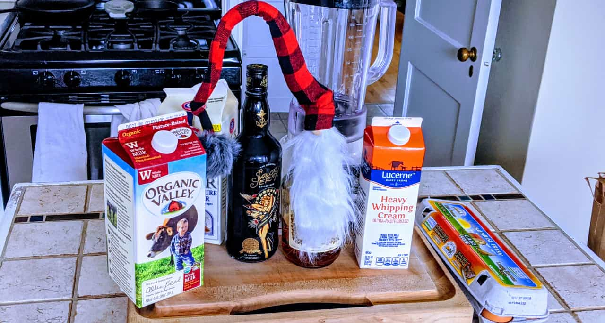
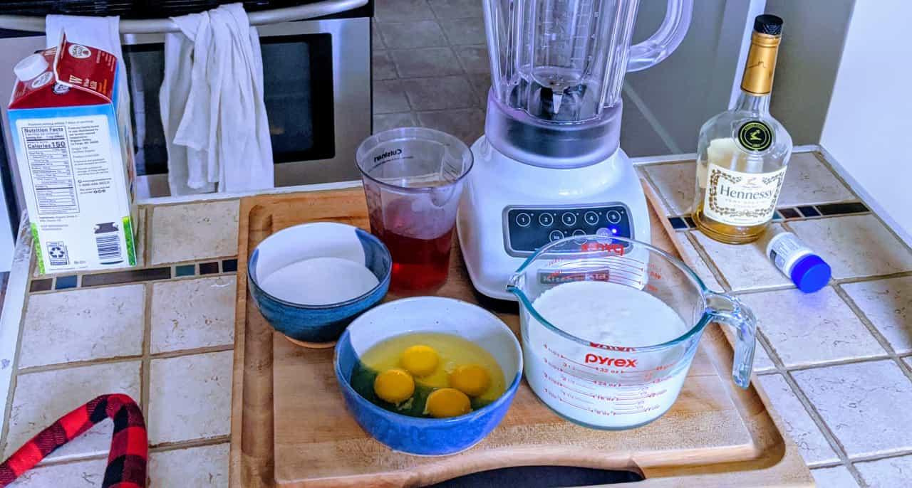

import { Image } from '$components'

The first few times I tried to cook, I stressed myself out and the results were disappointing.

I couldn't understand how it went wrong. "I followed the recipe! What the hell?!"

I'd start cooking by reading step one, which might say, "Add the garlic and onions to the pan and sauté until fragrant." Then I'd jump up to the ingredient list and read that I needed one medium-sized onion (diced) and three cloves of minced garlic. So I'd bust out the cutting board, dice 'em up, and start cooking.

Then step two would come: "Add in the tomatoes, tomato paste, chicken broth, paprika, cumin, salt, and pepper and bring to boil, then let simmer for ten minutes."

Oh. That's a lot.

I'd frantically measure out ingredients while trying not to burn the garlic and onions.

Chaos reigned, and I'd measure wrong, overcook things, or forget ingredients entirely.

## Then I learned about mise en place

French culinary education teaches a practice called *mise en place*, which roughly translates to "everything in its place".

In practice, this means the first step to cooking a meal — before any actual *cooking* happens at all — is to measure everything and make sure it's prepped and ready to go.

<Image
  caption="Egg nog ingredients, plus a goofy gnome holiday bottle topper."
  credit="Jason Lengstorf"
>

  

</Image>

**Learning mise en place changed the way I cook.**

Every year around the holidays I make a batch of [Jeffrey Morgenthaler's egg nog](https://www.jeffreymorgenthaler.com/egg-nog/).[^not-tequila] The first couple of times I did this, I found myself trying to quickly measure all the ingredients while the blender was running, which tended to work out, but was more stressful than I prefer.

[^not-tequila]:
  The one with brandy and rum at the bottom of the page, not the tequila/sherry version. The tequila version is good, though, and definitely worth trying.

After learning about mise en place, I start the recipe by measuring and prepping the ingredients, then putting them into bowls according to the step where they're added — cream and milk in one bowl, sugar in another, etc.[^chop]

[^chop]:
  In recipes where ingredients require prep like chopping, slicing, etc., do that before putting them into the bowls, too.

<Image
  caption="Mise en place for egg nog: everything is measured and in separate bowls, ready to be poured in at the right time."
  credit="Jason Lengstorf"
>

  

</Image>

Now the recipe is a breeze: I'm just pouring in Bowl #1, watching the clock, pouring in Bowl #2 slowly, and so on until I end up with a stress-free batch of delicious egg nog.

## Mise en place is for more than just cooking

The more I think about it, the more I'm convinced that the concept of mise en place has applications across all aspects of life. Whether I was specifically calling it "mise en place", or thinking about it as [efficiently planning projects](https://lengstorf.com/effective-project-planning), or waving my arms about [the importance of setting good expectations](https://lengstorf.com/setting-expectations), the common thread is in preparing up-front to make doing the work more effective and less hectic.

I tend to call this kind of work [meta-work](https://lengstorf.com/yak-shaving).

**If we know that we want to achieve a certain outcome — a delicious meal, a successful project — we give ourselves far better odds of achieving that outcome by learning what we need and getting it ready first.**

## Mise en place at work

At IBM, I ran a couple projects where I just dove in. I had a rough idea of where we needed to go, so my team just started building stuff. This put a lot of strain on us: it *always* felt like we were just making it up as we went along (we were) — we kept throwing away work when we hit surprises[^unsurprising] and had to regroup and adjust our plans.

[^unsurprising]:
  The "surprises" weren't actually surprises; they just felt that way because we hadn't thought more than a step or two into the future.

Had we done planning work ahead of time, we would have spotted most of the surprises *before we ever wrote a line of code*, which would have saved us quite a bit of time and frustration.

At [Netlify](https://netlify.com/?utm_source=lengstorf-com&utm_medium=mise-en-place-jl&utm_campaign=devex), I'm adopting a mise en place approach. I'm in charge of building the swag store, and starting by doing the planning. Instead of diving in, we're asking questions:

- What are we building?
- What work has already been done by other people in the company?
- What is our budget?
- Who are the stakeholders?
- What technologies do we need to integrate with?
- What are the non-negotiable features that need to be complete to mark this project as "done"?

Because we took the time to slow down and ask *before* starting to build, we already have answers to these questions. No time has been spent on design or code yet.

This has a profound effect on the project: rather than a panicked race along a path that we're making up as we go along, we have the whole project mapped out, with a clear understanding of the technical scope, business goals, ownership, and checkpoints.

**Instead of relying on assumptions and sheer force of will to complete the project, we have a clear path, with the requirements for each step ready for when we get there.**

Sure, it starts out a bit more slowly, but now that we've got the plan things are humming along quickly and I haven't felt stressed about it once.[^time]

[^time]:
  It's counterintuitive, but deliberately slowing down the beginning of a project has a *huge* payoff when it comes to meeting deadlines.

  By intentionally taking time at the beginning of the project to understand the scope and requirements thoroughly, we set better estimates, hit fewer unexpected challenges, and have an easier time getting the entire team to work together effectively.

## Less splatter paint; more paint-by-numbers

There's a time to make it up as we go along — experimentation and play are critical parts of learning and improving[^experiment] — but when it comes to projects where we need the closest thing to a guarantee we can manage, we don't want to be wandering around; we want to know *exactly* what's going on.

[^experiment]:
  I still have days where I just empty the contents of my fridge onto the counter and see what I can whip up. I still spend some of my free time playing with new tech and/or new ideas to see how it feels and poke at unknown corners to see what I find.

  Unstructured exploration is *so* important. But it's not the right tool for the job when you have deadlines and specific goals.

**Mise en place changes projects from unbounded exploration to paint-by-numbers: we know what to do at every step; we just need to do the work.**

## How to apply mise en place to your own life

If you want to give this approach a try, choose anything that you want or need to get done and try to separate out all the bits that can be done ahead of time, then do those *first*.

Are you putting together a bookshelf? Lay out the pieces for each step in order before you start building anything.

Starting a new project? Figure out who the stakeholders are and learn what their desired outcomes are — get those nailed down first. Then map out the project and figure out what questions need to be asked. What are the checkpoints? When do they happen (e.g. at the end of certain phases)? What needs to be true for a given phase to be complete? Who owns final approval?

All of this will need to be answered at some point.

Doing meta-work ahead of time doesn't add extra work — it moves the decision-making to the beginning of the project, which eliminates mid-project surprises and *decreases* the overall amount of work required.

The added clarity goes a long way toward reducing the team's stress and improving their ability to work quickly and effectively without constant oversight.

**We're not choosing whether or not we plan — planning will *always* happen — we're choosing whether we plan *first*, or plan *after* we've done a bunch of work against incorrect assumptions.**

## What else can be simplified with mise en place?

What other projects or activities get simpler if we prepare ahead of time? How do you use mise en place in your own life?

[Share your ideas and stories on Twitter!](https://twitter.com/intent/tweet?text=First,%20Get%20Ready:%20What%20mise%20en%20place%20can%20teach%20us%20about...%20everything&via=jlengstorf&url=https://lengstorf.com/mise-en-place/)
