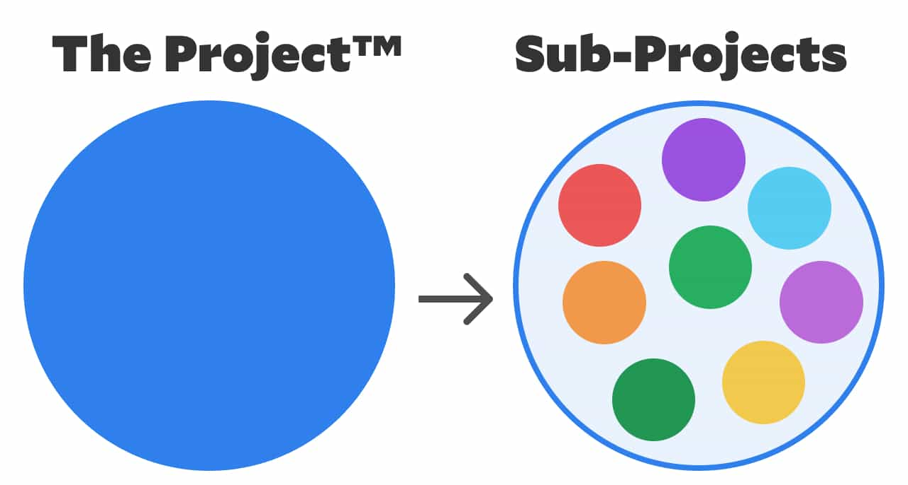
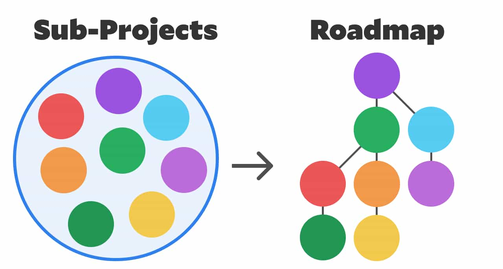
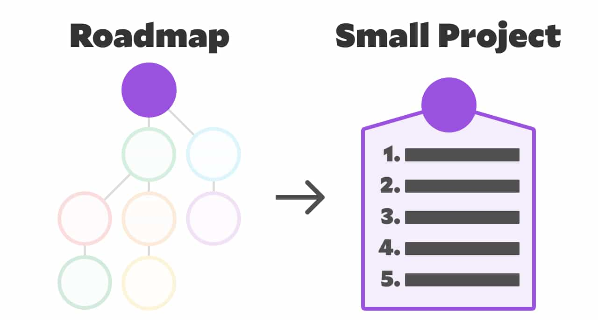

import { Image } from '$components'

I place a lot of value on planning. Which means I talk about it a lot. Like, *a lot*.

For all my talk about planning, there comes a point at which we need to stop planning and start, y'know, *doing* stuff. But where is that line?

**How do we know when we're done planning and ready to start executing the plan?**

My friend [Chris Biscardi](https://www.christopherbiscardi.com/) gave me some feedback on a post I wrote about the concept of [mise en place as it applies to project planning](https://lengstorf.com/mise-en-place/) and made excellent points:

> In cooking, everything is planned down to the last detail. It's all plan, then execution. It sounds like you're saying, "Plan everything before you begin," and that feels a bit at odds with software development. You can't entirely plan the surprises out of projects.

Possibilities open and close as you do more research. Figuring out the optimal time to stop researching, make a decision, and start working to implement that decision is important — and you'll never get to 100% complete research. You also need the ability to switch from active work on the project to researching potential future roads again. It's more of an ongoing process than a strict plan-then-execute.

Chris makes three extremely good points here:

1. It's impossible to plan in such a way that surprises can't happen.
2. The process of working on a project exposes areas that need additional research and planning.
3. Projects — especially large ones — aren't fixed efforts. They're processes.

Hearing this feedback made it clear that I've been banging the "do more planning!" drum without digging deep enough into handling the messy realities of working on real-world projects.

So let's fix that.

## tl;dr

- Including stakeholders in planning and limiting project scope will help minimize surprises.
- To complete large projects, break them into smaller projects, plan the highest priority small project, execute the plan, check assumptions, then repeat.
- Short-term plans should be high-fidelity and we should have high confidence in their success.
- Long-term plans will be lower fidelity and more likely to change over time.
- If we spend too long planning, we waste time for marginal improvements to the plan.

<Image
  caption="A train needs both rails <em>and</em> an engine, or it won’t accomplish much."
  credit="Denis Chick"
  creditLink="https://unsplash.com/photos/mHqIs22M2Kw"
>

  

</Image>

## We can't plan our way out of doing the work...

No amount of planning will deliver a finished product. Plans are the rails that guide the train to its destination, but we still need an engine — that's us, doing the work — to move the train along those rails.

Planning is a critical step, but it's still only one step along the path to success.

## ...but we also can't work our way out of a bad plan.

There's a reason we regularly say a project that's gone horribly wrong has "gone off the rails".

Without a good plan, we can move the project forward, but exactly *where* we're moving it isn't clear. Execution without planning is risky and stressful and potentially *very* expensive and wasteful.

## We need both.

Finding a balance between planning and execution — as well as a good rhythm for planning and executing as a continuous cycle — can be the difference between stressed out, unproductive teams and highly efficient, happy teams.

## Surprises are inevitable — but they don't need to be destructive.

There are myriad ways we'll be surprised during a project. A chosen tool may prove incapable of handling a critical feature. The project stakeholders may swoop into a meeting and change the entire direction of the project without notice. Another team may have already built this feature and no one told us about it.[^ibm]

[^ibm]:
  I watched this happen a couple times at IBM.

  Worse, I once had to *race* another team to complete a project because they heard what my team was working on, didn't like it for political reasons, and decided that they'd build their own version they could control.

  How do you account for *that* in a project planning meeting?

Many of these surprises can be eliminated with good planning: for example, we should be confident that our chosen tool can support the required features *before* we start building with it.[^chris] Learning that our plan has a fatal flaw mid-way through a project is a signal that we failed to research and plan properly.

[^chris]:
  I picture Chris pointing at the screen with a "this fuckin' guy" expression on his face as he reads this sentence, because *how do you know if a tool can support a feature if you're building things that don't exist yet?*

  That's a valid point, but I'd argue that an open question about a tool's capabilities points to the need for a short-term research project dedicated to evaluating the tool's capabilities as a way to de-risk starting the larger project with it.

  For a one-person team that may be a purely academic distinction, but for larger teams it would mean the difference between a senior team member building throwaway prototypes to prove that something is possible, and putting a full team on a project that may need to be restarted from scratch if the tool fails to meet minimum requirements.

Some of these surprises are kind of like the weather when we book flights: there's not much we can do about a severe thunderstorm shutting down our connecting flight in Denver, and there's even less we can do about an executive with a new pet project. We do the best we can, but it is what it is.

One strategy that can help mitigate issues with stakeholders changing their minds is to involve stakeholders in the planning and make sure the outcome is clearly defined with a public sign-off on the scope. It won't matter if they're the type to contradict themselves and ignore their own sign-off, but honestly, if your stakeholders can't sit still long enough for you to get through two weeks of work, it might be worth looking for new stakeholders.

## The plan defines the work defines the next plan.

Big projects are impossible to plan in entirety. However, it's *critical* to have a clear idea of the desired outcome in just enough detail to get the whole team on the same page about what direction we should be rowing in.

Big projects, in my mind, are better described as a related collection of smaller projects. These small projects are temporally bound to each other in many cases, meaning that one project can't start until another is completed.

[Planning big projects is an exercise in multi-level thinking.](https://lengstorf.com/level-setting/) We need to hold in our minds The Project™, while breaking off chunks of The Project™ into small-P sub-projects.

<Image
  caption="The Project™ is made up of lots of sub-projects."
  credit="Jason Lengstorf"
  border={false}
>

  

</Image>

### The Project™ is the vision.

The Project™ is a vision: it's a high-level, long-term, low-fidelity plan. It's huge and complex and full of assumptions and educated guesses. It will see dozens, if not hundreds, of small revisions and adjustments as we work toward realizing this vision.

<Image
  caption="Sub-projects should be prioritized into a roadmap."
  credit="Jason Lengstorf"
  border={false}
>

  

</Image>

### Work backward from the vision to create a roadmap.

But from The Project™, we can work backward from our desired outcome to get a rough sense of the steps that need to be taken to get there. Those steps can be further broken down into a roadmap, and that roadmap gets turned into a prioritized list of smaller projects that are short-term and focused on a single sub-goal.

<Image
  caption="The first sub-project can be planned comprehensively."
  credit="Jason Lengstorf"
  border={false}
>

  

</Image>

### Prioritize the roadmap, then thoroughly plan the first project.

These smaller projects should be prioritized. The highest priority project can then be planned in high fidelity, with a short time horizon. Then, with high confidence, we're able to execute the plan to complete the first small project.

### Repeat until the vision is realized.

When the project is done, we go back to The Project™, check our assumptions against new information learned while executing the last plan, then choose our next small project and start from the top.

By taking a moment at the end of each small project to check assumptions, we can make small adjustments to The Project™ to ensure that our vision lines up with the realities of building it. This avoids the pitfalls of [waterfall project management](https://www.projectmanager.com/software/use-cases/waterfall-methodology) while still providing a lot of structure for teams.

## Confidence in a plan should decrease as the time horizon gets further away.

We should be able to plan for short-term, high fidelity plans with fairly high confidence. We're never going to be 100% sure that something will work out, but it shouldn't be unreasonable to expect that we can plan 2–4 weeks of work confidently.

As we look further into the future, however, we should be comfortable working with lower confidence. We can't predict the future, so getting comfortable with uncertainty is a critical competency.

To give a practical example, my plans for tomorrow are more or less finalized. Barring any substantial bad luck (e.g. a sick friend, a burst pipe, the apocalypse) I know *exactly* what tomorrow holds in terms of where I need to be and who's expecting things from me.

My plans for three months from now are significantly less concrete. I'm talking to a few friends about visiting, and in discussions with some conferences about speaking, but the dates are still unclear and there's a reasonable chance that some of it won't happen at all. I have plans, but I'm less confident about them this far out.

## There is a point of diminishing returns with planning and research.

While it's important to do the meta-work and ensure that we're going into our projects with high confidence and a clear plan, there's a point at which we cross over from planning to procrastination.

It's hard to know exactly what the "right amount" of research is, but that number *for sure* is not 100%. The amount of extra confidence that comes with gathering 100% of the available information isn't going to be large enough to make up for the extra time required to gather that information.

My personal guideline is to plan until I don't have any question marks left. I may not have all the information to be sure my chosen solution is "the best", but I *do* know that it can deliver everything that I need to execute my plan.

If I find myself looking at a proposed solution and thinking, "I don't know if we can do X with this setup," then I know I need to keep researching and planning.

## Let's recap: how do we find balance between planning and execution?

For any project to succeed, both the planning and execution need to go well. For larger projects, we need to do the research and planning up front to avoid the most obvious failures and road blocks, and mitigate as best we can the parts of a project that we can't control, like stakeholder-driven changes mid-project.

We can't plan entire ambitious projects from start to finish, but we *can* break large projects into smaller projects and thoroughly research and plan those.

After completing small projects, we should check our long-term plans and assumptions against any new knowledge we gained from the project, make any necessary adjustments, and then repeat the process for the next small project.

While our long-term, large project plans will necessarily be a little vague and subject to change as we learn new information, our short-term plans for small projects within the larger project should be thoroughly planned and fairly concrete.

However, we need to keep in mind the balance between planning to improve our chances of success and planning to put off making a decision and doing the work. As a general guideline, plan until there are no question marks left in the short-term plan, then execute.

## How do you plan your projects?

I've seen a huge amount of success (and a significant decrease in my stress levels) by implementing the planning guidelines I talk about here,[^anywhere] but I by no means think that this is the only way to do it, and I *know* there's always room for improvement.

[^anywhere]:
  I do! I like them! I like plans! 
  Let’s talk of planning, fan of plans! 
  I’ll talk planning in the store. 
  I’ll talk plans until you’re bored. 
  I’ll talk planning here or there. 
  I’ll talk planning ANYWHERE!

I want to hear from you! How do you and/or your team plan projects? What works? What doesn't?

[Share your ideas on Twitter](https://twitter.com/intent/tweet?text=Finding%20the%20balance%20between%20planning%20and%20execution%20%E2%80%94%20some%20ideas%20for%20designing%20processes%20to%20set%20clear%20expectations%20and%20improve%20the%20outcome%20of%20your%20projects.&via=jlengstorf&url=https://lengstorf.com/planning-vs-execution/), or join a group of content creators and enthusiasts discuss this stuff at length on [the Party Corgi Discord](https://jason.af/pcn). (A lot of my posts — like this one! — start as discussions in that group.)
