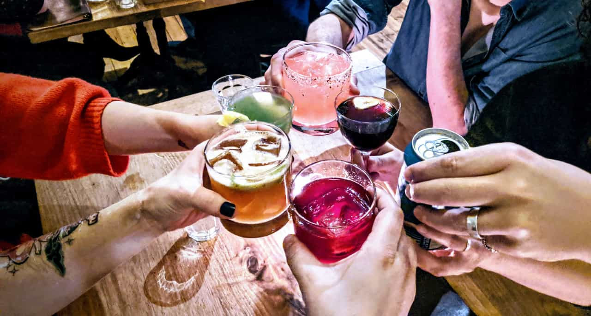

import { Image } from '$components'

I've been writing a [retrospective](/2016-personal-retrospective/) [every](/2017-personal-retrospective/) [year](/2018-personal-retrospective/) for a while now, and we've ticked over into the '20s, so it's that time again.

A retrospective is a format for reviewing progress to extract useful information from the past to inform actions going into the future. It's popular as a business practice, but (in my opinion) severely undervalued as a personal tool.

A personal retrospective is a way to measure progress and check in with ourselves: are we [improving the baseline](/baseline/)? Are we steadily [becoming better versions of ourselves](/keeping-score/)?

Taking the time to reflect and record our progress helps us qualify, quantify, and concretely describe the things that made us feel good, the things we want to improve, and the things we want to change as we go into our next year.

## First, a recap: where was I at the end of 2018?

In my 2018 retrospective, I laid out several goals for myself:

1. **Be more creative *off* the computer.** I was feeling like I spent way too much time looking at a screen, so I wanted to take on new projects that weren't screen-based.
2. **Write more often.** This has been my ongoing struggle. I love writing, but I struggle to make time for it. In 2016 and 2017, I only published three articles each year that weren't retrospectives — this was a huge drop-off from previous years: in 2015 I averaged a post every month, and in 2014 I wrote 33 posts. 😱
3. **Double down on community.** I moved to Portland at the beginning of 2018 after a year in Austin and [two years before that living out of a suitcase](/two-years-in-airbnbs/). A large part of our decision to settle down in Portland was because we missed having a close network of friends and family. And I knew that if I wanted to actually *have* the community I was missing, I needed to work for it.

I also set a goal to write quarterly retrospectives. I managed to get Q1 and Q2 done, but they felt less helpful than I'd expected, so I skipped Q3 and Q4 in favor of going back to the annual check-in.

Using these goals for context, let's get into the retro.

<Image
  caption="The Steadily Escalating Dinner Party raising a glass at Canard."
  credit="Jason Lengstorf"
>

  

</Image>

## What went well in 2019?

Overall, 2019 was a good year for me. I feel like I'm stepping into 2020 in a good place mentally, professionally, personally, and (somewhat) physically.

### I developed hobbies that don't involve computers.

Over the last year I've taken salsa dancing lessons, built a shed,[^shed] decorated our house, and became regulars at a few local businesses.

[^shed]:
    Okay, so this isn't really a hobby. It was more of a project. And I hated it. And I'm still somewhat convinced that the shed will fall over in a strong wind. But goddammit I hammered the thing together with my own hands! I'm calling it a victory for Outside Jason.

<blockquote class="twitter-tweet">
we got the lights and a few more plants on the bar shelves and hoooooooly shit I'm in love with this 😍😍😍 <a href="[https://t.co/Q91cOmwt0g](https://t.co/Q91cOmwt0g)">[pic.twitter.com/Q91cOmwt0g](http://pic.twitter.com/Q91cOmwt0g)</a>
— Jason Lengstorf (@jlengstorf) <a href="[https://twitter.com/jlengstorf/status/1199936561640431617?ref_src=twsrc^tfw](https://twitter.com/jlengstorf/status/1199936561640431617?ref_src=twsrc%5Etfw)">November 28, 2019</a></blockquote>

I'm still more or less an indoor pet, but I feel less like all of my attention goes to screens, which feels nice.

### I wrote significantly more content.

In 2019, I was able to get more content published on my blog than 2017 and 2018 combined. I also wrote technical articles for publications like [CSS-Tricks](https://css-tricks.com/how-to-modify-nodes-in-an-abstract-syntax-tree/) and [Smashing Magazine](https://www.smashingmagazine.com/2019/12/dynamic-async-functionality-jamsstack-websites/) — this was fun, because it's been a while since I've written technical content.

A lot of this content happened in later 2019, which was after I left Gatsby and joined [Netlify](https://www.netlify.com/?utm_source=lengstorf-com&utm_medium=2019-retro-jl&utm_campaign=devex). It felt like I had more time to sit and think after I left Gatsby, and that gave me the headspace to turn some of my thoughts into coherent posts.

Another huge factor was surrounding myself with people who regularly discuss the kinds of topics I love to dive into — several posts I wrote in 2019 started as copy-pasted excerpts of discussions from those chats.

(If you're a content creator and you like discussing both "philosophy of work" and web development, you may want to join the [Party Corgi Discord](https://jason.af/pcn), which is where I've been having these discussions.)

In addition to writing, I also created a bunch of code-related video content on *[Learn With Jason](https://www.learnwithjason.dev/)*, [egghead](https://egghead.io/instructors/jason-lengstorf), and [Frontend Masters](https://frontendmasters.com/teachers/jason-lengstorf/).

### My community ties felt strong and got stronger.

One of the major reasons to settle in Portland was to build a strong community, and it feels like we're doing that. In 2019, [Kyle Shevlin](https://kyleshevlin.com/) and I turned our impromptu get-togethers into a somewhat organized, usually [monthly get-together over food and beverages called Food With Friends](https://tinyletter.com/foodwithfriends), where anyone in the Portland community is welcome to join, with a nice group of regulars.

<blockquote class="twitter-tweet">
Today was one of the last few sunny days we’ll see in Portland this year. So we celebrated with smashburgers on homemade potato buns (by <a href="[https://twitter.com/marisamorby?ref_src=twsrc^tfw](https://twitter.com/marisamorby?ref_src=twsrc%5Etfw)">@marisamorby</a>) and a side of triple-fried Belgian fries by <a href="[https://twitter.com/jhooks?ref_src=twsrc^tfw](https://twitter.com/jhooks?ref_src=twsrc%5Etfw)">@jhooks</a>. <a href="[https://twitter.com/_matthewhoward_?ref_src=twsrc^tfw](https://twitter.com/_matthewhoward_?ref_src=twsrc%5Etfw)">@*matthewhoward*</a> followed with chocolat malted milkshakes.  Holy. Crap. 😋🤤 <a href="[https://t.co/FEMjDHr2WC](https://t.co/FEMjDHr2WC)">[pic.twitter.com/FEMjDHr2WC](http://pic.twitter.com/FEMjDHr2WC)</a>
— Jason Lengstorf (@jlengstorf) <a href="[https://twitter.com/jlengstorf/status/1190826187943104512?ref_src=twsrc^tfw](https://twitter.com/jlengstorf/status/1190826187943104512?ref_src=twsrc%5Etfw)">November 3, 2019</a></blockquote>

I also feel like I've built some really strong friendships over the last year. Our friends [Joel](https://twitter.com/jhooks), [Kristina](https://twitter.com/visualempathy), [Matt](https://twitter.com/_matthewhoward_), and [Leslie](https://twitter.com/lwaara) get together with [Marisa](https://twitter.com/marisamorby) and me for The Steadily Escalating Dinner Party, where we cook an elaborate meal together every month or so.

It's nice to have people I call "friends" instead of "acquaintances" or "work buddies" or "people from the internet".

### I learned more about what I want in my career.

Finding the right fit professionally is a continuous process of working, evaluating, and adjusting. In 2019 I reflected on [what I'm optimizing for](/what-are-you-optimizing-for/) and landed at Netlify, where I'm working with people I really look up to and operating as part of a team. The company is also paying a lot of attention to representing the communities we want to serve in our hiring decisions and the ethics of how to be a tech startup. It feels like the right place for me.

I also doubled down on *[Learn With Jason](https://www.learnwithjason.dev/)*, which has felt like the right format. It combines all the things I like: learning, teaching, interacting with the community, and talking through approaches with smart people.

## What could have gone better in 2019?

Overall, I'm pretty happy with the outcomes of 2019, but there are a few things I would have liked to improve.

### I wanted to work more on my physical health.

I managed to get to the gym twice a week in 2019, and I *did* lose ten pounds, but I haven't paid enough attention to my health. I *really* struggled in Austin, where every vegetable is deep fried and covered in cheese, so moving back to Portland was a big improvement on its own — and it feels like I was kind of relying on the environment and not actually making an effort of my own.

### I wanted to make more music.

I started [taking music lessons](https://www.learnwithjason.dev/make-a-beat-from-scratch-in-logic-pro-x), but I didn't make time for music as often as I wanted to.

I have no excuses here. I just... didn't do it.

## What will I change going into 2020?

All things considered, I feel like I have a pretty good rhythm going right now, so I'm not feeling the urge to make any major changes.

That being said, I have a few ideas for what I'd like to see happen in 2020.

### High-level 2020 goals.

- **I want to make more music.** [John Lindquist challenged Chris Biscardi and me to make original music for our livestreams](https://twitter.com/johnlindquist/status/1190028068481572864) by the end of 2020, so I want to use that as an accountability tool.
- **I want to improve my physical health.** I made some progress in 2019, but I'd like to make this more of a priority now that I've got a little more mental energy available.
- **I want to maintain the improvements I've made in other areas of my life.** I want to make sure I don't forget to maintain my current relationships, hobbies, and the other improvements I've made up to this point. I have a tendency to finish something and then immediately forget about it, so keeping myself honest about the work required to keep these aspects of my life healthy is important.

## What are your goals for 2020?

Running a retrospective remains one of my favorite methods for measuring my progress and making sure I'm actually moving toward the things I *want* to move toward. If you've never tried this, I *highly* recommend it. The format is to ask and answer three questions:

1. What went well?
2. What could have gone better?
3. What will I change going forward?

Sharing it publicly can be a good way to hold yourself accountable if you're comfortable with that. I strongly recommend posting it on your blog, but you can also [tweet at me](https://twitter.com/jlengstorf). And if your goals for 2020 include creating stuff and you want a safe, supportive community to bounce ideas off of, please [join the Party Corgi Discord](https://jason.af/pcn)!

Here's to making 2020 the best year yet!
