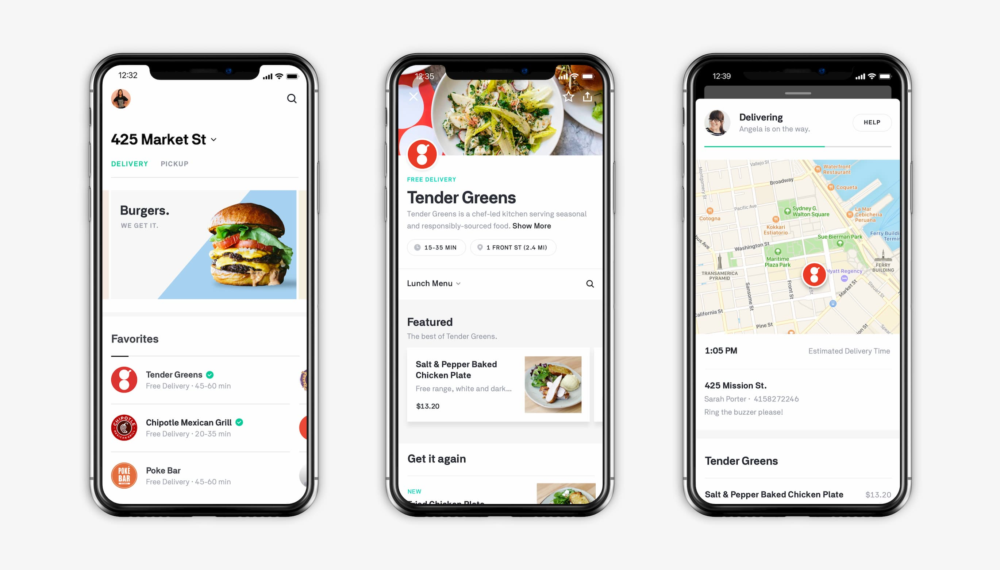
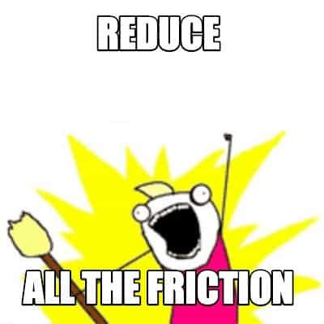
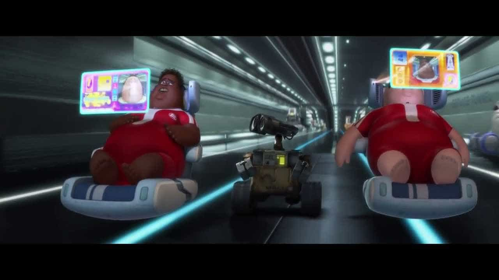

import { Image } from '$components'

One of the best ways to create a successful product is to find something people need to do, then reduce the friction for them to do it.

If you need food, a grocery store creates less friction than farming. To get to the store, a bike is less friction than walking; food delivery removes the need to leave your house *at all*; ordering delivery via app removes the need to talk to humans. We’ve removed so much friction from the process of feeding ourselves that we can push a button, hide in our house, and wait for a stranger to shove a burrito through our mail slot.

People are intrinsically lazy; they’ll always end up on the path of least resistance. And what‘s another word for resistance? Friction.

## Making things easier helps us get the desired results more often.

If we're trying to get a group of people, such as coworkers or customers, to do things a certain way, we can get much closer to guaranteeing that outcome by making it as easy as possible for people to do that thing.

If we [make the right thing the easy thing](/right-thing-easy-thing/), we can count on people to take the path of least resistance and know that they're taking the ideal path.

What the "right thing" is here is less of a moral decision and more of a business goal, but the principle holds.

<Image
  caption="Food delivery apps remove just about <em>all</em> of the friction from ordering food."
  credit="Postmates"
  creditLink="https://postmates.com/"
>

  

</Image>

The myriad apps that make our every impulse a button push away want us to buy things from them. They've removed all of the obstacles — all of the friction — so that we don't have to think *at all* to give them money. If I'm too tired to cook, I can open Postmates and reorder one of my five tried-and-true delivery meals in a few taps.

At IBM, my team took a whole bunch of compliance requirements and foundational code and packaged it up into a module. This transformed a process that used to be copy-pasting 700+ lines of code into a new service (which would go out of date and never *ever* get prioritized for upgrading) into a one-liner that could be easily upgraded and that guaranteed they were meeting foundational requirements for their services. It was optional to use, but nearly every team made the switch because it was so much easier than the alternative.

In both cases, the path of least resistance becomes the default, and through thoughtful design, the path of least resistance has become the path of best results.

## Reduce ALL the friction!

If making the right thing the easy thing means reducing friction to help guarantee desirable outcomes, it might be tempting to make a blanket statement like “reducing friction is always good”.

Once we see the benefits of reducing friction in a few areas, we get the urge to find all the other places where we’ve been enduring unnecessary friction. This leads to life hacks and shortcuts and Killer Apps™.

<Image
  align="right"
  creditLink="http://hyperboleandahalf.blogspot.com/2010/06/this-is-why-ill-never-be-adult.html"
  credit="Hyperbole and a Half"
>

  

</Image>

In my world — the Land of Developers — this urge is *strong*. We nerds take our productivity optimizations seriously.[^bros]

[^bros]:
  “Why are you wasting time with the mouse? Use keyboard shortcuts!”

  “Are you really stopping work just to eat? Slam a [Soylent](https://soylent.com/) and keep coding!”

  “Sleeping? *What?!* Start [micro-dosing](https://www.girlboss.com/work/microdosing-at-work) and you can stay productive for *days*, bro!”

This drive toward reducing friction has completely transformed modern life. Amazon is eating the world by allowing us to impulse purchase a waffle maker Friday night and have a waffle party Saturday morning without leaving the house.[^oddly-specific] Subscription services let us automate everything from [dressing ourselves](https://www.trunkclub.com/) to [charcuterie boards](https://www.olympiaprovisions.com/collections/olympia-postal-provisions) to [getting busy](https://love-drop.com/).

[^oddly-specific]:
  This oddly specific example brought to you by Marisa’s recent waffle craving.

Just about everything we can dream up has been turned into an app that will make that thing happen — we still have to lift a finger, but there's no effort required beyond that.

## Reduce *ALL* the friction?

Is removing all of the friction in our lives a good thing?

I guess it depends on [what we’re optimizing for](/what-are-you-optimizing-for/). There are always trade-offs.

On one hand, services like [MilkRun](https://localmilkrun.com/) make it far easier to support local farmers and eat healthier by putting together a box of seasonal produce and delivering it to my front door.

On the other, reducing *all* friction seems like a great way to end up like the people in *[WALL-E](https://movies.disney.com/wall-e)* who float around in hoverchairs and literally never do *anything*.

<Image
  caption="The people in WALL-E experience pretty much zero friction."
  credit="Disney / WALL-E"
  creditLink="https://movies.disney.com/wall-e"
>

  

</Image>

With that in mind, we may want to revise our premise to something like “reducing friction is *sometimes* good.“

That seems reasonable. Drawing the line for when it is and isn’t good is going to be pretty nuanced, but hopefully we can all agree that taking the “always good” premise to its logical conclusion would be too much.

But if we want to make this actionable, we need to decide *when* reducing friction is good. And if there are times when it’s *not* good, does that mean that there’s such a thing as “good friction”?[^heh]

[^heh]:
  

## Not all friction is bad.

Sometimes added difficulty is a good thing.

### Lessons are stickier when we have to work for them.

Without application or practices, education runs the risk of going in one ear and out the other. If we only read or watch something, we won't retain much — and it certainly won't help us cultivate a new skill.

Doing the work of practicing, taking notes, and other higher-effort learning activities helps the information stick in our brains and helps build actual expertise in new skills and patterns.

### Awards feel awardier when we feel like we accomplished something.

Our sense of accomplishment is often directly correlated to the amount of friction we overcame. Beating long odds carries a higher emotional reward than winning a participation trophy. Both have value — it feels good to be included — but there's an extra something special about doing hard work and being recognized for that.

### Teams feel teamier when we're empathetic and intentional.

Group dynamics rely on intentionally making some things harder to do.

Want to stress out your teammates and cause a lot of resentment? Change the plan with no notice and no explanation.

Adding friction to changing decisions that affect the whole group means that it's harder for an individual to make changes, but that extra friction also means that it's less likely for the group to be caught off guard or to feel like they've lost their agency.

**A team's roadmap is probably a great place to add *extra* friction to ensure that changes are well understood, fully justified, and generally agreed upon by the group.**

## Adding friction to one path can reduce it on another.

If we think a little further about the team example, something interesting emerges: by *increasing* friction for individuals to alter the course of the group, we *decrease* friction for the group to accomplish its goals.

So maybe it's not so much that we're adding "good friction", but that we're making sure to reduce friction [at the right level](/level-setting).

Maybe we shouldn't be asking whether we need to introduce good friction, but instead should ask some qualifying questions:

- who benefits if we remove this friction?
- does removing this friction introduce new friction somewhere else?

If we apply these questions to the question of whether we should make it really easy to change a team's roadmap, the answers make a pretty clear case:

- **Who benefits if we remove this friction?** Leadership benefits — they'll be able to make changes to the roadmap quickly whenever they feel like it.
- **Does removing this friction introduce new friction somewhere else?** Yes. The team can't be sure that the roadmap is accurate because it can change at any moment, so there will be uncertainty about what to work on. Unexpected changes mean work will likely get thrown away, which is demotivating and frustrating.

Introducing a process that requires fully qualifying proposed changes might be frustrating for the "move fast and break things" types, but putting those additional gates (friction) in place removes a ton of friction for the broader team — and in terms of absolute reduction, that's a larger amount of reduced friction.

Put another way: **adding friction to one step to reduce friction in the overall process is still a net reduction in friction.**

## How you can start reducing friction for yourself, your team, and your customers.

If you're interested in making the right thing the easy thing, start by asking questions to discover opportunities to reduce friction:

- **When you look at the broad scope, what is the [desired outcome](https://marisamorby.com/output-vs-outcome)?** For example: "a website visitor buys our product", "all teams comply with security requirements", "I get to the gym twice a week".
- **What does the path to achieving that outcome look like right now?** Think through each step that has to happen in order to get the desired outcome. User workflows, flowcharts, and checklists can be really helpful for visualizing this.
- **What are the stumbling blocks on that path?** Use whatever data you can get your hands on to understand where friction exists in your existing workflow. Where do people fall out of your sales funnel? What do teams consistently get wrong with security? Where do you feel the most reluctance on your way to the gym?
- **How can you remove stumbling blocks?** Once you've identified stumbling blocks, the real work begins: you know what the friction *is* — now how do you remove it? Sometimes this is obvious once you're looking at the whole picture ("people can't find the 'buy' button!"). Other times it's really tricky ("I just can't get myself out the front door to go to the gym"). Don't forget to ask yourself who benefits, and how removing this friction might introduce new friction elsewhere!

This is far from a comprehensive framework, but I've used this set of questions as a basis for [building new habits in my personal life](/how-to-stay-consistent), helping my company [identify root problems](/dirt-floors), and just about every other situation where I've needed to help improve a process.

## How are you making the right thing the easy thing?

Do you have strategies for reducing friction? When have you found it to be a good thing to make something harder? What other questions do you ask when you set out to improve a workflow?

[Hit me up on Twitter](https://twitter.com/compose/tweet?url=https://lengstorf.com/reduce-friction&text=Hey%20@jlengstorf%20I%20have%20opinions%20about) or join the [Party Corgi Discord](https://jason.af/pcn) — I'd love to chat with you!
