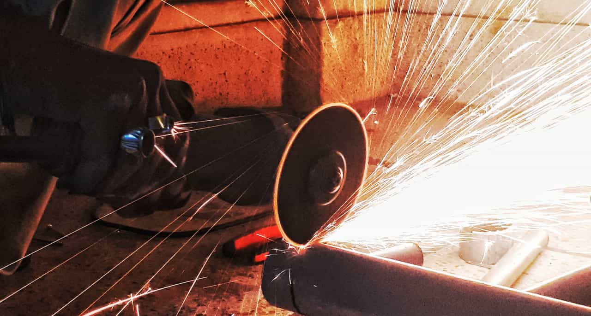

import { Image } from '$components'

Early in my career, I swore by “the grind”. I treated concentrated force of will like vegans treat nuts and just substituted that shit for everything.

Lack of experience? Underestimated how long it will take? My original plan hit a dead end and the deadline was looming? No problem — I’d just grind until I figured it out.

**For years, I believed I could solve any and every problem by working harder. And [it almost ruined my career](/overkill-cult/).**

Don’t get me wrong: a willingness to work hard is a great quality to have. After all, just about every project is going to [hit a stretch of sloggy, boring work](/why-ideas-fail/), and having a lower gear to drop into and push through that is *really* valuable.

What I *am* saying is that **the substitution of grinding in place of careful consideration, planning, and processes is a huge problem that massively contributes to burnout and the glamorization of unhealthy habits.**

<Image
  caption="Grinding wears through the work, but it also wears through the grinder."
  credit="Karan Bhatia"
  creditLink="https://unsplash.com/photos/ib7jwp7m0iA"
>

  

</Image>

## Hooooold up. Let’s set some context here.

This is an *extremely* nuanced area of discussion, and I want to make sure what follows doesn’t come off as blanket advice that applies to everyone.

So let’s start by [setting expectations](/setting-expectations): in the context of this article, “grinding” is a reference to my early days as an entrepreneur where I was skipping sleep, social activities, hobbies, relationships, health, and just about everything else in favor of trying to build my business.

There’s a certain corner of startup culture that glorifies this lifestyle. These are the “sleep when you’re dead” types; the “eat ~~sleep~~ work repeat” types; the “100-hour weeks are a rite of passage” types.

Everything that follows is directed toward the voluntary grind.

## "Powering through" is rarely the best option.

By one measure, my ability to power through problems is one of my greatest assets: deciding that I'm going to do something, then *sticking through it until it's done*, has allowed me to finish things even when it‘s a miserable slog, which helped me build my reputation and network, which in turn helped me build my career to where it is today.

However, my stubborn strength of will prevents me from thinking laterally about some problems, and that causes me a nontrivial amount of unnecessary pain and difficulty. It enables me to be bullheaded about seeing my solution through, even if it's not a great solution.

If I see a problem, I have always relied on The Jason Lengstorf Rock-Solid 3-Step Plan to Overcome Any Obstacle:

1. Identify the wall between you and the thing you want to accomplish
2. Bash your head against the wall until the wall gives out
3. Climb through the hole you've just made to victory

In the broadest sense, this approach has delivered repeatable success for me. However, it’s a gross oversimplification that leaves out all the sub-steps, such as:

- Step 2, part 9: rage weep because the thing you copy-pasted from Stack Overflow doesn't do what it says it should do and you don't know enough of the underlying concepts to debug it
- Step 2, part 27: angrily slam your laptop shut and take 30 minutes to seriously consider homesteading in Montana, or
- Step 2, part 28: take a deep, ragged breath, press the heels of your palms into your eyes, and open the laptop again because this is your life now and you'll never *not* be doing this so you may as well accept it.

While I was busy bashing my head against problems, I failed to realize that maybe — just maybe — alternative options existed that didn't rely on the thickness of my skull.

## Long-term success is not sustainable through constant effort.

Force of will is like a rocket booster: it can exert an incredible amount of force for a limited period of time — but once the fuel runs out, you're left with a burned-out husk that needs to be fished out of the ocean and repaired and refueled at extremely high cost.

In addition to the short-burst nature of grinding, there's also the major issue with finding the work interesting (or at least rewarding).

This is a losing game for several reasons:

1. If we’re not interested in the project, we don't get the rocket boost (until a panic-driven race to the deadline kicks in, that is).
2. If we develop some other focus outside of the team's project, we’ll apply our force of will to *that*, leaving the project hanging (until the panic kicks in, of course).
3. Appreciation for this kind of work has diminishing returns. You can't promote someone who's single-handedly driving a project forward,[^leave] and teammates will likely be both dependent on this effort and resentful of their dependence — over time the relationship sours, as imbalanced relationships tend to do.

[^leave]:
  Who’s going to do the work if they leave?

And that's the risk: force of will is capricious. **We can only apply force of will if we feel strongly enough about the thing to feel it's worthy of the effort.**  And a lot of the work that moves the needle isn't that exciting.

## What should we rely on instead?

**Relying on sheer force of will to finish projects should be treated like a disaster preparedness kit: it's great to know it's there in case of emergencies, but — and this is the important bit — if we need to use it, it means *something has gone wrong*.**

Grinding should be our last resort.

In my grindier days, I already knew I was going to bash my head against a problem before I'd even heard the full project brief. This all but guaranteed I'd stay locked in the cycle. Had I taken some time upfront to ask more questions and consider more options before diving in, I could have saved myself thousands of hours and a [beard-killing amount of stress](/overkill-cult/).

### Ask more (and better) questions.

**Asking better questions guarantees the desired outcome is clear.** And often, what someone tells you they want doesn't always line up with their desired outcome.

We need to [ask the right questions at the right level](/level-setting/) to make sure we understand not just the current project, but how that project fits into the overall goals of the business, team, household, or whatever larger unit the project is in service of.

Knowing what we're actually trying to accomplish means we can feel more confident in questioning the how of things, which means we're more likely to make smart decisions instead of obvious ones that rely on force of will to complete.

### Think laterally and consider more options.

Instead of committing to bashing *through* the wall every time, spend some time looking at alternatives.

In a staggering number of projects I've worked on, I started out believing that the only way to get it done was to put my head down and grind it out.

As I've become less willing to make personal sacrifices for professional goals, it’s become clear that **just about every project has multiple solutions — and many of those solutions don't require any grinding whatsoever.**

It's like I realized that most of these walls could just be walked around. Half the time they had *doors* I could have used, or at least a window I could wiggle through.

Now that I know this, **it feels less like I succeeded *because* of my willingness to grind, and more like I succeeded *despite* my tendency to do things the hard way.**

## Are we succeeding because of the grind? Or in spite of it?

I stubbornly refused to buy a suitcase with wheels on it for years.

I'd carry my suitcase through airports like a tough guy, judging the “lazy” people who were effortlessly rolling their luggage along, shoulder burning, sweating through my shirt like some kind of smug masochist.

**Grind culture feels like that to me: people acting smug about their inability to get ahead with reasonable hours, good rest, and healthy social lives.**

### Sometimes we have to live lessons to learn them.

Maybe a little bit of doing things the hard way is just part of learning. We have to see what the hard way feels like so we can appreciate the ease of alternative approaches.

Maybe the drive that leads us to grind is made of stubborn pride, and we can’t have one without the other. Maybe that’s why we refer to the early hardships as “paying dues”.

Or maybe that’s just how I try to justify my decision to do things poorly for so long.

## Work smart. Grind sparingly.

Ultimately, this is a note to my younger self that I am *positive* he would brush off as “probably true for most people, but *I’m different* — I can handle this”.

So I’m not here to convince anyone. You’re going to do what you believe is right for you, and I support that: it’s what I’ve been doing my entire career, and I’m doing fine in spite of all my stubborn, terrible decisions along the way.

But I wanted to write this for anyone out there feeling tired — like *really* tired — who’s starting to feel like maybe this career was a mistake, or maybe this level of sustained superhuman effort might not be sustainable after all, or who’s feeling lonely because the hustle and grind lifestyle has kept you isolated.

For those people, maybe this post can be a reminder that between grind and burnout there are options. We can work hard without working constantly. We can achieve our goals without giving up our relationships, hobbies, and downtime.

**We can build a career that supports the lifestyle we want *and* have the time to actually enjoy that lifestyle.**

It’s a balancing act, but we can do it. *You* can do it.

We just have to do the work to give ourselves permission not to do the work sometimes.
