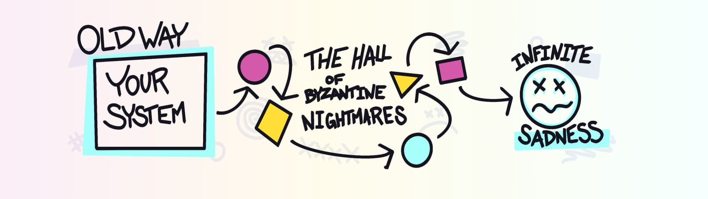
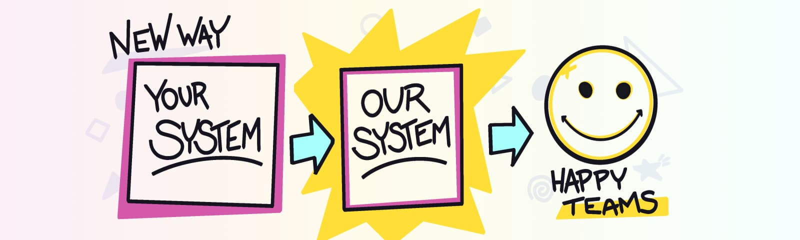
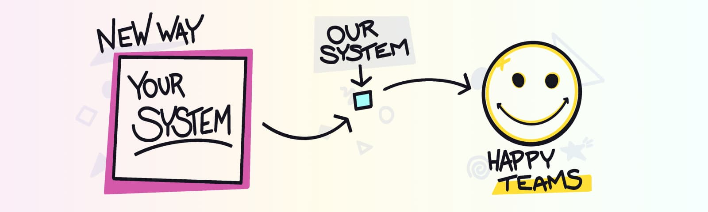

import { Image } from '$components';

Back when I worked at IBM, my team worked on a project to automate a bunch of busywork that was being manually handled by every team separately.[^deets]

[^deets]:
    This swapped out a bunch of boilerplate code for a package that handled security compliance, deployment, and other configuration that was always the same but — for whatever reason — was being copy-pasted by every team in the organization. And when a policy changed, *every single team* needed to make manual changes. Not to mention someone had to own reviewing every team's work to make sure the changes were done correctly.

    In short: the old way was an efficiency nightmare.

    Our solution packaged up all of that copy-pasted configuration and manual review into a single source of truth that could be centrally managed. Each team could replace a huge chunk of their code with this package, and then they'd never need to manually update or review the boilerplate stuff again.

My back-of-the-napkin math said this would save each team several week's worth of working hours every year, and when that was multiplied out across all teams it added up to thousands of hours and hundreds of thousands of dollars saved — all by doing less work.

I was extremely proud of my team. We'd managed to take something that was a constant source of drudgery for our coworkers and eliminate it while also saving the company money.

But when we started talking to teams about it, *no one would use it*. I was at a loss — how could teams choose a bunch of manual busywork over a drop-in solution that removed all that hassle?

I was venting about this in a meeting with my manager’s manager, [Nic Sauriol](https://www.linkedin.com/in/nsauriol/), and he said, “I know exactly what you’re going through — I’ve been there before.”

Then he told me about The Box.

## What story are you telling?

In his previous career, Nic was working on a similar project: take a bunch of hassle and make it disappear with a drop-in replacement. His project hit the same wall: teams just wouldn't adopt it, despite the benefits it promised.

The meetings consisted of an explanation of the work that was being removed, a discussion of the migration path, and an architectural drawing that showed how the new tech fit in.

That diagram had two parts: a drawing of the old way, and a drawing of the new way that used his team’s system.

The old way was an anxiety-inducing system diagram with lots of interconnected components and arrows.

<Image
  caption="Dramatic reenactment of the “before” diagram."
  credit="Jason Lengstorf"
  creditType="illustration"
>

  

</Image>

The new way showed all of that complexity abstracted away into a The Box: a new, improved system that would solve a ton of problems!

<Image
  caption="Dramatic reenactment of the “after” diagram."
  credit="Jason Lengstorf"
  creditType="illustration"
>

  

</Image>

Nic and his team took this around to teams throughout the company, explaining the benefits and showing these diagrams, and **no one would make the switch.**

This was baffling, because *why on Earth* would anyone want to keep all of the mess from the old way when they could drop in a replacement that made all of that go away?

## What’s in The Box?

On digging deeper, Nic discovered that teams were worried that the switch would be a lateral move.

The new system seemed big. **Wasn’t this just taking all of the old stuff and putting it in The Box?** That would be _harder_ for them to fix problems. They worried it would be *more* hassle, and they didn’t want to take the risk.

Nic was baffled by this — his team’s presentations went into detail about how this *wasn’t* the case.

As he was reviewing the presentation materials, he found himself staring at the diagrams and realized something: **he was drawing the box for his system at the same size as the other teams’ systems, and that made it look like a big thing.**

He was drawing the box too big.

## Draw the box smaller

Nic‘s team started presenting a revised diagram in these meetings that made their system look as small as just one of the components in the diagram of the old way.

<Image
  caption="Dramatic reenactment of the revised new way diagram."
  credit="Jason Lengstorf"
  creditType="illustration"
>

  

</Image>

**The teams’ systems were represented as large boxes, but the new system was drawn as a tiny box. After this change, teams were willing to give it a try because it seemed a tiny change that would be easy to back out if it didn’t work.**

## Pay attention to visual metaphors

As silly as this seems, it’s actually a really important thing to realize about human psychology: we evaluate things as we see them, and when the things we’re evaluating are intangible, like software systems, we “see” them through visual metaphors and evaluate those.

**If we’re attempting to convince someone to try something, we should try to empathize with the people we’re presenting to.** Are they overwhelmed and dealing with lots of complexity? If our proposal helps them remove some of that work, drawing a small box helps emphasize that we’re trying to *reduce* or *eliminate* work; a large box might communicate that it‘s a lateral move or actually creating additional work.

[Maggie Appleton](https://maggieappleton.com/) is one of the brightest minds in this space, and she explains this much better than I can in a [_killer_ talk on visual metaphors](https://www.youtube.com/watch?v=K8MF3aDg-bM&feature=youtu.be&t=13845).[^context]

[^context]: This talk is in the context of software, but the concepts apply everywhere.

## The right metaphor gets results.

After my conversation with Nic, I changed the way I presented my team‘s tool. We drew the box smaller and talked about all the work that disappeared by using this tool. We stopped talking about all the amazing things our tool could do — the part that was exciting to us — and instead focused on what was exciting to the people we were trying to convince to try it out.

Our new approach worked, and teams started to adopt it.

**We didn’t change the tool at all; we only changed how we communicated about it. We drew the box smaller.**

## What boxes could you redraw?

Are there any challenges you’re facing right now where you’re having trouble convincing someone to try your idea? What kind of boxes are you drawing? How could you draw them differently?

Let’s talk about it [on Twitter](https://twitter.com/compose/tweet?text=I%20just%20read%20%E2%80%9CDraw%20the%20Box%20Smaller%E2%80%9D%20by%20@jlengstorf&url=https://lengstorf.com/draw-the-box-smaller)!
