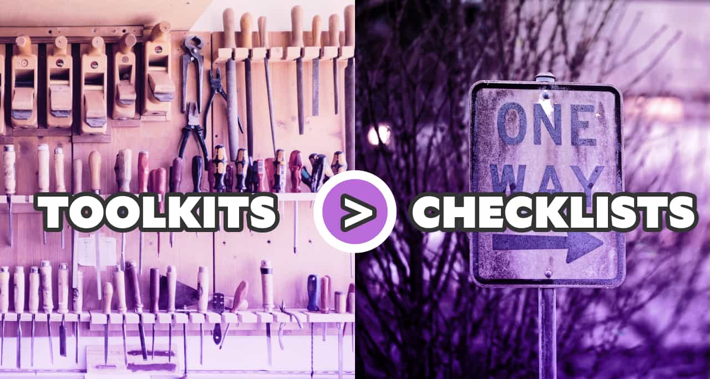

import { Image } from '$components';

When a process is designed, it’s almost always coming from a good place. A process is introduced to avoid a specific problem, smooth out a tricky job, or otherwise make it more likely that we’ll get the desired outcome from our work.

“We made a mistake, so let’s add a safeguard to make sure we don’t make that mistake again in the future.”

Processes get bundled into checklists, because managers are always on the lookout for quantifiable metrics.[^metrics]

[^metrics]:
    This isn’t a dig at managers or metrics. I love [making progress quantifiable](/effective-project-planning) and I think we should all do it. In this context, I mean that a checklist is something that is immediately quantifiable — it’s either completed or it’s not — so it can be really tempting to add checklists as a way of measuring productivity, which is the part I believe is a mistake.

## Checklists treat people like robots.

The biggest problem with checklists is that they’re linear: we start with step 1, and there’s a decision tree to be followed based on what happens.

**In a lot of checklists, a non-trivial amount of the required work ends up being irrelevant.** The team has to check a bunch of boxes that don’t apply to their project just so they can move on to the steps that _do_ matter.

### The Official How-To-Eat-Food Checklist™

Imagine you want to eat some soup, and you have to follow a linear “meal consumption guidelines” process to eat it:

1. Attempt to eat the meal with chopsticks
1. If unsuccessful, attempt to eat the meal with a fork
1. If unsuccessful, use both a fork and a knife
1. If unsuccessful, attempt to eat the meal with a spoon

This process is generic, and that makes it absurd: it creates waste and busywork (unnecessarily dirty utensils that need washing), burns a lot of time, and manages to insult the intelligence of the eater in the process.

**A decision tree like this assumes that the person using it has no knowledge or judgment _at all_. It’s the sort of list that makes a ton of sense for a robot, but is utterly insulting to a human.** Even if we’ve never eaten soup before, we can probably think through things and determine that a spoon is the best soup-to-face delivery method.

## Checklists can be a good thing, but they shouldn’t be the first thing.

A checklist that helps enforce relevant, necessary behaviors is a good thing, and we should keep them around.[^a11y] However, we should also work hard to keep checklists small and relevant — and we should stop using them when they stop making sense.

[^a11y]:
    Making sure your project goes through an [accessibility checklist](https://a11yproject.com/checklist/) before shipping, for example, is a decidedly Good Thing™ — a checklist like this adds a lot of value and is full of things that are easy to overlook. This is a checklist that is contained, relevant, and critical to the business, so it’s [introducing the right kind of friction](/reduce-friction) to ensure high quality.

As companies evolve, a once-helpful process can turn into an unnecessary chore. Since checklists aren’t revisited often, they don’t adapt quickly (or at all). As a checklist becomes outdated, it often becomes an outdated hindrance instead of the helpful safeguard it started out as.[^shortcuts]

[^shortcuts]:
    When I’ve worked with teams at larger companies, there has invariably been at least one process that no one could explain and that everyone either grumbled through or outright ignored. It was typically something that had been inherited from long-departed team members and no one knew why it was originally created, but also no one knew who had the authority to remove it, so it stayed in place.

**Checklists feel official, so they tend to evolve only by expanding.** They become irrelevant, atrophy, and can often turn into busywork like reports, forms, and other artifacts that _start_ in a good place but end up creating drag on teams that draws out turnaround times, saps energy, and drains motivation.

It’s usually far harder to remove a process than to add a new one,[^removal] so teams end up with huge process checklists that they _must_ follow before they can ship.

[^removal]:
    No matter how broken a process is, someone will be upset if it’s removed. Sometimes this is a vague management fear, like, “If we take away this safeguard and something goes wrong, will I get blamed? I can’t approve that.” Other times it’s reasonable: “This process is the only thing that keeps us compliant with security guidelines.” And sometimes it’s straight up [who-moved-my-cheese](https://en.wikipedia.org/wiki/Who_Moved_My_Cheese%3F) nonsense: “This is the way we’ve always done things! I know it’s broken, but change is terrifying and I don’t wanna!”

**Overused, overgrown checklists are a huge source of bureaucratic outgrowth. To keep our teams moving quickly, we should reach for checklists _last_, opting instead for flexible toolkits.**

## Go nonlinear with toolkits.

A better way to think about processes is as a collection of tools.

<Image
  caption='Photos by <a href="https://unsplash.com/photos/t5YUoHW6zRo">Barn Images</a> and <a href="https://unsplash.com/photos/oeANb6sSOFk">Fidel Fernando</a>.'
>

  

</Image>

Going back to the soup analogy, if we consider each utensil to be an individual process, we can trust our team to reason about which process they actually need to follow and choose the ones that make them most effective.

(In this case, that means reaching for a spoon because it’s the right tool for the job. Unless it’s a really chunky soup, in which case you might add in a fork or chopsticks. No, dear god, please don’t add that to the decision tree.)

**Reframing our processes as toolkits instead of checklists lets us keep all the benefits of well-designed processes without the drag of jumping through irrelevant hoops to satisfy a checklist.**

## Processes exist to solve problems; toolkits let us choose only the processes we need.

**Solving real-world problems is rarely a predictable process. This means that comprehensive checklists are inherently unsuitable for the task.** This is why strategies like the [waterfall model](https://en.wikipedia.org/wiki/Waterfall_model) have slow, demotivating timelines: you can’t predict the exact process for solving novel problems, and that means any checklist-based approach will either be out of alignment with the end goal or so broad as to be largely irrelevant.

However, if we break a linear checklist into its component subprocesses and treat each of those as a tool, we’re able to use our smart, non-robot, human brains to assess the situation and choose the processes from the toolkit that let us accomplish the task at hand.

## Toolkits combine safeguards with autonomy and trust.

One of the major issues with process checklists is that they don’t trust the person following them _at all_. **An exhaustive checklist implicitly says to the reader, “I don’t trust you to get this right, so I need you to prove that you did it properly by checking each of these boxes in order.”**[^mcdonalds]

[^mcdonalds]:
    This is how restaurants like McDonald’s enforce consistency: they’re not hiring people; they’re hiring squishy robots to follow extremely specific assembly instructions. Workers in these types of jobs are more or less strictly prohibited from making judgment calls. When I used to work in fast food, I never once felt proud of my work because it was so clearly _not_ my work: I was a set of hands to do someone else’s work.

**A toolkit inverts that relationship. It says, “You’re the expert here, so we trust you to get this done. Here are all the tools you might need to get there.”**

Realistically, the outcome is the same: the useful processes will be followed, and the irrelevant ones will be ignored. The difference is that in a checklist scenario, the person doing the work is forced to prove they tried each irrelevant step before moving on, while a toolkit-based approach allows the worker to use their own deductive reasoning to make the decision.

## A checklist can be part of the toolkit.

The wonderful thing about toolkits is that they can include checklists that are useful in certain contexts. **“Is this your first time doing a task like this? No problem! Use this handy checklist to see all the questions we recommend asking to decide how to solve it.”**

Next time, you may not need the checklist, so you won’t reach for that tool again.

## Toolkits enable results-based work.

One of the best ways to improve a team’s sense of autonomy and job satisfaction is to use [results-based management strategies](/results-based-work). Toolkits give teams the ability to choose their own approach (autonomy) and allow them to be measured on the outcome of their work rather than the specifics of their workflow.

## Many checklists can be broken up into toolkits easily.

**The main distinction between a checklist and a toolkit isn’t actually _what_ they are; it’s _how they’re expected to be used.**

If you’re leading a team, you can turn a linear checklist into a toolkit simply by changing expectations: rather than saying, “I need you to prove to me that you did everything on this list”, say, “I expect you to meet our quality standards for shipping. This collection of processes is here for your to use as needed to get there.”

It’s subtle, but it makes a huge difference in outcomes. It makes your team feel like experts instead of worker bees. It allows people to take pride in their work. It treats people like people and not robots.

## What toolkits already exist on your team? What will you create?

Are there checklists you can reframe as toolkits today? What toolkits could you create that would empower your team to succeed without removing their autonomy?

[Let’s talk about it on Twitter!](https://twitter.com/compose/tweet?text=Toolkits%20Over%20Checklists%20by%20@jlengstorf&url=https://lengstorf.com/toolkits-over-checklists)
