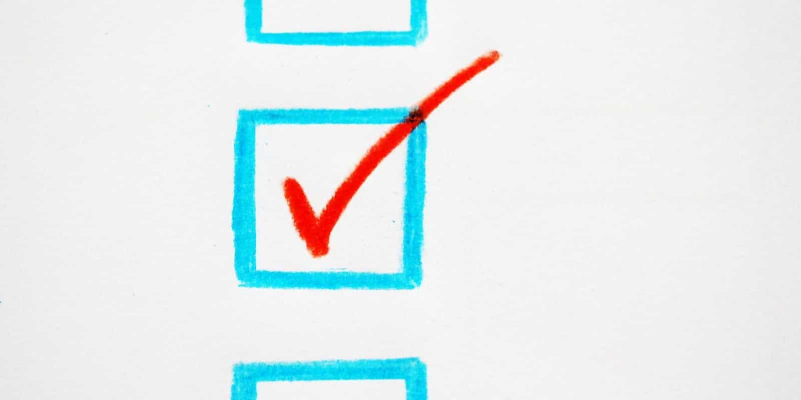

import { Image } from '$components';

If your goal is to be more consistent with content, your instinct may be to make a plan. But — and I can’t believe I’m about to say this — **trying to plan your way to a creative habit is a mistake.**

Look: I *love* to plan. I love it so much that I’ve written about [planning](https://lengstorf.com/effective-project-planning), [preparation](https://lengstorf.com/mise-en-place/), and [yak shaving](https://lengstorf.com/yak-shaving/) at length. However, there is such a thing as [too much planning](https://lengstorf.com/planning-vs-execution/). **When it comes to building a habit for creating content, _doing_ is so much more important that planning _at all_ can hinder progress.**

## Don’t let planning get in the way of doing.

**Until we’ve built a content creation habit, planning is the enemy of consistency.** If we spend too much time trying to create the perfect website for blogging, or to create the perfect scenes for streaming, or brainstorming the perfect format for sharing content, we’ll burn all our energy preparing and never actually get around to *doing things*.

With content, the goal should be to do the minimum amount of planning required to get something shipped. For writing, the [digital garden format](https://joelhooks.com/digital-garden) (or, really, *lack of* format) is a great way to lower the barrier to publishing. For streaming, pushing the button to go live on *anything* we can share publicly —  a hobby project, learning a new language, building something for work, whatever — switches the thinking from “I need to be ready to stream” to “I am streaming already; what would I want to change next time?”

<Image
  credit="SerwisBaybyPl"
  creditLink="https://pixabay.com/users/SerwisBaybyPl-390529/"
>

  

</Image>

## Focus on consistency, not correctness.

When trying to build a habit, the most important thing is figuring out [how to stay consistent](/how-to-stay-consistent/). We should be setting up routines and incentives that help us _do the thing_, and worry very little (if at all) about whether or not the thing we’re doing is done “correctly”.

**When we’re building a new habit, there is no such thing as “correct”; there is only “doing the thing” and “not doing the thing”.** We have to be consistent about doing the thing before we can start to think about whether we’re doing it well.

## Go wide, then go deep.

Until we try, it’s hard to know whether or not something is enjoyable enough to keep doing it. This is where plans gets us into trouble: we’re forced to hypothesize about how much we would enjoy something, and [humans are tragically terrible at predicting that sort of thing](https://www.psychologytoday.com/us/basics/affective-forecasting).

This means that we can’t really plan our way to consistency; we have to _experiment_ our way there. We have to cast a wide net, try anything and everything that sounds fun, and keep track of what we’re enjoying so we can do more of it.

**To start, try everything that sounds interesting. As you learn about what you enjoy, focus on doing more of the stuff that’s fun.**

Just make sure not to mix up “hard because I need practice” with “not fun” — don’t give up on something too early just because you’d have to work at it.

## Try everything. Keep doing the fun stuff.

We all enjoy different media when we create things. I love to [draw on my iPad](https://dribbble.com/jlengstorf), but I don’t like the setup or mess involved with painting or charcoal.

Livestreaming and conference talks give me energy and make me happy. I could keep going for hours — I’m having a blast, so why would I stop? For me, a chance to get up on stage, share information, and perform a little is a bright spot that I cherish.

My relationship with writing is more of a pendulum: some days I can write for hours without stopping, and sometimes stringing two sentences together is so hard it drains all my emotional energy and leaves me curled up on the couch whining because I don’t have any melted cheese to eat.

**I only know this about myself because I experimented with creating content using all of these approaches.** When I was starting out, I decided to _just try things_. I wrote; I spoke; I went live on Twitch. I learned what I enjoy (and what I don’t) and now I know where to focus my efforts.

## It’s easier to stay consistent (and grow an audience) when you’re having fun.

People can tell whether or not we’re having fun, and it’s *way* more fun when it feels like the creator cares. There’s a sense of joy that shines through, and that joyfulness makes everyone — creator and consumer alike — want to come back for more.

<Image
  caption="Anderson .Paak is radiating happiness in this performance."
>

  <iframe width="560" height="315" src="https://www.youtube-nocookie.com/embed/ferZnZ0_rSM" frameborder="0" allow="accelerometer; autoplay; encrypted-media; gyroscope; picture-in-picture" allowfullscreen></iframe>

</Image>

A notable example of this for me is Anderson .Paak. I had heard a song or two and was pretty _meh_ about it. Then I watched [his Tiny Desk concert](https://www.youtube.com/watch?v=ferZnZ0_rSM), and the pure happiness you can see in that performance turned me into a fan.[^psychology]

[^psychology]:
    The psychology of this is fascinating because I’m not sure if I like his music more because of his joy, or if I like how much *he* likes his music and have adjusted my opinion of his music accordingly. Ultimately, it doesn’t matter: I’m now an Anderson .Paak fan and it is 100% due to this performance.

**Creating content that’s fun to create makes it feel like play instead of work.** That makes a _huge_ difference in our ability to stay consistent.
