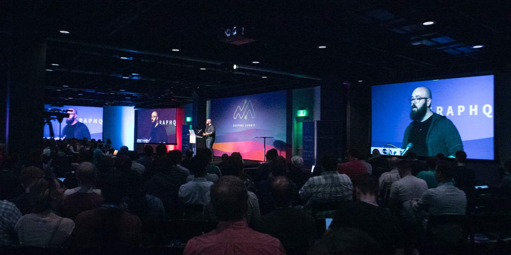

I'm available for speaking gigs; just [contact me](mailto:speaking@lengstorf.com?subject=Speaking+Inquiry). I'd be happy to speak about my experiences with remote working, business-building, or web design and development.

<figure class="figure figure--center">
  
  <figcaption class="figure__caption">
    Jason Lengstorf at the 2017 GraphQL Summit in San Francisco.
    <small class="figure__attribution">
      Photo: 
      <a class="figure__attribution-link" 
         href="https://orangephotography.com/">
        Orange Photography
      </a>
    </small>
  </figcaption>
</figure>

Currently I’m focusing on giving presentations in the following areas:

-   **Work-Life Balance and Efficiency:** raising awareness about the health and career risks of overworking, teaching high-efficiency habits, encouraging downtime
-   **Building Effective Teams:** process design, designing healthy culture, onboarding, internal training
-   **Modern Front-End Development:** progressive web apps, high-performance patterns, React + GraphQL, architecture, testing, functional programming
-   **GraphQL:** managing GraphQL servers, using GraphQL in microservice architectures, combining GraphQL with REST

For a full list of the proposals I’m kicking around right now, see [my presentation list](https://github.com/jlengstorf/presentations). If I’ve given the presentation before, the slides are up there, too.

## Upcoming Speaking Engagements

-   [**JazzCon.Tech**](http://jazzcon.tech/), March 2018, New Orleans, LA, USA
-   [**#PerfMatters**](https://perfmattersconf.com/), March 2018, Redwood City, CA, USA
-   [**The Lead Developer**](https://newyork2018.theleaddeveloper.com/), April 2018, New York, NY, USA
-   [**Generate**](https://www.generateconf.com/new-york), April 2018, New York, NY, USA
-   [**CRAFT**](https://craft-conf.com/), May 2018, Budapest, Hungary
-   [**Syntax Code & Craft Conference**](https://2018.syntaxcon.com/), June 2018, Charleston, SC, USA

<a href="mailto:speaking@lengstorf.com?subject=Speaking+Inquiry" class="btn btn--small">Book me to speak at your event »</a>

## Previous Speaking Engagements

-   **Assert(js)**, February 2018, San Antonio, TX, USA
-   **Global CFP Diversity Day**, February 2018, Austin, TX, USA
-   **APIStrat**, November 2017, Portland, OR, USA
-   **GraphQL Summit**, October 2017, Portland, OR, USA ([video](https://www.youtube.com/watch?v=T3FbZsYXi50))
-   **Connect.Tech**, September 2017, Atlanta, GA, USA ([video](https://www.recallact.com/presentation/how-i-cut-my-working-hours-half-and-somehow-managed-get-more-done))
-   **Web Summer Camp**, August 2017, Rovinj, Croatia
-   **That Conference**, August 2017, Wisconsin Dells, WI, USA
-   **Web Rebels**, June 2017, Oslo, Norway ([video](https://youtu.be/4WbpKSh0FWk?t=2h44m44s))
-   **DEVit**, May 2017, Thessaloniki, Greece
-   **Oracle Code**, April 2017, Toronto, ON, Canada
-   **Oracle Code**, March 2017, Austin, TX, USA
-   **WordCamp Atlanta**, March 2017, Atlanta, GA, USA ([video](http://wordpress.tv/2017/03/29/jason-lengstorf-wordpress-deployment-for-professionals-how-to-solve-the-problem-of-multiple-wordpress-installs-in-30-minutes-or-less/))
-   **PHP Sevilla**, June 2016, Sevilla, Spain
-   **WebVisions**, July 2015, Barcelona, Spain
-   **Future Insights Live**, June 2015, Las Vegas, NV, USA
-   **Future of Web Design**, April 2015, London, UK
-   **Ultimate Developer Event**, October 2014, Boston, MA, USA
-   **Future of Web Apps**, October 2014, Boston, MA, USA
-   **CSS Dev Conf**, October 2014, New Orleans, LA, USA
-   **ForwardJS**, July 2014, San Francisco, CA, USA
-   **Big Sky Dev Con**, June 2014, Bozeman, MT, USA
-   **Future Insights Live**, June 2014, Las Vegas, NV, USA
-   **Webvisions Portland**, May 2014, Portland, OR, USA
-   **Changing The Game**, February 2014, Las Vegas, NV, USA
-   **Ultimate Developer Event**, November 2013, Boston, MA, USA
-   **Big Sky Dev Con**, June 2013, Bozeman, MT, USA
-   **Future Insights Live**, April 2013, Las Vegas, NV, USA
-   **Big Sky Dev Con**, 2012, Bozeman, MT, USA
-   **SXSW**, 2011, Austin, TX, USA
-   **Montana Programmers**, Missoula, MT, USA
